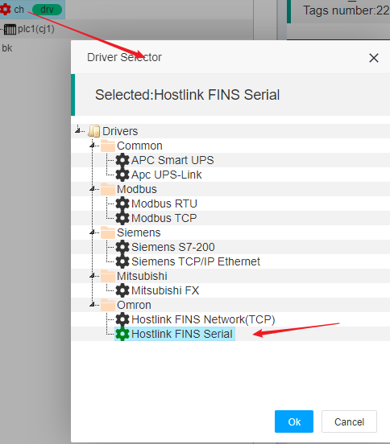
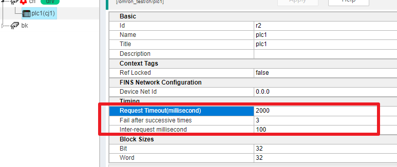

IOT-Tree Device Driver - Omron HostLink FINS Serial</a>
==

When we run the IOT-Tree Server and directly connect to Omron related PLCs through a serial port (including the transparent transmission serial port Eth conversion gateway), we can use the Omron Hostlink protocol for communication, and of course, we run FINS related commands internally. All drivers are named "HostLink FINS Serial".

This driver supports CP1 CJ1 CJ2 CS and other PLC series

## 1. Supported PLC addresses

Taking CP1/CJ1 as an example, this driver supports the following addresses. Other models can view the help document when configuring labels

<table class="layui-table">
  <colgroup>
    <col width="150">
    <col width="150">
    <col>
  </colgroup>
  <thead>
    <tr>
      <th width="30%">Device Type</th>
      <th width="25%">Range</th>
      <th width="15%">Data Type</th>
      <th width="10%">Access</th>
      <th width="20%">Sample</th>
    </tr> 
  </thead>
  <tbody>
    <tr>
      <td rowspan="6">Auxiliary Relay</td>
      <td>A000 - A447</td>
      <td>int16,uint16</td>
      <td>Read</td>
      <td></td>
    </tr>
    <tr>
      <td>A000 - A446</td>
      <td>int32,uint32,float</td>
      <td>Read</td>
      <td></td>
    </tr>
    <tr>
      <td>A448 - A959</td>
      <td>int16,uint16</td>
      <td>Read/Write</td>
      <td></td>
    </tr>
    <tr>
      <td>A448 - A958</td>
      <td>int32,uint32,float</td>
      <td>Read/Write</td>
      <td></td>
    </tr>
    <tr>
      <td>A000.xx - A447.xx [00-xx-15]</td>
      <td>bool</td>
      <td>Read/Write</td>
      <td></td>
    </tr>
    <tr>
      <td>A448.xx - A959.xx [00-xx-15]</td>
      <td>bool</td>
      <td>Read/Write</td>
      <td></td>
    </tr>
    <tr>
      <td rowspan="3">CIO</td>
      <td>CIO0000 - CIO6143</td>
      <td>int16,uint16</td>
      <td>Read/Write</td>
      <td></td>
    </tr>
    <tr>
      <td>CIO0000 - CIO6142</td>
      <td>int32,uint32,float</td>
      <td>Read/Write</td>
      <td></td>
    </tr>
    <tr>
      <td>CIO0000.xx - CIO6143.xx [00-xx-15]</td>
      <td>bool</td>
      <td>Read/Write</td>
      <td></td>
    </tr>
    <tr>
      <td rowspan="1">Counter</td>
      <td>C0000 - C4095</td>
      <td>int16,uint16</td>
      <td>Read/Write</td>
      <td></td>
    </tr>
    <tr>
      <td rowspan="1">Counter Status</td>
      <td>CS0000 - CS4095</td>
      <td>bool</td>
      <td>Read/Write</td>
      <td></td>
    </tr>
    <tr>
      <td rowspan="3">Data Memory</td>
      <td>D00000 - D32767</td>
      <td>int16,uint16</td>
      <td>Read/Write</td>
      <td></td>
    </tr>
    <tr>
      <td>D00000 - D32766</td>
      <td>int32,uint32,float</td>
      <td>Read/Write</td>
      <td></td>
    </tr>
    <tr>
      <td>D00000.xx - D32767.xx [00-xx-15]</td>
      <td>bool</td>
      <td>Read/Write</td>
      <td></td>
    </tr>
    <tr>
      <td rowspan="2">Data Register</td>
      <td>DR00 - DR15</td>
      <td>int16,uint16</td>
      <td>Read/Write</td>
      <td></td>
    </tr>
    <tr>
      <td>DR00 - DR14</td>
      <td>int32,uint32,float</td>
      <td>Read/Write</td>
      <td></td>
    </tr>
    <tr>
      <td rowspan="3">Holding Relay</td>
      <td>H0000 - H1535</td>
      <td>int16,uint16</td>
      <td>Read/Write</td>
      <td></td>
    </tr>
    <tr>
      <td>H0000 - H1534</td>
      <td>int32,uint32,float</td>
      <td>Read/Write</td>
      <td></td>
    </tr>
    <tr>
      <td>H0000.xx - H1535.xx [00-xx-15]</td>
      <td>bool</td>
      <td>Read/Write</td>
      <td></td>
    </tr>
    <tr>
      <td rowspan="1">Index Register</td>
      <td>IR00 - IR15</td>
      <td>int16,uint16</td>
      <td>Read/Write</td>
      <td></td>
    </tr>
    <tr>
      <td rowspan="1">Task Flag</td>
      <td>TK00 - TK31</td>
      <td>bool</td>
      <td>Read</td>
      <td></td>
    </tr>
    <tr>
      <td rowspan="1">Timer</td>
      <td>T0000 - T4095</td>
      <td>int16,uint16</td>
      <td>Read/Write</td>
      <td></td>
    </tr>
    <tr>
      <td rowspan="1">Timer Status</td>
      <td>TS0000 - TS4095</td>
      <td>bool</td>
      <td>Read/Write</td>
      <td></td>
    </tr>
    <tr>
      <td rowspan="3">Working Relay</td>
      <td>W000 - W511</td>
      <td>int16,uint16</td>
      <td>Read/Write</td>
      <td></td>
    </tr>
    <tr>
      <td>W000 - W510</td>
      <td>int32,uint32,float</td>
      <td>Read/Write</td>
      <td></td>
    </tr>
    <tr>
      <td>W000.xx - W511.xx [00-xx-15]</td>
      <td>bool</td>
      <td>Read/Write</td>
      <td></td>
    </tr>
  </tbody>
</table>

## 2. Set channel drivers

In the project, when adding or modifying channel drivers, choose the following:

## 3 Device related parameters

### 3.1 Time parameters

Under the corresponding channel of this driver, the time parameters of the device are quite important. If some parameters are set too small, packet loss may occur easily:

1) Request Timeout (millisecond)

This parameter is the expiration time to wait for the return after sending a request instruction to the PLC on the IOT-Tree end. If the PLC does not return data in a timely manner, an expiration error may occur.

2) Inter reqeust millisecond

Due to the fact that the Tags we configure may involve multiple memory areas of the PLC, basically multiple request response instructions will appear in the driver layer during a single data update. Setting appropriate time intervals between each instruction can ensure more stable communication.

### 3.2 Data Block Size

Due to the FINS communication protocol of Omron PLC, the underlying layer basically reads data in two ways: Word and Bit, and each request instruction has a limited size. In order to achieve more reliable communication, we can set this parameter so that each request is limited to how many Words or Bits to read at once. This can ensure that the data packets are of appropriate size, which not only meets efficiency but also improves reliability.

