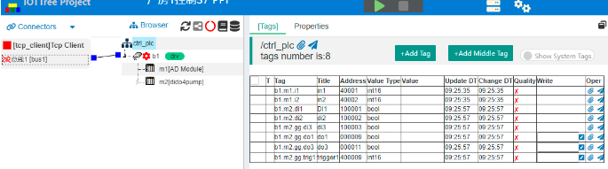

IOT-Tree Device Driver -PPI
==


The PPI communication protocol is a built-in protocol of Siemens 'PLC S7-200 CPU'. Physically based on RS-485 communication, PPI communication can be achieved through shielded twisted pair. The PPI protocol is a master-slave protocol. The master station device sends a request to the slave station device, and the slave station device responds, but the slave station cannot actively send out information. The master station communicates with the slave station through a shared connection managed by the PPI protocol. The PPI protocol does not limit the number of master stations that can communicate with any slave station, but in a network, there cannot be more than 32 master stations.

IOT-Tree has built-in support for the PPI protocol and can communicate directly with the PLC through the COM port corresponding to RS-485. This section is illustrated by an online usage example.


## 1 Preparation

### 1.1 Connecting PLC method


The PLC model used on site is "S7-200 CPU 224XP CN", which has two RS485 interfaces (corresponding to 3 and 8 of the two 9-pin interfaces).


The 9-pin interface definition of S7-200 is shown in the following figure:


Just use a two core shielded cable, connect 8-pin A and 3-pin B, and connect the shielding layer to the shielding shell of the 9-pin connector. With the RS485 interface, you can communicate and physically connect with the PLC in the following ways

1) If the device you are running IOT-Tree Server has its own RS485 interface, you can connect it.
2) If you are running IOT-Tree Server as a PC, you can use the serial port RS232-RS485 or USB-RS485 of the PC to connect.

Note: Both of the above will use COM port in the system.

3) You can use a RS485-Eth module, then convert it to Ethernet and use TCP for connecting.

This example uses the second method, which uses COM3 in the system to connect to the PLC


### 1.2 PLC connection and programming


Use "STEP 7 MicroWIN" for local control programming of PLC. If the program uses its own protocol to occupy one of the interfaces, then do not use this interface for connection. This depends on how you needs.

If the "S7-200 RS485" port is not occupied, it directly supports the PPI protocol. Among them, the PLC address is 2

Power up the PLC, download the program through the programming cable, and start it.


## 2 IOT-Tree configuration


IOT-Tree has been deployed on PC and is ready to use COM3 for RS485 communication with the PLC prepared above.

Click to enter the project configuration UI, as shown in the following figure:




### 2.1 Add COM Connector and Channel


Click on Connectors in the upper left corner, select COM from the menu, and then fill in the following information in the pop-up dialog:


Click the "OK" button to see that a COM connector has been added to the left Connectors area.

Next, right-click on the project root node and select "New Channel". In the pop-up dialog, fill in the following information:


Among them, Driver clicks to select "Siemens S7-200". This driver corresponds to the PPI protocol. Click OK to complete the addition of the channel.

Next, click the mouse on the small square on the right side of the connector "s7_2" and do not release it. Drag the line segment over the small square on the left side of the channel "s7ch" and release it. The system will establish an association between the connector channels, as shown in the following figure:


From it, we can see that if the RS485-Ethernet method is used for the left connector, only different associations need to be used, which does not affect the channel configuration (the separation of connector and data organization allows IOT-Tree to more elegantly handle the access of various devices and data).


### 2.2 Add PLC device


Right click on the channel s7ch node, select "New Device", and fill in the device information in the pop-up dialog:


```
Name=plc2
```


There is no need to fill in anything else. After clicking OK, the corresponding device node will appear under the channel. Click on this node, select "Properties" tab in the main content area on the right, modify the value to 2 in the property "Device Address" line (this is the address we configured for the PLC earlier), and then click on the "Apply" button in the upper right corner to save. As shown in the following figure:


### 2.3 Add device data tags


The internal data of S7-200 is stored in different storage areas, such as output image register area Q, input image register I, variable storage area V, and so on. The PPI driver corresponding to IOT-Tree Server is also compatible with this PLC data addressing method.

Click on the [Tags] tab in the main content area, and it will show tags list corresponding to the PLC2 device. We can click the "+Add Tag" button above,in the pop-up dialog, we fill in the following information:


```
Name=q0_1
Title=Q0.1
Date type=bool
R/W=Read/Write
Address=Q0.1
```


After clicking OK, you can see that this item has been added to the list.

Using the same method, we have added the following content:


```
Name=qb
Title=QB
Date type=uint8
R/W=Read/Write
Address=QB0

Name=t40
Title=T40
Date type=uint32
R/W=Read Only
Address=T40

Name=i1_0
Title=I1.0
Date type=bool
R/W=Read Only
Address=I1.0

Name=vb100
Title=VB100
Date type=uint8
R/W=Read/Write
Address=vb100
```


Finally, we completed the following tags list under device PLC2:


The key is the "Address" of each Tag, which is compatible with Siemens PLC programming software. Another content is the "Value type", which indicates that the input Address may be limited to a 'Value type'. When writing, you can click the "Check Address" button on the right side of the Address, and it will automatically help you modify it.

The tags we have configured will be used in this project of IOT-Tree Server. Obviously, if you want IOT-Tree and PLC internal programs to coordinate and control, you can define them as tags through some common variables for mutual writing and reading.

Next, we can run to see the effect.


## 3 Running effect


After ensuring that the PLC has been powered on and COM3 is not occupied, click on the green start project button above the project configuration.


You can see that all data points are running normally and you can see some changes in values, such as my PLC program using timer T40, which keeps changing values.

For the point "q0_1", you can enter 1 in the Write column and click the write button on the right. You can find that the "Q0.1" port of the PLC has an output (the indicator light also lights up, provided that this output is not controlled by your PLC program).


## 4 Further more


You can add a human-machine interaction node (HMI) in this project and design the operation UI through online editing function. Please refer to HMI related content for this section. In this project, the following monitoring UI were implemented:


Alternatively, you can directly output data in the "HTTP JSON" format from the organizational nodes in the project, making it convenient for other systems to call real-time data. If you right-click on the PLC2 node and click "Access", you can view the output JSON format data in the pop-up window, which is very convenient for other systems to obtain:


