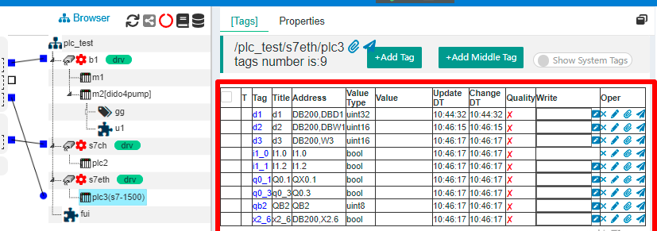

IOT-Tree Device Driver - Simens Ethernet
==


IOT-Tree has a built-in Siemens Ethernet driver, which can directly connect various PLC models such as S7-300/1200/1500 through Ethernet Tcp. This section is illustrated by an online usage example.

​
## 1 Preparation


This example uses S7-1500 as the test PLC. If you do not have relevant device, you can install Siemens simulation environment cooperated with NetToPLCsim.


Please refer to the relevant content on Siemens' official website for details. :STEP 7 Basic/Professional , WinCC Basic/Comfort/Advanced, NetToPLCsim

### 1.1 Preparation of PLC and comparison testing software


Use TIA Portal to program local control of the PLC, where the PLC IP address is 192.168.18.8 and port is 102

Power up the PLC and download the program to start.

Use KEPServerEx6 for connection testing to ensure that the external connection of the PLC is working. The point information I have configured is as follows:


Click the "Quick Client" button and a pop-up window will view the data items under the corresponding node, ensuring that all are "Good"


### 1.2 IOT-Tree Server Installation and configuration

Your device can run on a PC or embedded system, and relevant installation and configuration documents can be referenced[Quick Start][qk_start]

[qk_start]:../quick_start.md


After all the above preparations are completed, we can now use IOT-Tree to connect with relevant drivers.


## 2 IOT-Tree Configuration


In IOT-Tree, click to enter the project configuration UI. The project content is as follows:


### 2.1 Add TcpClient Connector and Channel


Click on Connectors in the upper left corner, select "Tcp Client" from the menu, and then fill in the following information in the pop-up dialog


The main content is the "IP address" and "port" of the PLC. Click the OK button, and you will see a TcpClient connection added on the left.

Next, right-click on the project root node and select "New Channel". In the pop-up dialog, fill in the following information:


Among them, Driver clicks to select "Siemens TCP/IP Ethernet". Click OK to complete the addition of the channel. At this point, you can see that the left side of the s7eth channel is different from the other channels, and there is no square box. This is because each TCP/IP based PLC device requires its own Tcp connection, so unlike bus based channels, the connection association under this driver must be carried out through the device. Therefore, we will first add PLC device below the channel.


### 2.2 Add a PLC device and associate it with TcpClient


Right click on the channel "s7eth" node, select "New Device", and fill in the device information in the pop-up dialog:


```
Name=plc3
Model=S7-1500
```


There is no need to fill in anything else. After clicking OK, the corresponding device node will appear under the channel. At this point, you will notice a circular connection box on the left side of the device.

Next, click the mouse on the small square on the right side of the connected "c18_8" and do not release it. Drag the line segment to the top of the small circle on the left side of device PLC3 and release it. The system will establish an association between connected devices, as shown in the following figure:


From it, we can see that if different Ethernet connection methods are used for the left, it can also be connected to related devices. In general, the PLC implements "Tcp Server" and can only wait for the Tcp Client to connect. We can use an intermediate proxy node, which can be a client actively connecting to the IOT-Tree Server and using the client method to connect to the PLC on the other end, so that we can more flexibly support complex network environments; It can be seen that the separation of connector and data organization enables IOT-Tree to more elegantly handle the access of various devices and data.

Click on the PLC3 node and select Properties tab in the main content area on the right. We can modify the relevant rack and slot parameters of the "S7 Communication Parameters". As shown in the following figure:


### 2.3 Add device data tags


The internal data of S7-1500 is processed through different storage areas, such as output image register area Q, input image register I, DB storage area, and so on. The driver corresponding to IOT-Tree Server is also compatible with this PLC data addressing method.

Click on the \[Tags] tab in the main content area, and it will show tags list corresponding to the PLC3 device. We can click the "+Add Tag" button above to add.

In the pop-up dialog, we fill in the following information:

```
Name=d1
Title=d1
Date type=uint32
R/W=Read/Write
Address=DB200,DBD0
```


After clicking OK, you can see that this item has been added to the list. Using the same method, we have added the following content:


```
Name=d2
Title=d2
Date type=uint16
R/W=Read/Write
Address=DB200.DBW1

Name=d3
Title=d3
Date type=uint16
R/W=Read/Write
Address=DB200.W3

Name=i1_0
Title=I1.0
Date type=bool
R/W=Read Only
Address=I1.0

Name=i1_1
Title=I1.1
Date type=bool
R/W=Read/Write
Address=I1.1

Name=q0_1
Title=Q0.1
Data Type=bool
R/W=Read/Write
Address=QX0.1

Name=q0_3
Title=q0_3
Data Type=bool
R/W=Read/Write
Address=Q0.3

Name=qb2
Title=QB2
Data Type=uint8
R/W=Read/Write
Address=QB2

Name=x2_6
Title=x2_6
Data Type=bool
R/W=Read/Write
Address=DB200.X2.6
```


Finally, we completed the following tags list under device PLC3:





The key is the Address content of each Tag, which is compatible with Siemens' PLC programming software. Another is the Value type, which indicates that the input Address may limit the Value type. When editing, you can click the "Check Address" button on the right side of the Address, and it will automatically help you modify it.

The tags we have configured will be used in this project of IOT-Tree Server. Obviously, if you want IOT-Tree and PLC internal programs to coordinate and control, you can define them as tags through some common variables for mutual writing and reading.

Upon closer examination of the definitions of these data tags, it can be observed that they are very similar to the OPC software KEPServerEx. In real-time, IOT-Tree Server can indeed serve as an OPC software, with more features added, such as online UI rendering, script task running, and HTTP based JSON format output, to facilitate IoT applications.

Next, we can run to see the effect.


## 3 Running effect


To ensure that the PLC has been powered on and running, click on the green start project button above the project configuration.


You can see that all tags are running valid. Now, we can cooperate with KEPServerEx software to write data and cross check data changes.

For the point "q0_1", you can enter 1 in the Write column and click the write button on the right. You can find that the "Q0.1" port of the PLC has an output (the indicator light also lights up, provided that this output is not controlled by your PLC program); Looking at the "Quick Client" of KEPServerEx at the same time, it can be observed that the value of "q0_1" has also changed, and vice versa. As shown in the following figure:


## 4 Further more


You can add a human-machine interaction node (HMI) in this project and design the operation UI through online editing function. Please refer to HMI related content for this section. In this project, the following monitoring UI were implemented:


Alternatively, you can directly output data in the "HTTP JSON" format from the organizational nodes in the project, making it convenient for other systems to call real-time data. If you right-click on the PLC2 node and click "Access", you can view the output JSON format data in the pop-up window, which is very convenient for other systems to obtain:


