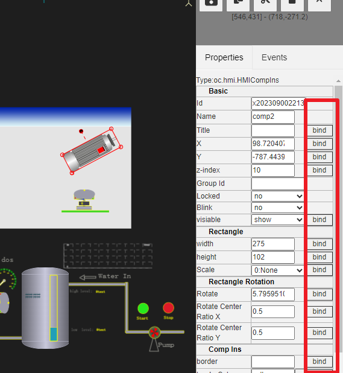
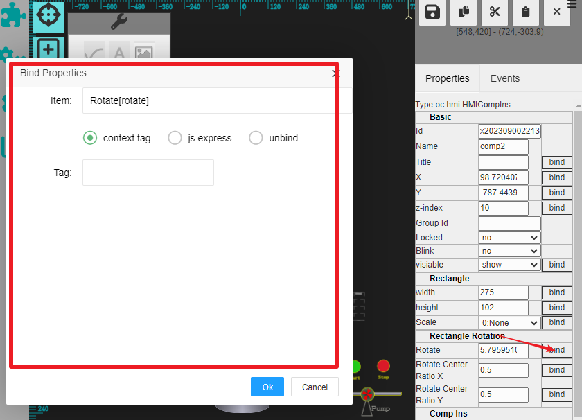
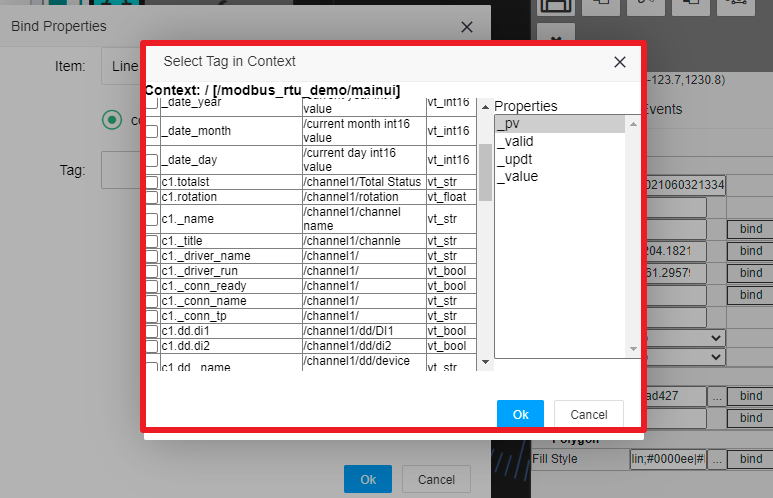
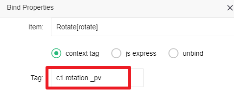
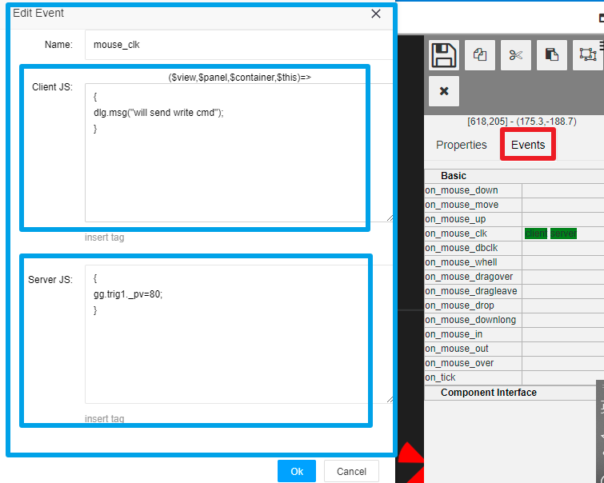

Properties binding and event handling
==

IOT tree server provides powerful online HMI editing function. If you don't understand this, please refer to [HMI UI editing instructions][qn_hmi_edit].

Interactive UI editing allows you to create your monitoring screen or scene according to your needs. Next, how can you make these monitoring images change dynamically according to your real-time data? Conversely, you also need to issue control instructions to the monitored devices. How can this be achieved?

IOT tree server establishes the association between UI components and data context through entity attribute binding mechanism. At the same time, the element provides an event response mechanism to respond to user actions.

## 1 Draw item's property binding (bind)

In the property bar on the right of the UI editing area, if a property supports binding, a bind button will appear.

Click this button to open the attribute binding window. There are two binding properties: context tag binding and JS expression binding.

The context tag is based on the data context corresponding to the container node to which the HMI UI node belongs. JS based expressions can provide a more flexible way to generate attribute data. For example, you can meet specific logic according to multiple context tags and output data types and values that meet the attribute display.

After binding the draw item in the HMI UI, start the project and access the runtime UI (right-click and select "Access" to open it). You will see that the values of element properties will change with the changes in Tag data, resulting in a dynamically changing visual effect.

### 1.1 Context based tag binding

Click the tag input box to pop up the context tags that can be used by this HMI UI and the corresponding proterties values. You can choose directly. As shown below:

After selection, the unique identification string corresponding to the context tag will appear in the tag input box:

### 1.2 JS expression binding

Based on the running environment of the HMI UI context, the bound data can be defined using expressions in JS syntax format. As shown below:

For more information about JS expressions, please refer to [JS Script Usage][qn_js_exp].

## 2 Draw item event handling

After the draw item is selected, Click the events bar on the right. You can see all the events that this element can provide. For example, on_mouse_down is the event that the user presses the mouse on the element. If you want to make relevant UI changes or the server does corresponding actions (such as issuing an instruction to the device) when the user clicks this element, you need to add a JS script for handling this event.

Click the input box of the corresponding event to pop up the event handling JS script editing interface. As shown below:

As shown in the figure, the event handling JS script is divided into client JS (client JS) and server JS (server JS).

The operation on the client is mainly based on the browser HMI UI framework, and no interaction with the server is allowed. The element properties are dynamically adjusted through the UI framework to form the dynamic changes of the element display. For details, please refer to [JS usage][qn_js_exp].

Scripts running on the server respond to browser side events, but all scripts run on the server. Its running environment is mainly based on the label data context corresponding to the node to which the UI belongs. On the server side, the script can directly read or write the tag value (finally, it may issue instructions to the device through the device driver corresponding to the tag). For details, please refer to [JS usage][qn_js_exp].

In summary, to provide users with automated monitoring dynamic UI, we only need to bind the data provided by the tag list in the context. On the other hand, if you want to provide user with operation input or command issuance, you only need to handle it on the corresponding draw item event and write data to the tags in the context. From it, it can be seen that this process is very simple, and you only need to have a slight understanding of JS scripting knowledge to easily master it.

[qn_js_exp]: ../js/index.md
[adv_js_exp]: ../advanced/adv_js_exp.md
[qn_hmi_edit]: ./hmi_edit.md
