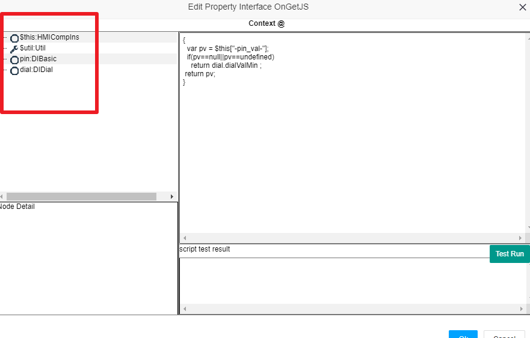
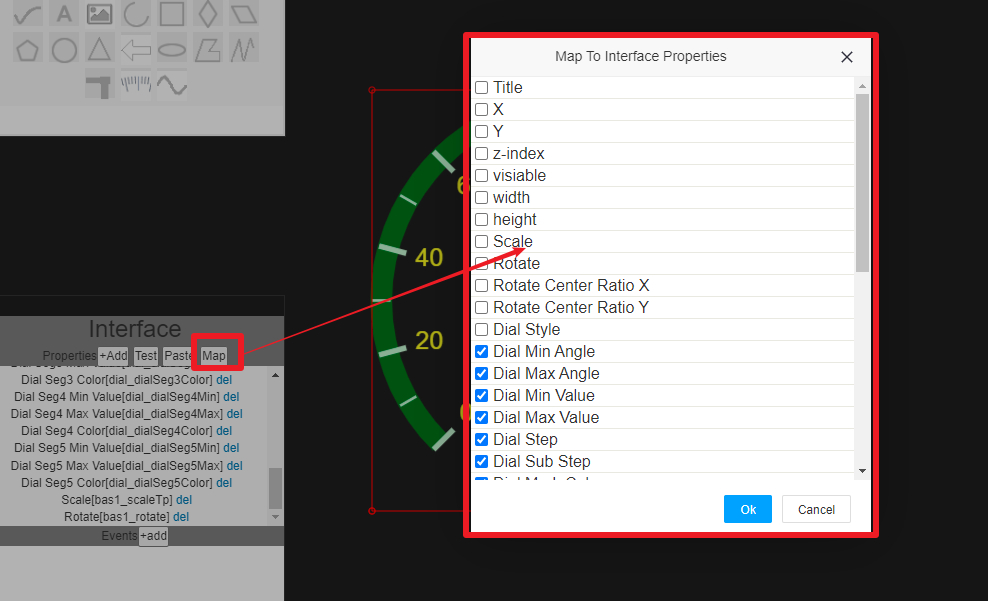

HMI(UI) Components(Controllers)
==


As previous documents mentioned, IOT-Tree provides HMI Library functionality for UI editing, and you can easily select UI components (controls) from it and drag them into the UI editing area. Moreover, the items in these libraries have their own special properties, and you only need to easily fill in a few parameters to allow a custom item to provide you with inherently complex functions. For example, after clicking on the Dial item below, you only need to provide simple Dial parameters to provide you with a rich Dial support.


In theory, we can directly use basic drawing toolbox without relying on the UI library to draw the desired HMI, and then use properties binding context tags to achieve animation effects, and use primitive events to achieve interaction. 

But this is not only inefficient, but also more prone to errors. From a practical perspective, it is recommended that different manufacturers or users can establish their own UI Components, which is not only convenient for themselves but also for others.

The UI Library management and editing provided by IOT-Tree is entirely based on online mode, and each item is currently only allowed to be implemented using basic drawing functions. The interdependence between the basic element, UI library, sub node UI, and UI is shown in the following figure:


From the dependency relationship above, it can be seen that basic elements are very important. The stronger the functionality of basic elements, the more convenient it will be to use the UI library and UI above. For example, the current instrument would be difficult to implement without the support of the basic element's scale (Dial). With this basic element, when defining instrument components, only three basic elements are needed. The basic elements of IOT-Tree will be continuously added according to future needs.


### 1 Add or modify a UI Component


In the IOT-Tree login management main page, we open window of a HMI library, select a category, and on the right, you can see all the components under that category. When you want to add a component, click the "Add Component Item" button above and enter a title in the pop-up input box; If you want to edit an existing element, simply move the mouse over this component and an editing button will appear inside. Click to enter the editing page.

In fact, a large part of your work is to find that a certain UI component's functionality is not sufficient and you want to add some functions based on the original one. You can right-click on the component, select "Copy" to copy, and then right-click in the blank list, select "Paste" to copy a component and enter editing. This not only preserves the original components, but also allows for the rapid addition of a new one based on the existing components.

Regardless of the above addition method, we ultimately need to enter the specific editing UI. For the convenience of introduction, we open an existing element for editing. As shown in the following figure:


This editing UI is similar to a regular UI editing in project, with a basic element toolbox on the left and a property and event management area for the selected item on the right. There is an interface area in the bottom left corner, which we will discuss later.


### 2 Making process of UI components


We will use an example to illustrate the process of making UI components.


#### 2.1 Drawing Components Using Basic Primitives


The items within the current UI component editing area can only be basic items (IOT-Tree may add other support in the future). For specific drawing operations of basic items in the editing area.

please refer to: :[HMI Editing instructions][hmi_edit]。


Let's take the UI component above as an example. Use the mouse to select the draw item inside and move the decomposition. You will find that this component only has three basic draw items, as shown in the following figure.


They are a triangle, a circle, and a dial. Among them, the pointer made of triangles has the following rotation related properties:

```
Rotate center Ratio X=0.5
Rotate center Ratio Y=1.0
```


This represents that the pointer is centered at the bottom as the center of rotation.

The overall drawing is very simple.


#### 2.2 Resources in UI Components


When making some UI components, sometimes for convenience, we use images (which may include multiple) as the basis, and the image will be switched according to your operation, so that we can easily create good animation effects. So, how does this image enter the component?

IOT-Tree introduces the concept of resources (Res), where each component can have its own resources. Let's take another 'emergency stop switch' component as an example. In the Basic library under the HMI Library, select Category "Switch" and you will find a red emergency stop switch. Open the editing UI for this component. In the newly opened editing window, click the button icon "resources" in the upper right corner to open the resource window for this component. As shown in the following figure:


It already contains the two images required for this component. You can upload the image files required for the component inside. In a resource list, name is important, as it not only needs to comply with the IOT-Tree naming qualification (starting from a-z A-Z), but also cannot be duplicated. When uploading a new resource file, you must first specify a name and then click the button to select File Upload Add. The added files can be used in the elements.

There is only one Img basic item inside this component. After selection, there is a DI Image classification in the properties, and the value used in the property "Image Res=stopu.png" is the name of the image file we have uploaded. You can also click the "..." button on the right side of the input box to pop up a resource dialog for selection.


In this example, we want to simulate a mouse click on this item to generate a press action - essentially, switching resource images on this Img item by changing the "Image Res" property. This requires the use of mouse click event handling. Because the click event processing must use JS scripts, and the scripts need to operate on the draw items, then some conditions are required. Please look down.


#### 2.2 The name of draw items in JS


n order to support manipulating draw item in JS scripts, we must set the Name property on the draw item that need to be manipulated (by default, newly added item's Name is empty). Once the name is set, it can be directly used in JS scripts.


Continuing with the example of the "emergency stop button" component, we select the Img draw item and fill in "sw" in the Name property. Then open the "Events" tab and click on the right side of the "on_mouse_down" event to open the JS editing dialog. The JS script filled in internally is shown in the following figure:


We can see a very simple logic. Every time we click on the sw item, the imgRes property of the this switches between two images, which is so simple. Among them, sw is the name of the Img item within the current component, which becomes the object of this element - it can be used directly.


<font color=green>However, sw is an Img object, how does the internal member 'sw.imgRes' know?</font>


This is important, "sw" is a JS object, and the properties of the draw item can be viewed at any time. However, in the properties list on the right, only the title of the property is displayed on the left. Our JS script must use the intrinsic name of the property. This name can be viewed in the property list -<font color=red>You just need to move the mouse over the property name without moving it, and the intrinsic variable name of the property will be tipped</font>, as shown in the following figure:


In running time,with this mouse event and handling JS script, you will find that every time you click on this Img item, the internal displayed image will change, looking like you pressed the "emergency stop switch".


对于JS脚本的详细信息，请参考[JS Script Usage][js_u]

#### 2.3 Component Property Interface

##### 2.3.1 Overall Description


Our UI component will eventually be referenced by a UI node in the project, and each instance will become an internal element of the UI. In order to enhance the capabilities of a component, we can expose its special properties to the outside world. These properties can be edited and adjusted in the outter UI node to generate more flexible adaptability - this is called the property interface by IOT-Tree (in the Interface toolbox at the bottom left of the editing area).

In the "emergency stop button" component above, there is no definition, and when referenced in a UI of a project, the special properties related to the component are empty. In the dashboard component above, we have defined many property interfaces, which become special properties of the component when referenced:

The following are the differences between the two components being referenced in the project UI:


<table>
  <tr>
    <td>Properties interface in component</td>
    <td></td>
    <td>Properties in project</td>
  </tr>
  <tr>
    <td></td>
    <td>→→→</td>
    <td></td>
  </tr>

  <tr>
    <td></td>
    <td>→→→</td>
    <td></td>
  </tr>
</table>


It is obvious that the dashboard provides property interfaces to external users, allowing them to set various parameters of the dashboard according to their needs, such as range, scale division, color, and so on. Only such dashboard components can truly be practical (without these parameter adjustment support, this component would have no meaning for reuse).


##### 2.3.2 Property interface definition


We can add or edit external property interfaces of components in the Interface toolbox, simply click the "Add" button in the interface toolbox or click "edit" in a certain interface. The following dialog pops up:


Among them, Name is the name of this property interface, which must comply with the IOT-Tree naming qualification (starting from a-z A-Z), and Value Type represents the property value type. The 'Editor assist' is used to indicate special support for referenced property values, such as color.

Next are the two most important inputs: OnGetJS and OnSetJS. They respectively represent the JS functions to be run when the specific instance generated by this component is referenced by a UI node, and the relevant properties are read or write.

From the above figure, we can see that both functions are anonymous JS functions, with a $this parameter representing the specific instance object referenced in the UI node. For OnSetJS, there is also a $value representing the value entered when the property is set.

The "Value" property interface shown in the above figure is very typical. Let's analyze the JS code inside and refer to it for your own custom components in the future:


**OnGetJS**
```
var pv = $this["-pin_val-"];


//This code looks up the current value of the pointer in this instance, and we use a very strange property name "-pin_val-" to prevent conflicts with members that already exist in the JS object $this.

```

```
 if(pv==null||pv==undefined)
    return dial.dialValMin ;
 return pv;


//If this "pv" value does not exist, we will return the minimum value of the scale, where "dial" is the Name property of the internal "Dial" item of the component. If present, return this value.

```
**OnSetJS**
```

//Set the input value for the current instance object and assign it to the variable "pv"
var pv = $this["-pin_val-"]=$value; 


//Subsequently, adjust the rotation angle of the internal pointer based on this variable, where "pin" is the Name property of the internal pointer draw item, and rotate can be displayed by hovering the mouse over the property title to display the internal name.

  if(pv==null||pv==undefined||pv==""||pv<dial.dialValMin)
    pv = dial.dialValMin;
  if(pv>dial.dialValMax)
    pv = dial.dialValMax;
  var ha = dial.dialAngMax-dial.dialAngMin;
  var hv = dial.dialValMax-dial.dialValMin;
  var ang = (pv-dial.dialValMin)/hv*ha+dial.dialAngMin;
  pin.rotate = (ang-180)*Math.PI/180;
```
**JS Context**


If you are unsure of the context members that can be directly referenced within JS, you can double-click on the JS editing area with the mouse. On the left side of the pop-up JS editing dialog, you can see that the current Client JS can support content. As shown in the following figure:





It is obvious that when we select this component item in the UI node editing UI and display its properties, the OnGetJS function will be triggered. When entering content in the property input box, the OnSetJS function will be triggered. You will see that the pointer will rotate based on your input.

Please note that the above JS code is run on the client side.


For detailed about JS scripts, please refer to[JS Script Usage][js_u]

##### 2.3.3 Property Interface Mapping


In the above property interface definition, we can define the external property support of UI components when they are used by implementing OnGetJS and OnSetJS. This implementation function is very flexible and powerful, but it is relatively complex. In many cases, we only need the external environment to directly modify a certain property of an internal Draw Item, without the need to use JS scripts for transformation - that is, we want to directly open a sub draw item property inside the UI component as an property interface.

This is achieved through "Property interface mapping".

In the editing area, select a certain draw item that requires open properties, and then click the "Map" button in the interface toolbox in the bottom left corner. In the pop-up dialog, you can see a list of all properties of the current draw item. You only need to check the properties you want to open to the public. As shown in the following figure:





After clicking "OK", the interface in the bottom left corner will display the open property content you checked. You can see that the name of each interface is automatically prefixed with a unique combination.


#### 2.4 Component Event Interface Definition


IOT-Tree also plans UI component event interfaces. When a component is complex internally and contains more interaction events, component events need to be provided. In most cases, it is not necessary.

This content is still under planning, please look forward to


TODO


### 3 Summary


The above provides a complete explanation of the overall process of customizing HMI(UI) components for IOT-Tree. It can be found that you only need a little knowledge of JS to easily create your own components.

IOT-Tree comes with some built-in components, which you can refer to for research. It is recommended that when creating your own similar components, you directly copy them to your library, and then make modifications and adjustments.


[js_u]:../js/index.md
[hmi_edit]:./hmi_edit.md
