HMI Components(Controllers)
==

前面的资料已经说明了，IOT-Tree针对UI编辑，专门提供了图库(HMI Library)功能，并且你可以很方便的从中选择图元组件(控件)，拖拽到UI编辑区中。并且，这些图库中的图元，有自己特殊的属性，你只需要轻松的填写几个参数，就可以让一个定制图元为你提供内在复杂功能。例如，下面的仪表盘图元，你点击选择之后，只需要提供简单的表盘参数，就可以给你一个功能丰富的仪表支持。

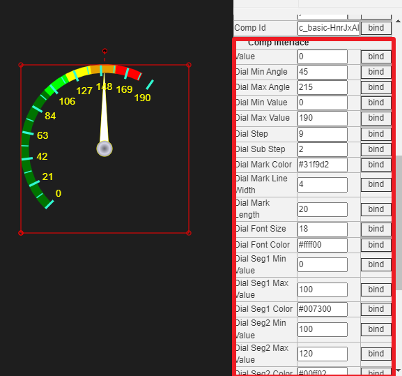

理论上，我们完全可以不依赖图元库，直接用基本绘图支持，画出我们想要的画面，然后通过属性绑定上下文标签实现动画效果，通过图元事件实现图元交互。但这样不仅效率低下，而且也更容易出错。从实际出发，建议不同的厂商或用户，可以建立自己的图元库，不仅方便自己也方便他人。

IOT-Tree提供的图库(HMI Library)管理和编辑，完全基于在线方式，每个图元目前只允许使用基本绘图功能实现。基础图元、图元库、子节点UI和UI相互依赖关系如下图：

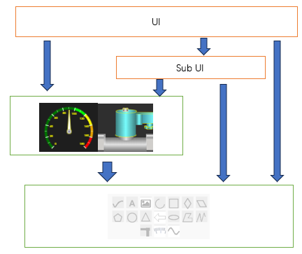

从上面依赖关系可以看出，基础图元非常重要，如果基础图元功能越强，上面的图元库和UI就会使用起来越方便。如：当前的仪表盘如果没有基础图元的刻度(Dial)的支持，实现起来会很困难。而有了这个基础图元，定义仪表组件的时候，只需要三个基础图元就可以完成。IOT-Tree的基础图元会根据未来需要不断添加，敬请期待。

### 1 新增或修改某个图元库组件

在IOT-Tree登录管理主界面中，我们打开某个库的管理窗口，选择某个分类，在右边就可以看到这个分类下的所有图元组件。当你想新增一个组件时，点击上方"Add Component Item"按钮，在弹出的输入框输入一个标题即可；如果要编辑一个现有图元，只需要移动鼠标到这个组件上方，内部就会出现编辑操作按钮，点击即可进入编辑界面。

事实上，你有很大一部分工作是发现某个组件功能有点不够使用，想在原来的基础之上再添加一些功能，那么你可以鼠标右键这个组件，选择"Copy"复制，然后在列表空白出鼠标右键，选择"Paste"，你就复制了一个组件，然后进入编辑即可。这样既可以保留原有组件，又可以在现有组件基础上快速新增一个新的。

不管以上哪种添加方式，我们最终都要进入具体的编辑界面。为了方便介绍，我们打开一个现有的图元进行编辑。如下图：

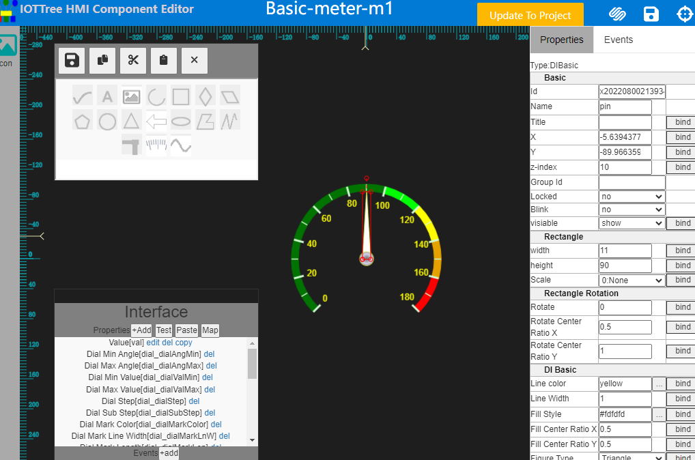

这个编辑界面和普通的UI节点类似，左边有基础图元工具箱，右边是选中图元的属性和事件管理区。左下角有个接口Interface区，我们会在后续展开讨论。

### 2 图元组件制作过程

我们就以例子作为说明图元组件制作过程。

#### 2.1 使用基础图元绘制组件

当前图元组件编辑区内部的图元只能是基础图元(IOT-Tree后续可能会新增其他支持)。具体的基础图元在编辑区的绘制操作请参考:[HMI Editing instructions][hmi_edit]。

我们还是以上面的仪表盘图元为例，使用鼠标选中里面的图元，并移动分解，你会发现这个仪表盘只有三个基础图元，如下图。

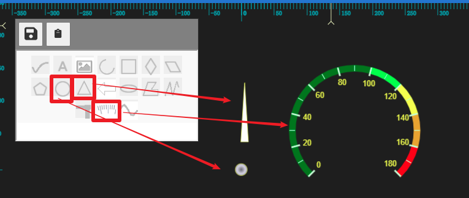

他们分别是三角形(Triangle)、圆形(Circle)和刻度盘(Dial)。其中，三角形制作的指针，旋转相关属性

```
Rotate center Ratio X=0.5
Rotate center Ratio Y=1.0
```
这代表了指针以底部中心作为旋转中心。

整体绘制非常简单。

#### 2.2 组件内部资源

我们在制作一些图元组件时，有时候为了方便，使用图片（可能含多个）作为基础，并且此图片会根据你的操作进行切换，这样就能很轻易的做出很好的动画效果。那么，这个图片如何进入组件呢？

IOT-Tree引入了一个资源(Res)的概念，每个组件可以有自己的资源。我们还是以另一个“急停开关”组件作为例子。在HMI Library下面的Basic库中，选择分类Switch,你好发现有个红色的急停开开关，打开此组件的编辑画面。在新打开的编辑窗口中，右上角点击按钮图标"resources",弹出此组件的资源窗口。如下图：

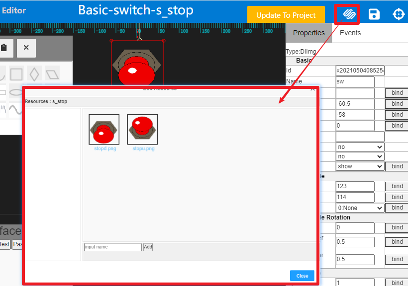

里面已经包含了此组件需要的两张图片，你可以在里面上传组件需要的图片文件。在一个资源列表中，名称定义很重要，不仅需要符合IOT-Tree命名限定（a-z A-Z起始），同时不能重复。在上传一个新的资源文件时必须先指定名称，然后点击按钮选择文件上传添加。添加的文件就可以在图元中使用了。

本组件内部只有一个Img基础图元，选择之后，属性里面有个DI Image分类，里面的属性Image Res=stopu.png使用的值就是我们已经上传的图片文件名称。你也可以点击输入框右边的"..."按钮，弹出资源窗口进行选择。

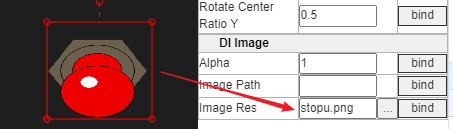

本例子我们要模拟出鼠标点击此图元产生按压动作——本质就是就是在这个Img图元上，通过改变Image Res属性对资源图片进行切换。这个就需要使用鼠标点击事件处理。因为点击事件处理必须使用JS脚本，并且脚本需要对图元进行操作，那么就需要一些条件。请往下看。

#### 2.2 图元名称在JS脚本中的作用

为了能够支持在JS脚本中操作图元，我们必须对需要被操作的图元设定Name属性(缺省情况下编辑区新增的图元是没有Name属性的)。一旦设定了名称，那么在JS脚本中就可以直接使用了。

**请注意:由于组件自身的编辑只在显示端，内部的图元操作就是Client端的JS脚本**

还是接着这个急停按钮组件的例子，我们选中这个Img图元，在Name属性填写"sw"。然后打开"Events选项卡，在"on_mouse_down"这个事件右边点击打开JS编辑窗口，内部填写的JS脚本如下图：

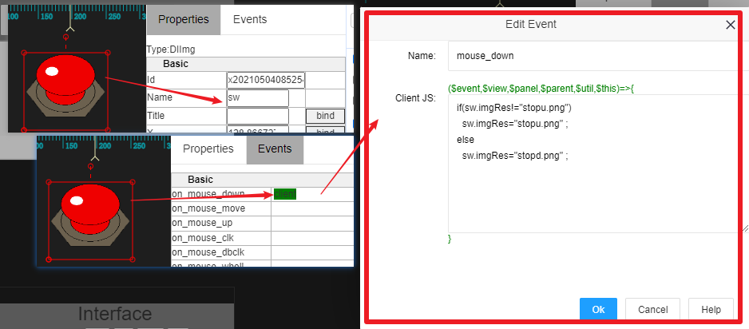

我们可以看到一个很简单的逻辑，每次点击sw图元的imgRes属性在两个图片之间切换，就这么简单。其中，sw就是当前组件内部这个Img图元的名称，在JS脚本中直接就会成为此图元的对象——可以直接使用。

<font color=green>不过，sw是个Img图元对象，内部"sw.imgRes"这个成员是怎么知道的呢？</font>

这个很重要，sw是个图元对象，而图元的属性我们可以随时查看，但在右边的属性列表中，左边只展示了属性的标题(Title),我们JS脚本必须使用属性的内在名称。这个名称可以在属性列表中查看——<font color=red>你只需要鼠标移动到属性名称上方不动，就会显示出属性的内在变量名称</font>，如下图：

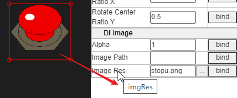

有了这个鼠标事件和处理脚本，你会发现，每次你点击这个Img图元，内部显示的图片就会变化，看着像是你按动了这个急停开关。

对于JS脚本的详细信息，请参考[JS Script Usage][js_u]

#### 2.3 组件属性接口

##### 2.3.1 属性接口总体说明

我们的组件最终会被项目中某个UI节点引用，并且每个实例就成为了这个UI的内部一个图元。为了提升组件的能力，我们可以使某个组件对外暴露出自己特殊的属性，这些属性可以在UI节点中被编辑调整，以产生更灵活的适应能力——这个被IOT-Tree成为属性接口（在编辑区左下方Interface子窗口中）。

在上面的急停按钮组件中，没有任何定义，在项目某个UI中引用时，和组件相关的特殊属性就是空的。而在上面的仪表盘组件中，我们定义了很多属性接口，在被引用时这些属性接口都成为了组件的特殊属性：

以下就是两个组件在项目UI中被引用的差别：

<table>
  <tr>
    <td>Properties interface in component</td>
    <td></td>
    <td>Properties in project</td>
  </tr>
  <tr>
    <td>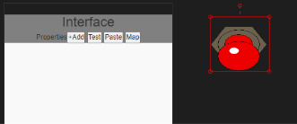</td>
    <td>→→→</td>
    <td>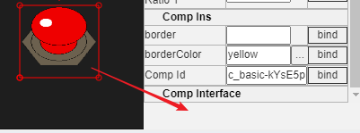</td>
  </tr>

  <tr>
    <td>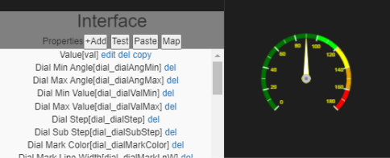</td>
    <td>→→→</td>
    <td>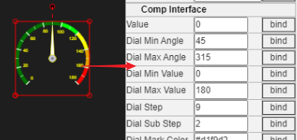</td>
  </tr>
</table>


很明显，仪表盘通过对外提供了属性接口，可以使得外界使用者能够根据自己的需要设定仪表盘的各种参数，如量程、刻度划分、颜色等等。这样的仪表盘组件才能够真正实用（如果没有这些参数调整支持，这个组件也就没有重复使用的意义了）。

##### 2.3.2 属性接口定义

我们可以在接口管理子窗口中新增或编辑组件对外的属性接口，只需要点击Interface窗口中的"Add"按钮或在某个接口中，点击"edit"。弹出如下窗口：

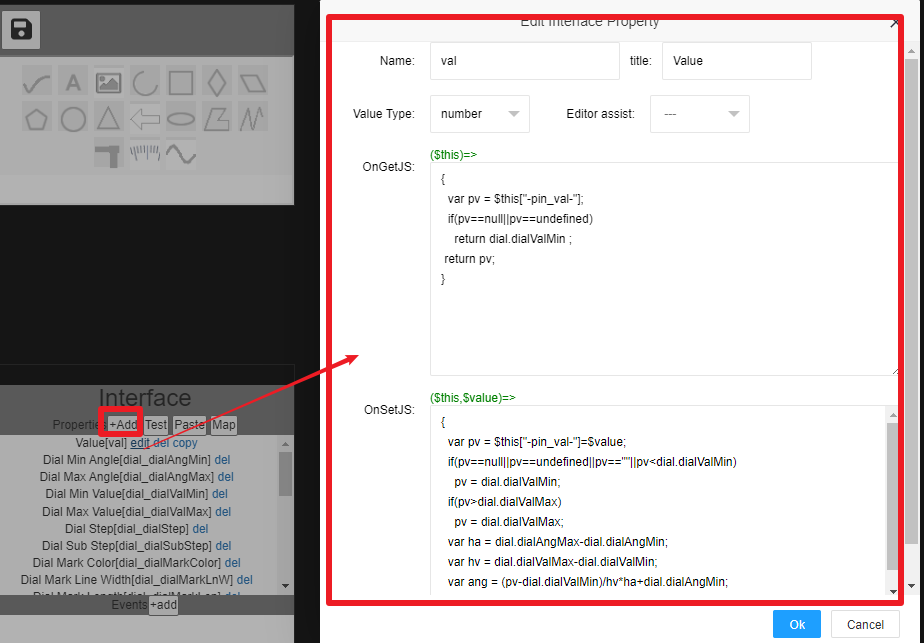

其中，Name就是此属性接口名称，必须符合IOT-Tree命名限定(a-z A-Z起始),Value Type代表属性值类型。Editor assist用来告诉引用的属性列表，此值可以选择填写(如颜色等)。

接下来是最重要的两个输入： OnGetJS ,OnSetJS。他们分别代表此组件被某个UI节点引用时，产生的具体实例，在此属性被读取或设置数据时，要运行的JS函数。

从上图我们看到，两个函数都是匿名JS函数，有个$this参数代表在UI节点引用具体的实例对象，对于OnSetJS还有一个$value代表属性被设置的时候输入的值。

上图的这个Value属性接口很典型，我们分析一下里面的JS代码，在后续你的自定义组件就可以自己参考了：

**OnGetJS**
```
var pv = $this["-pin_val-"];

//此代码在这个实例中查找指针当前值，我们使用了一个很奇怪的属性名称"-pin_val-",这是为了防止和$this这个JS对象已经存在的成员冲突。
```

```
 if(pv==null||pv==undefined)
    return dial.dialValMin ;
 return pv;
这个pv值如果不存在，这时候我们就返回刻度盘的最小值，其中dial是组件内部刻度盘图元的Name属性。如果存在，则返回此值即可。
```
**OnSetJS**
```
var pv = $this["-pin_val-"]=$value; //对当前组件图元实例进行输入值的设置，并赋值给pv这个变量

//后续根据这个变量调整内部指针的旋转角度，其中pin是内部指针图元的Name属性，rotate可以用鼠标在属性标题上方不动，就可以显示出来的内部名称。
  if(pv==null||pv==undefined||pv==""||pv<dial.dialValMin)
    pv = dial.dialValMin;
  if(pv>dial.dialValMax)
    pv = dial.dialValMax;
  var ha = dial.dialAngMax-dial.dialAngMin;
  var hv = dial.dialValMax-dial.dialValMin;
  var ang = (pv-dial.dialValMin)/hv*ha+dial.dialAngMin;
  pin.rotate = (ang-180)*Math.PI/180;
```

很明显，当在UI节点编辑界面中，我们选中这个组件图元，展示属性的时候就会触发OnGetJS函数。而在属性输入框输入内容时，就会触发OnSetJS这个函数。你会看到指针会根据你的输入做旋转动作。

请注意：以上的JS代码都是Client端运行的。

对于JS脚本的详细信息，请参考[JS Script Usage][js_u]

#### 2.4 组件事件接口定义

IOT-Tree也规划了组件事件接口。当一个组件内部很复杂，包含更多交互事件时，才需要提供组件事件。大多数情况UI是不需要的。

本内容孩子规划中，敬请期待...

TODO


### 3 总结

以上基本完整的讲述了IOT-Tree自定义HMI组件的整体过程，可以发现你只需要很少的JS知识，就可以很容易地制作你自己的组件。

IOT-Tree内部自带了一些组件，你可以参考研究，并且建议你新建自己类似的组件时，直接复制到你的库中，然后修改调整。

[js_u]:../js/index.md
[hmi_edit]:./hmi_edit.md
