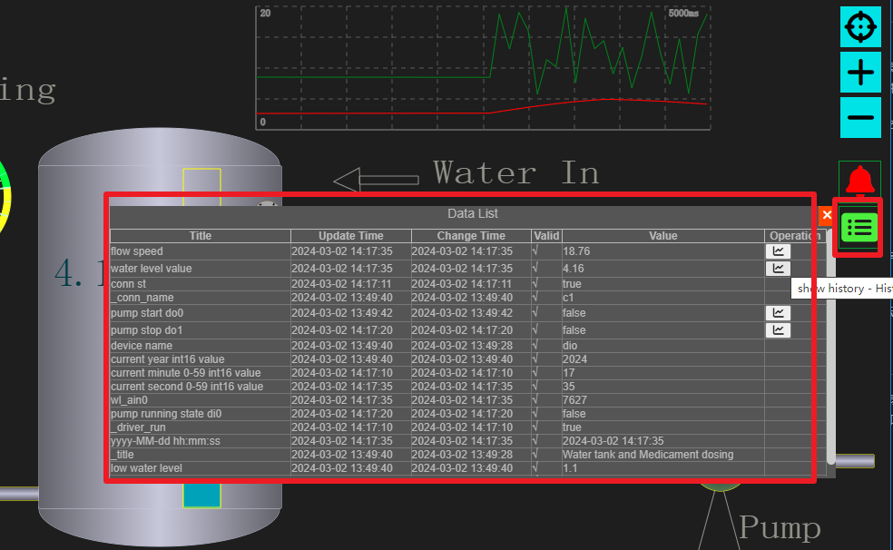
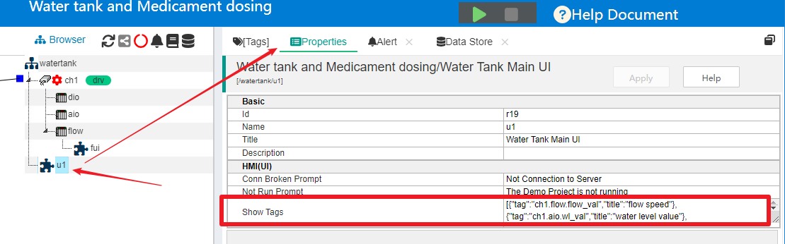
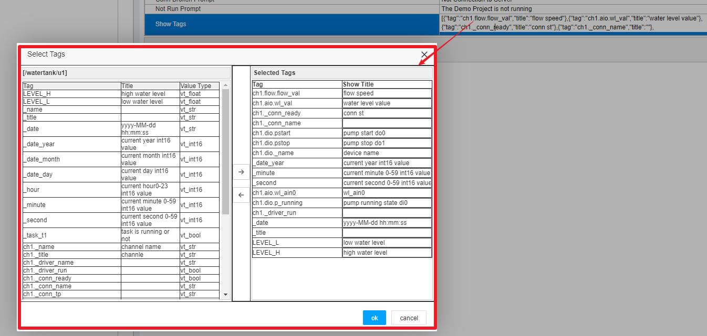
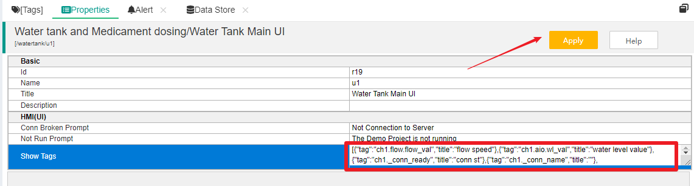
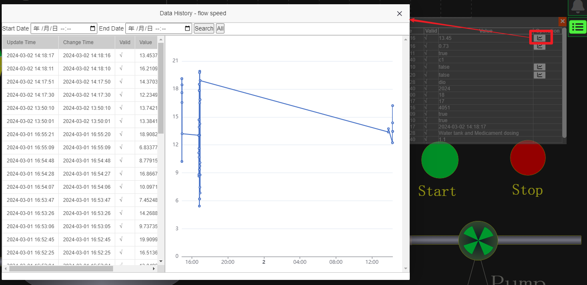

HMI Client's data list
==

If you have completed a project using IOT Tree Server and are ready to deliver it to end users. So the most commonly used monitoring UI by end users is the one you configure for them. If you provide the project management end of IOT-Tree Server directly to end users, it is not a good choice - after all, it is too professional and not secure.

In addition to the elements and bound data that you edit online, the end user also needs the following content for the monitoring UI:

1) Users are required to be able to visually view specific data in the on-site monitoring UI, which may be in large quantities and cannot all be displayed in your configuration.

2) Users need to record and store certain data tags, and can view historical records in the front-end monitoring UI.

Starting from version 1.0.4, the IOT-Tree Server supports data storage and historical data recording functions. Please refer to:<a href="doc/main/store.md" target="main">&nbsp;&nbsp;&nbsp; Data Store</a>

For this reason, IOT-Tree also provides support for tag data lists and historical data display for the front-end of monitoring UI.

## 1 Display of front-end tag data

In order to enable HMI(UI) to support tag data lists at runtime, we have added a list window icon to the front-end monitoring UI, which can be clicked to display sub windows of the data list. As shown in the following figure:

Among them, if a display data has historical stored data, there will be a corresponding display button on the right.

It is obvious that we do not need or allow all tags data in the project to be displayed in this sub window. This raises a question, how can we conveniently and quickly set the tags  that a monitoring UI needs to display?

After comprehensive consideration, we provide setting support in the project HMI node properties.

## 2 Project HMI node configuration in admin

In the project management page, we click to select a certain HMI (UI) node, and then select "Properties" in the main content area on the right. You can see that in the node's property editing list, there is a "Show Tags" content. As shown in the following figure:

Click on the editing area on the right side of this list item, and a selection window will pop up:

You can see that in the pop-up window, on the left is all the tags in the context of this UI node, and on the right is the selected tags. And you can reset the display title for the selected tags. In the middle are the select and deselect buttons.

You just need to select, modify the title, and then click "OK" to complete the data item content in the runtime data display sub window of this UI screen. Please note that click the "Apply" button above the attribute list to save.

## 3 Final effect

Through the above simple setup process, your corresponding monitoring UI can directly display real-time data during runtime. If a tag is configured for historical storage by storage management. So you can also click to open and view historical data.

