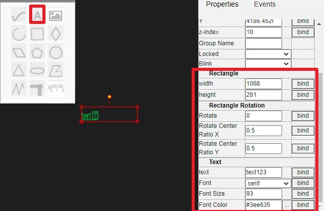

HMI Editing instructions
==

当我们在某个HMI节点鼠标右键，选择"Edit",就可以在主内容区新增一个界面编辑选项卡。如下图：

编辑界面看似比较复杂，其主要部分也就左中右三部分，左边竖条是图元库（含树中之节点、图元库、背景元素等）中间带标尺的是编辑区域(含基本图元飘窗)，右边是操作属性/事件区域。其中，右边操作属性区可以隐藏，尽可能给编辑区域使用。如果感觉整个编辑区域不够，还可以点击选项卡右上角最大化图标，可以使得选项卡充满整个窗口。

## 1 编辑界面基本操作

### 1.1 Stepless zoom

编辑区域使用无极缩放方式，并且配合鼠标可以快速查看整体和局部。在编辑区域左上方有竖排列三个按钮，它们分别为"自适应展示"、"放大"和"缩小"。

你可以尝试点击可以发现，点击"自适应展示"按钮，编辑区内的所有内容以充满整个区域，这个中心点和放大倍数是整体展示最理想的状态。而点击"放大"和"缩小",则图像以编辑区中心点为中心进行放大缩小。

移动鼠标到编辑区的某个位置，然后转动滚轮，你会发现图像会根据你的滚轮不同方向进行放大缩小，并且放大缩小动作以当前鼠标的位置为中心点。

### 1.2 Right mouse button(Overall roaming)

Right click the picture without releasing it. When moving, you can roam the picture as a whole.

### 1.3 鼠标左键(选择和移动)

鼠标左键功能主要是选择图元和移动图元，IOT-Tree规定，图元的移动必须是选择之后的图元——也即是，如果要移动一个或多个图元，必须先选中，然后在选中的图元之上再次移动操作才会起作用。

#### 1.3.1 选择图元

_单选图元_

鼠标移动到某个图元上方，在没有任何移动的情况下点击左键并释放左键，释放之后就会发现图元被选中。

如果某个位置有多个图元叠加，则不要移动鼠标，再次鼠标左键并释放，你会发现被选择的图元会在重叠的图元中切换。

_多选图元_

如果你要在一个小区域内选择多个图元，那么只需要按下鼠标左键不松开，然后移动鼠标。此时你会发现有个虚线构成的矩形选择区域出现，并随着你的鼠标位置不断变化尺寸。你只需要使这个虚线选择框覆盖到对应的多个图元，然后松开左键，就可以把多个图元同时选中了。

>注：被选中的图元都会有个红色的矩形边框出现

如果你要取消选中的图元，只需要鼠标在没有图元的区域左键点击一下即可。

#### 1.3.2 移动选中图元

未选中的图元是不可移动的，所以在通过单选或多选之后，你就可以移动选中的这些图元了。此时，鼠标一定要在被选中的图元上方，按下左键不要松开，然后移动鼠标，你会发现图元会跟随鼠标移动。当图元到达你需要的位置之后，松开鼠标左键就完成了移动操作。

#### 1.3.3 修改选中图元尺寸

一些图元是支持尺寸大小通过鼠标调整的，前提是单独选中此图元——选中的图元会显示出矩形边界框。此时，如果此图元可以被改变大小尺寸，把鼠标移到边界线上，你就会发现鼠标标记会变成可调整的上下或左右的箭头。如果鼠标移到编辑框的角上，就会变成移动此点（含两个方向）的箭头。

此时，你按下鼠标左键不松开，移动就可以改变图元的尺寸。

#### 1.3.4 旋转选中图元

一些图元支持旋转，前提是单独选中此图元——选中的图元会显示出矩形边界框，并且在边框上方会出现一个支持旋转的锚点。鼠标移动到这个位置，会变成十字形状。此时，你按下鼠标左键不松开，移动就可以调整图元的旋转角度。

### 1.4 Keyboard operation instructions

#### 1.4.1 Copy paste

When selecting an drawitem, use the keyboard combination Ctrl + C to copy the currently selected element.

Then, use the keyboard combination Ctrl + V to paste the copied item at the mouse position in the drawing area. When you move the mouse, the copied element moves with the mouse. You can move the mouse to the appropriate position and click the left mouse button to place it.

If you want to discard the paste, right-click.

IOT tree server supports copy and paste across drawing areas.

#### 1.4.2 Delete operation

Select an drawitem and press del to delete the drawitem

#### 1.4.3 rollback

TODO

## 2 Edit property panel

On the right side of the drawing area is the properties editing area. When the mouse selects an element, the property area displays all the properties of the element. As shown below

### 2.1 Basic properties

All items have basic properties, as shown in the above figure. The basic properties include ID, name, title, coordinate position x, y, stack height Z-index. Locked or not.

The ID is automatically generated by the system, and the name must be unique in the UI editing area and meet the name naming qualification. The coordinate position is the coordinate of the upper left corner of this entity in the drawing area (Cartesian coordinate system).

As the stacking height of items, Z-index is similar to Z-index in CSS. The higher the value, the later the painting order. When an item overlaps with other items, the larger the display effect Z-index is, the more it is displayed on the following items.

If the locked property is set to yes, the item is locked in the drawing area. The mouse cannot drag this. And when the mouse selects multiple items in a rectangular area, the locked items will not be selected. However, you can make a single selection of the locked element by clicking the mouse. At this time, you can also modify or unlock the properties.

These basic properties are part of the commons, please refer to for more details:[Common properties][hmi_props]

[hmi_props]:./hmi_props.md

### 2.2 Base drawitems and properties

Basic primitives include polyline, polygon, circle, ellipse, arc, text, picture, pipe (not implemented), Bezier curve, etc. they all have their own properties and characteristics.

In the upper left corner of the drawing area, there is a basic item toolbar. Click one of the items to select. When the mouse cursor moves to the back area, it will become a cross. Click and move the left mouse button to start drawing the corresponding basic item. When you release the left key, the currently created item is selected by default. You can then make adjustments and attribute modifications

#### 2.2.1 Polyline editing and properties

Click the toolbar , then left click in the drawing area and move the drawing polyline. When the polyline drawing is completed, click the right mouse button to finish the drawing operation.

When the polyline is selected, the intersection of each line segment can be dragged with the mouse to support the adjustment and modification of the polyline.

In the attribute area, you can modify the line color and line width of the line. As shown below:

#### 2.2.2 Polygon editing and properties

Click the toolbar , then left click in the drawing area and move the drawing polygon. When the polygon drawing is completed, right-click to finish the drawing operation.

When a polygon is selected, the intersection of each line segment can be dragged with the mouse to support the adjustment and modification of the polygon.

In the property area, you can modify the line color and line width of the line.

At the same time, the polygon belongs to the surface graph, and the fill style can be set, as shown in the following figure:

#### 2.2.3 Text editing and properties

Click the toolbar , and then click place text box in the drawing area.

The text box itself is a rectangular box. When selected, you can use the mouse to adjust the size and other basic operations.

Text attributes include rectangle size, rotation size, text attribute, font and font color. As shown below:

#### 2.2.4 Picture added and properties

Click the toolbar , and then click in the drawing area to draw a rectangular area, which is also the picture display area.

The picture area itself is a rectangular box. When selected, you can use the mouse to adjust the size and other basic operations.

Text attributes include rectangle size, rotation size, and picture path or picture resources. As shown below:

For project resources, please refer to [quick understanding of associated resources in IOT tree][qn_res]

## 3 子图图元、控件图元

IOT-Tree项目树中，顶层的UI可以引用底层的子图UI(子图图元)，也可以引用图元库中的控件。对于图元库中的控件管理相关内容，请参考[图元库][hmi_comp]

### 3.1 子图图元

为了能够直观说明子图图元在高层UI节点的引用，我们打开IOT-Tree内部自带的演示项目[Water tank and Medicament dosing][case_auto]，在 ch1/flow这个设备节点上，鼠标右键新增一个UI节点（鼠标右键选择New HMI，填写名称"fui")。然后，鼠标右键此节点，选择"Edit UI",并简单编辑内部内容，如下图：

此时，在根节点下面的u1节点，就可以引用此子图图元了。鼠标右键u1节点，选择"Edit UI"打开UI编辑选项卡。在左上角点击按钮"Context Sub-HMI"时，会发现滑出一个选择窗口，可以看到里面包含了"/ch1/flow/fui"这个子画面。

鼠标点中此项，拖拽到中间的编辑区域，松开鼠标之后，你就可以看到子图元被添加到画面中。

可以看出，如果设备定义以及包含了设备自身的一些UI，在项目中被引用时，能够很大的方便项目顶层界面的编辑配置。

### 3.2 控件库引用

同理，我们接着前面这个演示项目u1编辑，点击左边"Components"按钮，就会滑出一个选择窗口，里面包含了本系统实例图元库(HMI Components)的内容：

此窗口左边是一颗二级树——库/分类，点击选择某个库下面的分类，右边就会列出所有的组件（控件）。鼠标选中需要的控件，拖拽到编辑区并释放，你就会看到控件图元出现在编辑区。

### 3.3 背景引用

接着前面这个演示项目u1编辑，点击左边"Background"按钮，就会滑出一个选择窗口，里面包含了一些画面背景图片：

点击选择某个背景，拖拽到编辑区并释放，你就会看到背景出现在编辑区。这种背景图片一般用来设置一定比例尺寸的画面场景，以满足不同分辨率的显示设备。

>注意：请及时保存你在画面编辑的工作，保存的时候点击右边属性区域上方的保存按钮
>

以上就是基本的UI节点编辑操作功能。

你如愿要继续了解UI画面如何使用上下文中的数据进行动态展示，请继续查看[Properties binding and event handling][bind_evt]

[bind_evt]:./hmi_bind_evt.md
[case_auto]:../case/case_auto.md
[hmi_comp]: ./hmi_comp.md
[qn_res]: ./quick_know_res.md
