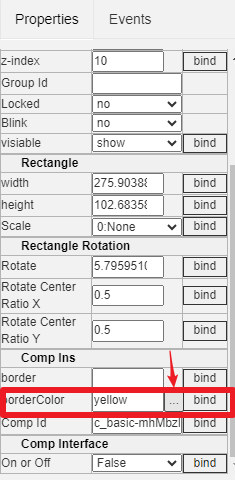

Draw Item Common properties
==

The draw item in the IOT-Tree HMI(UI) have many common properties, such as color, fill, and so on. These properties will have the same configuration meaning. This article provides a detailed explanation of these common properties.

### 1 General Description of Property Box

In the UI editing area, when a single draw item is selected, the content of the properties box on the right will change with the current selection. You can modify and adjust the properties here.

As shown in the above figure, the properties list box will have one level of grouping, with each grouping representing a specific aspect of the property. For example, "Basic" represents the basic properties that all items have, "Rectangle" represents that the draw item has a rectangular bounding box and can have dimensions, "Rectangle Rotation" represents that the draw item not only has bounding boxes, but also rotation parameter properties, and so on.

Each property has an name and value (if this value can be selected for input, there is also a select square button next to it).

If the value of a certain property supports dynamic modification during runtime, there will be a "bind" button at the far right. With this button, you can open the context data item (tags list) corresponding to this UI, select the specific Tag inside and bind it to this property. Thus, associations can be established between draw items and contextual data through property binding, and we can see that most of the items' property can be bound. So, UI supports rich and colorful changes at runtime.

[hmi_bind_evt]:./hmi_bind_evt.md

### 2 Basic Properties

#### 2.1 Id,Name,Title

The "Id" property is a unique value within the draw item and is automatically generated by the system. It is read-only and cannot be modified.

The "Name" property must comply with the naming restrictions specified by IOT-Tree ( starting with A-Z, a-z, and subsequent characters can only be A-Z, a-z, _). This property is generally not required. If you want to "Client JS" support modifying this draw item, you can set a unique Name. Then "Client JS" can directly use this Name variable as "Draw Item Object".

"Title" is the title of the draw item and can be left blank.

#### 2.2 X,Y,z-index

These three properties represent the x, y coordinates and stacking height of the draw item in the drawing area. Among them, the Y coordinate arrow is downward, and the value increases as it goes down.

The higher the "z-index" value, the higher the stack. When multiple draw items overlap, the lower items are rendered first.

#### 2.3 Locked

If draw item locked=yes, then it is locked and cannot be moved with the mouse. Moreover, locked items cannot be selected during multiple selection operations. If the mouse clicks on an unlocked overlapping draw items during single selection, only unlocked items can be selected. If you want to select a locked one, it must be in a position where there are no overlapping items,and do single selection.

#### 2.4 Blink

Draw item is blink or not

#### 2.5 visiable

When this property value is hidden, it will be hidden at runtime.

### 3 Rectangle Properties

Draw items have rectangular boundaries that can change size and drawing direction

#### 3.1 width,height

Draw item width and height properties. If you modify the size with the mouse, you will see that these properties will be adjusted accordingly. Conversely, if you manually input the dimensions, you can also see the size changes of the corresponding items in the drawing area.

#### 3.2 Scale

You can choose to flip draw item left to right or up and down.

### 4 Rectangle Rotation Properties

"Rotation" represents the rotation angle, in radians.

By default, the rotation takes the center point of the bounding rectangle as the rotation center. If you want to change the rotation center point, adjust the following two attributes: "Rotate Center Ratio X, Rotate Center Ratio Y". These two attributes are the ratio of the position of the center point within the rectangle relative to the X and Y directions, with default values (0.5,0.5) representing the center position. If you change this to (0.5,1.0), it means that the center point is located below the boundary of the draw item. For example, if you want to implement a gauge pointer, you should set the rotation center point this way.

### Others

The above are common properties that most draws item will support, and for specific items, there are also some special properties of their own. This is explained in the relevant documents.

