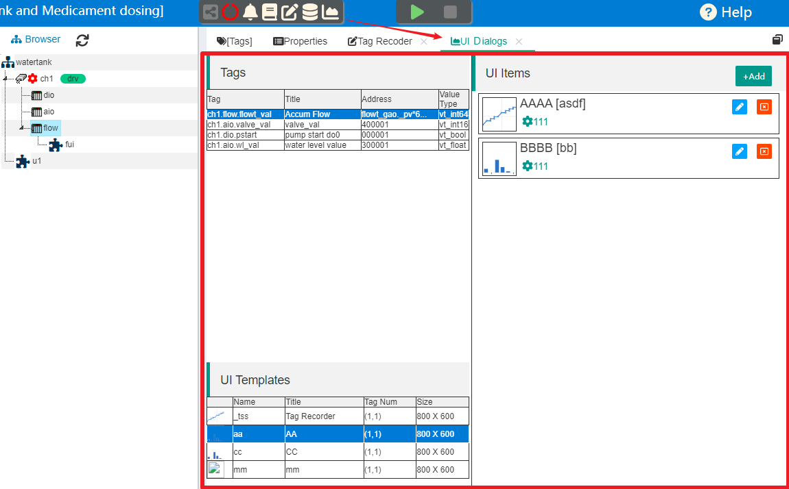
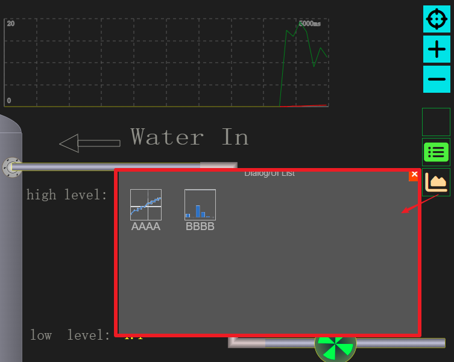
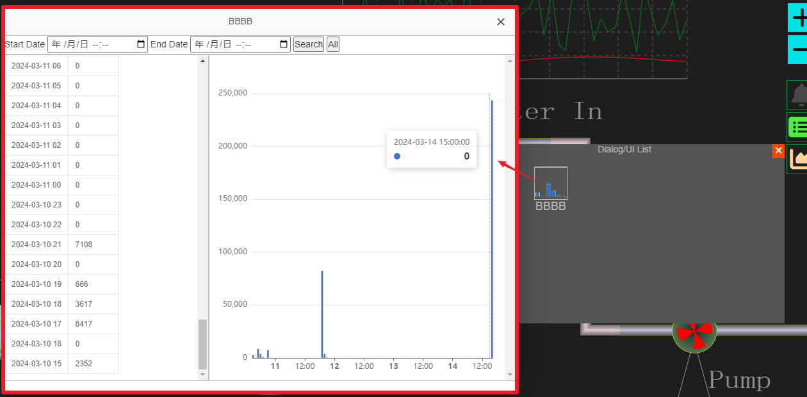

Recorded data shower
==

### 1 Dialog-based data display function

In version 1.3, IOT-Tree began to support internal tag data recording, which raises the requirement of how to process and display these data. To this end, IOT-Tree provides a simple UI management function based on dialogs to ensure simplicity and clarity.
You only need to select tags and display templates on the management side to define your own dialog items (UI Items), which can then be used directly by end users in the monitoring screen.

Due to the ever-changing display and use of data, it is impossible for us to meet all the needs of various users. Therefore, we only provide the above simple functions, which are expected to meet the needs of a large portion of users. In subsequent versions, we plan to implement a front-end UI plug-in development and management function: you only need to be familiar with html js related technologies to develop some UI plug-ins and deploy them to specific directories. Then you can select related RESTful resources in the dialog management and configure some specific UI interfaces.

### 2 Define UI Items

In most IoT/automated monitoring scenarios, users' needs for displaying historical data records are generally straightforward: making historical records for a few important tag data, and performing simple statistics and queries on specific, less tag data.  If it is possible to generate an archive report, that would be fine.

For example, the data volume of a certain material needs to be recorded, and it can survive daily, monthly, and yearly. Another example is an important production safety indicator that requires recording several values every day for subsequent viewing.

In order to enable you to quickly meet the basic requirements of end users and facilitate the completion of on-site deployment and debugging tasks, IOT-Tree implements UI item management functions for these basic functional interfaces. You can simply check the configuration to complete these display contents. These functions can be called and opened in the monitoring screen.

#### 2.1 Setting tag recording parameters

Only the tags with internal records set can support the display and use of UI items.
For details on how to set tags for internal recording and secondary processing, please refer to the following related content:

<a href="../store/inner_tssdb.md" target="main">&nbsp;&nbsp;&nbsp;Internal timing segment recorder (TSSDB)</a>

#### 2.2 Setting the Tag Record Data Processor

After the tag settings are recorded, it is possible to support the display of the original data recorded. However, the data results that we need to display may require secondary processing.

IOT-Tree has specialized secondary processing for records, and each processor can have its own generated data. These data also have different display support.

<a href="../store/inner_recpro.md" target="main">&nbsp;&nbsp;&nbsp;Secondary processing of recorded data</a>

#### 2.3 UI Item Customization

Click the "UI Dialog Manager" icon on the top of the project management main interface to see the UI Item customization interface for this project.

As you can see, the upper left is the tag list, the lower left is the corresponding UI template (UI Templates), and the right side is what we need to define.

You only need to select the tag you want to display, and the corresponding UI template list will appear below.  After selecting a UI template, the "Add" button on the right will be activated, and you can click it to add a UI item.

The essence of each UI display item is simple: it just displays a combination of required tags, UI templates, and some naming or other parameters.

Because you typically use more technical names when configuring and processing project data—these names may not be easily understood by end users. However, the UI items we define are generally intended for end users, so you can use a name that is familiar to them.

#### 2.4 Display in the monitoring screen

The UI Item defined above can be automatically displayed in the HMI front-end monitoring screen. The requirement is that the label you configure must be in the context of the HMI node.
In the monitoring screen, click the "show UI Dialog list" icon on the right side to see a pop-up window with a corresponding icon list.

Click the corresponding icon to pop up the relevant display dialog box

