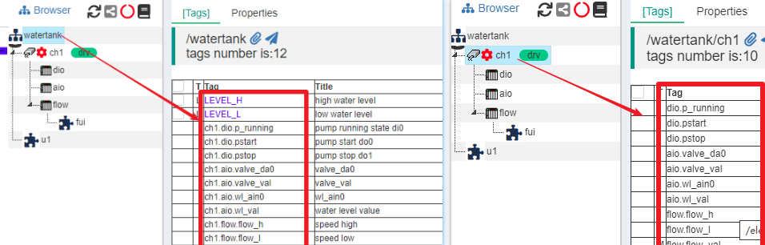

JS Script Usage
==

## 1 IOT-Tree内在JS支持

IOT-Tree在内部支持JS脚本用来对一些数据转换、事件处理、控制任务的工作做支持。JS脚本分两种，一种是运行在Client端（一般是浏览器端）。一种是运行在Server端，由Java提供JS运行环境。Client主要是支持HMI(UI)图元相关的事件处理。而Java Server端主要以项目的树形容器节点形成的上下文中做很多需要复杂逻辑的功能。

由于IOT-Tree内部的精细划分，我们使用JS一般都限定在局部实现（大多场合仅仅类似实现一个JS函数），这样可以大大简化JS的实现，尽可能减少项目的复杂度，同时又能满足业务需要。可以说，IOT-Tree的强大需要JS的支持，但又限定不滥用它。

本文档要求你已经掌握JS的基础语法，如果你对JS语法不了解，网络上的教程很多，估计只需要几天时间你就可以掌握了。

## 2 Server端JS运行上下文

IOT-Tree以项目为基础，内部建立了一颗树,层次为：项目-通道-设备-标签组。这些容器节点可以包含具体的标签列表（数据项）和HMI UI节点。由于IOT-Tree规定高层的容器节点可以访问它所包含的子孙节点所有内容，那么在此节点下面的JS运行上下文(Context)就包含了下面节点的所有内容。在某个容器节点下，每个子孙标签(Tags)都可以通过唯一的路径进行定位，而在JS代码内，这些标签(Tags)数据项则可以使用xxx.xx.xxx的方式进行使用。

### 2.1 节点对象成员


### 2.1 在一个容器节点下的成员

在某个容器节点上下文中，如果有要访问子节点或标签，则只需要使用节点下面的子节点或标签的Name属性即可。



如上图：在根节点"watertank"下面，JS访问ch1节点、设备ch1.dio和ch1.dio.p_running标签。

```
console.log(ch1); //ch1就是此节点下的ch1这个通道对象
console.log(ch1.dio); // 在设备dio下面的设备dio
console.log(ch1.dio.p_running); // 在设备dio下面的p_running 标签
```

而在ch1这个节点的上下文中，JS访问设备dio和标签dio.p_running标签

```
console.log(dio); // 设备dio
console.log(dio.p_running); // 在设备dio下面的p_running 标签
```

#### 2.1.1 特殊JS对象$prj,$ch,$dev,$parent,$this

>$this ，表示当前容器节点对象。

>$prj 所属项目根节点对象，所有的容器节点都有这个对象，因为所有的容器节点都在项目根下面。

>$ch 所属的通道节点，如果当前节点本身是一个通道，那么 $this和$ch是同一个对象。如果当前容器节点并不在通道下面，如某个标签组TagG直接定义在根部，那么就不存在此对象。

>$dev 所属的设备节点，如果当前节点本身是一个设备，那么 $this和$dev是同一个对象。如果当前容器节点并不在设备下面，那么就不存在此对象。

>$parent 当前节点的父节点。如果当前节点是$prj，那么就没有个对象。

#### 2.1.2 系统JS对象

系统JS对象在任何脚本运行时，都可以直接使用，主要有 $debug $sys/$system $util

>$debug tiao

#### 2.1.2 项目节点JS对象($prj)

<table style="width:100%;border:1px solid;">
    <tr>
      <td>Fields</td>
      <td>Description</td>
    </tr>
    <tr>
      <td>_name</td>
      <td>Node Name</td>
    </tr>
    <tr>
      <td>_title</td>
      <td>Node Title</td>
    </tr>
    <tr>
      <td>_desc</td>
      <td>Node Desc</td>
    </tr>
</table>

#### 2.1.3 通道节点JS对象($ch)

#### 2.1.4 设备节点($dev)

#### 2.1.5 标签组节点


### 2.2 标签对象的属性

### 2.3 系统自带对象和内部支持函数

### 
