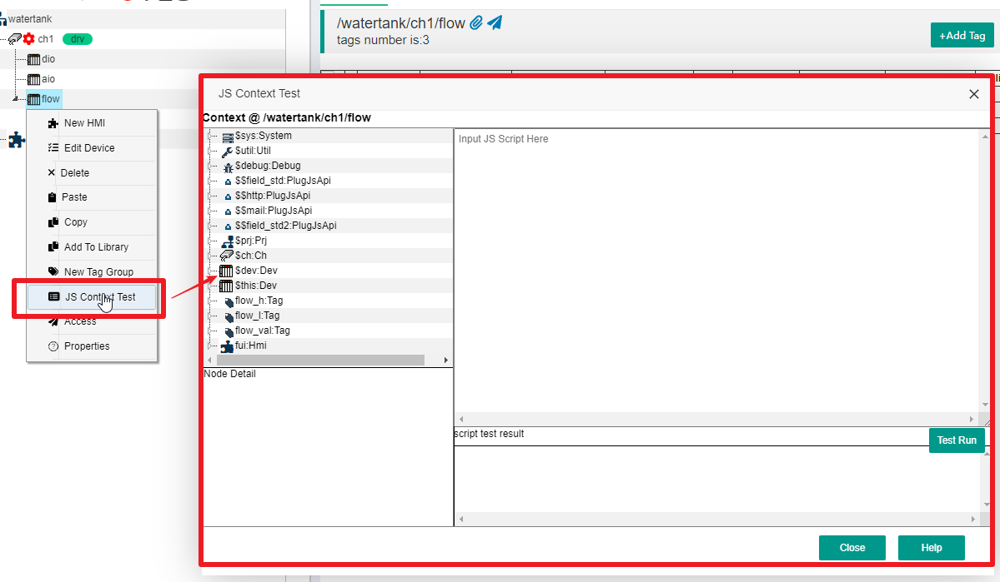

JS Script Usage
==

## 1 IOT-Tree built-in JS support


IOT-Tree internally supports JS scripts to support some data conversion, event handling, and control tasks. There are two types of JS scripts, one is running on the client side (usually the browser side). One is to run on the server side, with Java providing the JS runtime environment. The client mainly supports event handling related to HMI (UI) items. The Server mainly implements logical functions in the context formed by the tree container nodes of the project.

Due to the fine division within IOT-Tree, our use of JS is generally limited to local implementations (mostly similar to implementing a JS function), which can greatly simplify JS code, reduce errors, reduce complexity, and meet business needs. It can be said that the power of IOT-Tree requires JS support, but it is also limited to not abusing it.

This document requires that you have already mastered the basic syntax of JS. If you are not familiar with JS syntax and there are many tutorials available online, it is estimated that you will only need a few days to master it.


## 2 Server JS Context


IOT-Tree is based on the project which has an internal tree with a hierarchy:project - channel - device - tag groups. These container nodes can contain tags (data items) and HMI(UI) nodes. Since IOT-Tree specifies that high-level container nodes can access all the content of their descendants, the JS context below this node contains all the content of the following nodes. Under a container node, each descendant tag (Tag) can be located through a unique path, while in JS code, these tag data items can be used using the method of "xxx.xx.xxx".

In fact, under a container node, there are some special members in the JS context, in addition to the child nodes. If these members are an object, they also have their own members. This forms a complete contextual content.


### 2.1 Overall Description of Node JS Context Members


When we select a container node in the project, we can see all the tags under the tab \[Tags], which are consistent with the JS access method. As shown in the figure: Under the root node "watertank", JS accesses the "ch1" node, device "ch1.dio", and "ch1.dio.p_running" tags.


Although the tag list also represents the hierarchical referencing relationships of JS code in the context, the content in the node context in IOT-Tree goes far beyond these. Below, we will use a dialog for JS context testing to explain.

For project root nodes, channel nodes, device nodes, and tags group nodes, each container node has its own JS Context. In the project management page, right-click a node to see the option "JS Context Test". Click to open the test dialog for the corresponding JS script running context of this node. It includes all JS object members under this node.

In the demo project "Water tank and Medication Dosing", we right-click on the device "flow" under channel "ch1", and then click "JS Context Test" in the pop-up menu to see all the content supported by JS under the device node "flow" (of course, the public members and functions supported by standard JS are not listed here). As shown in the following figure:





On the left side of the pop-up dialog, there is a list of JS contextual members, each member being the root of a tree. The display name format for each member is "name:Type", with the left side of ':' indicating the JS member name and the right side indicating the data type of this member.

>$sys, $util, and $debug are some of the system's built-in support, which are available in every context.

>$prj, $ch, $dev represent the unique corresponding project objects, channel objects, and device objects contained in this context. Our container node this time is a flow device, so naturally it is also under the project and channel. If your current context node is the project root, then $ch $dev will no longer existed.

>$this object represents the current container node. In this example, the flow node is a Dev, so $this and $dev are the same object. You can see that the data type to the right of ':' is' Dev '.

>Other objects, in the example "flow_h、flow_l、flow_val、fui" are ordinary objects defined under the flow node, which can represent tag objects or other objects.

IOT-Tree has some restrictions on the context root members, which must be container members. This can avoid some conflicts. If you want to access all the content below the current node. It can be done using the $this.xxxx method. Let's expand the $this member, as shown in the following figure:


It can be seen that among the expanded members, there will be more content. In addition to the existing objects such as "flow_h, flow_l, flow_val, fui", we can also see the following members:

>__id:str __n:str  __t:str  __d:str ,these members are basic types, and each node object will have a unique ID, name, title, and description corresponding to that node. Please note that these members are all marked with two underscores '_' at the beginning. You can directly use the symbol.

>Functions, under the $this node, we can see some function definitions that can be called through the $this.fff() method.

Let's expand the root member 'flow_val: Tag', and we can see that objects of this Tag not only contain "__id:str __n:str  __t:str  __d:str",but also has own special members, as shown in the following figure:


>\_pv:number This is the runtime value of this tag, and the type on the right side of ':' will vary depending on different tag definitions. This tag is a number type. If a value is assigned to this, it will trigger the device driver corresponding to the tag to write to the device.

>\_valid:bool represents whether this tag value is valid at runtime; \_updt represents the last read time of the runtime tag value; \_chgdt represents the last change time of the runtime tag value, which is the number of milliseconds of system time

>When reading '_value', it is the same as '_pv', but when assigning a value, it is only done in the IOT-Tree memory and does not trigger device driver actions.

>The "RT_setVal" function can assign values to tags, but the assignment is only done in the IOT-Tree memory and does not trigger device driven actions. This function is equivalent to assigning a value to the member '_value'.

<font color="red">It can be seen that the tree on the left is essentially a member reference where we can write JS code under the flow node, which is the most accurate calling document. The following code is all valid.</font>


```
var n1 = $this.__n ;
var s1 = $this.getDevModel() ;

//Root members can be directly used in the context
var v1 = flow_val._pv ;
flow_val._pv = 100; //Assign values and trigger device driver write data
flow_val._value = 100 ; //set the value of this Tag in memory
flow_val.RT_setVal(100) ; //Same as flow_val._value = 100 ;

//$this represents the current object, and the following three lines of code are equivalent to the above three lines
$this.flow_val._pv = 100; //Assign values and trigger device driver write data
$this.flow_val._value = 100 ; //set the value of this Tag in memory
$this.flow_val.RT_setVal(100) ; //Same as flow_val._value = 100 ;
```

### 2.2 Member Variable Name Stipulation

#### 2.2.1 $xxx


The members named in the "$xxx" format represent the environment variable members provided by the system, such as "$prj $this". These members are directly defined at the root of the context.


#### 2.2.2 _xxx


The "\_xxx" format for naming members is generally a variable member provided by the system.


#### 2.2.3 __xxx


The named members in the format of "__xxx" (starting with two underscores) represent members of a basic type provided by the system under a certain object, such as "__id __n" members under each node, whose data is the basic type (str number, etc.).


### 2.3 JS Code Block and Test UI


In IOT-Tree, the use of JS code mostly occurs in the form of code blocks, because IOT-Tree has made the use of JS flexible, powerful, and as simple as possible through its precise architecture. There may be specific usage scenarios as follows:

1) Define a Middle Tag whose value can be combined into JS code by using other tags in the context of the container node where the tag is located as variables;
2) Define a scheduled task to run;
3) A certain virtual connector directly drives some data below the channel;

These code blocks can be abstracted as simple expressions or a function implementation.

#### 2.3.1 Expressions


Expressions usually only have one line, and with a simple line of code, we can use some combination of input variables to calculate and return the desired result. Here are a few examples:


```
 flow_val._pv+12
```

```
 $util.modbus_float(flow_h._pv,flow_l._pv)
```

#### 2.3.2 Functions


As a function, the code can be viewed as an anonymous function, implementing multi line code logic through contextual input variables. The return value is processed through a return code. In the IOT-Tree code block, you only need to place the code in "{}", then it is considered a function implementation. You must have a return statement internally, otherwise this code block will be considered to return null

```
  {
     let h=flow_h._pv ;
     let l =flow_l._pv ;
     return $util.modbus_float(h,l) ;
  }
```

```
  {
     let h=flow_h._pv ;
     let l =flow_l._pv ;
     let v = $util.modbus_float(h,l) ;
     if(v>100)
        return true ;
     else
        return false;
  }
```

#### 2.3.3 Test Dialog


In the above example, by right-clicking on a container node in the project, we can see the "JS Context Test" option. Clicking on it opens the test dialog box we provided. In addition to the document support for the context member tree provided on the left, we can write test code blocks on the right.

After writing the test code, click the "Test Run" button to see the running results in the results area, as shown in the following figure:


Please note that in the above example, tags such as "flow_h" and "flow_l" are used, and their value "_pv" must be valid for the project to run normally in order to calculate the results properly.

## 3 JS At Client


IOT-Tree supports client-side JS, mainly applied to HMI (UI). These scripts run on the browser side, such as the event handling of draw items. It has no direct relationship with the context on the server side. Please refer to [HMI related documents][hmi].


[hmi]:../hmi/index.md

## 4 Develop your own Server JS underlying support


In the context root members, you can see members in the \$$xxx format, which represent custom variable members provided by the system, such as \$$mail. You can implement it through Java code and register it as a plugin for IOT-Tree.


## 5 IOT-Tree Inner JS Api Plugins


IOT Tree has specifically defined some inner plugins to facilitate your business needs. These inner plugins can bring great value and convenience to your JS scripts. For example, \$$http

Of course, you can also give us suggestions to implement more common inner plugins for everyone's convenience.


Please refer to:[Plugin-JsApi][plugin_jsapi]

[plugin_jsapi]:../advanced/adv_plugin_jsapi.md
