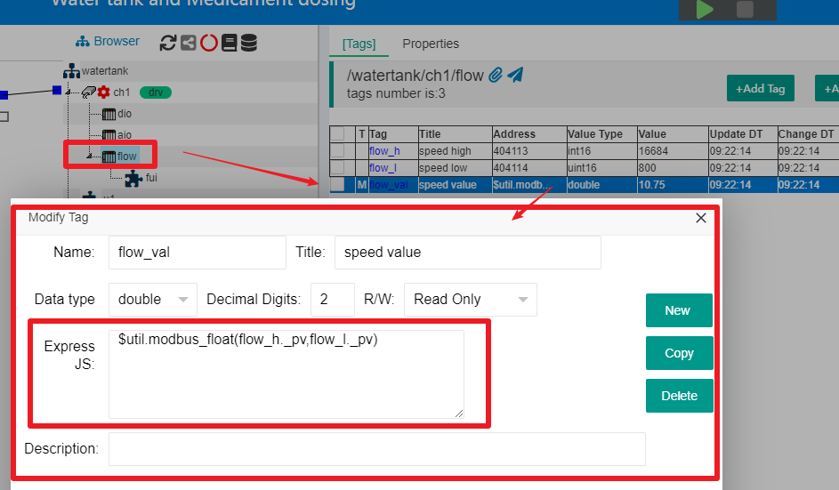

JS In Middel Tag
==

## 1 The JS context used by the middle tag

The Middle Tag under a certain container node needs to be defined by editing the corresponding JS code block to generate the required tag value.

For example, in the Demo project "Water tank and Medication Dosing" in IOT-Tree. Click on channel "ch1" - device "flow" in the project tree, and you can see a middle tag "flow_val" below this device in the \[Tags] tab in the main content area on the right. Double click on this tag to open the corresponding editing dialog, as shown in the following figure:

From the figure, it can be seen that the tag "flow_val" is calculated using the function provided by $util by inputting the "_pv" values of the tags "flow_h" and "flow_l" to obtain the floating-point value.

IOT-Tree stipulates that the middle tag is calculated using the context of the container node to which the tag belongs, which means that all other tags of the container node and child nodes can be directly used

We double click on the JS editing box with the mouse to pop up a JS editing dialog. You can see that the JS context content is listed on the left. 

Note: We can see that the context includes top-level node members such as "$prj $ch", which means that JS code can also access the content under high-level nodes through these objects. We strongly recommend that you do not use other content that is not under the current node ($this) unless absolutely necessary, as such a definition can make your definition lose its reusability. For example, if you add this device into "Device Library" and use it in other projects, it will cause problems - because this will cause your middle tag to not find the input object

## 2 JS Code Block

The middle tag JS can use an expression or a code block with a return value. Please refer to:[JS Script Usage - JS Code Block and Test UI][ind]

[ind]:./index.md
