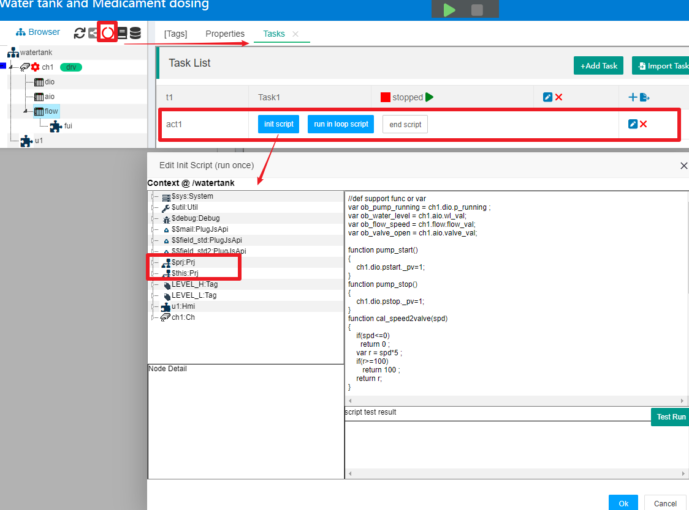

JS In Task
==

If you are not familiar with the task of IOT-Tree, please refer to [Task][task]。


IOT-Tree has divided the JS script in the task's Action, as shown in the following figure:


As you can see, there are three script divisions within each Action: "init script", "run in loop script", and "end script". They correspond to "initialization script", "repeatedly running script in the loop" and "running end script" respectively.

>init script: When the task is started, it is only run once. You can define initialization variables and some function declarations.

>run in loop script: This JS script will be run repeatedly during the task run according to the running time interval set by the task.

>end script: When the task stops normally, it will be run once. You can deal with the aftermath.

You can click to edit the JS script of the three parts of each Action as needed. Of course, if you do not set any script for a part, it will not work.


[task]:../main/task.md

## 1 Task Script Context $prj


IOT-Tree currently stipulates that all task JS scripts in a project have a running context at the root of the project. That is to say, JS can call all content open to JS under the entire project.

_Note: It is not ruled out that in the future, control logic similar to tasks will be added to the project tree. For example, for a specific device node, internal control logic is specifically defined, so that some common control logic will also be reused as the node is reused_

We use the demo project "Water tank and Medical Dosing" that comes with IOT-Tree as an example to illustrate. In the main management ui of the project, click the task running status icon above the project tree. The "Tasks" tab will appear in the main content area, which includes a task "t1" and the activity "act1" below it. Click on the "init script" button of this activity, and on the left side of the pop-up script editing dialog, there is a JS runtime context based on the root of this project. We can see that the $this object and $prj inside are equivalent.




## 2 init script


The init script code will be run once when the task starts, and you can define the initial content required for subsequent repeated code runs. For example, in this demo project, there may seem to be a lot of code, but in fact, two things were done:

1) Initialize some global variables
2) Define functions that may be used in the future


```
//def support func or var
var ob_pump_running = ch1.dio.p_running ;
var ob_water_level = ch1.aio.wl_val;
var ob_flow_speed = ch1.flow.flow_val;
var ob_valve_open = ch1.aio.valve_val;
var ob_pstart = ch1.dio.pstart;
var ob_pstop = ch1.dio.pstop;

function pump_start()
{
    ob_pstart._pv=1;
}
function pump_stop()
{
    ob_pstop._pv=1;
}

...
//pump ctrl by water level
function pump_ctrl()
{
   var wl = ob_water_level._pv;
   if(ob_pump_running._pv)
   {//pump is running
        if(wl>=LEVEL_H._pv)
           pump_stop();
   }
   else
   {
        if(wl<=LEVEL_L._pv)
           pump_start();
   }
}

//valve ctrl by flow speed
function valve_ctrl()
{
    var spd = ob_flow_speed._pv;
    var v_open = cal_speed2valve(spd);
    ob_valve_open._pv=v_open;
}

```


IOT-Tree strongly recommends that you also use the following mode to write initialization code:

>Define the tags in the project that may be used for subsequent functions of global variable assignment, as the tag path format in the project is xxx.xx.xx. This hierarchical reference based on the project may change when you adjust the project structure. Assigning a value by naming a relatively fixed global variable can simplify the call in subsequent functions and make it easier to maintain and modify.

```
//Subsequent functions use ob_pump_running to replace the corresponding tags in the project.
var ob_pump_running = ch1.dio.p_running ;
```

>In the initialization code, define all subsequent required functions.


## 3 run in loop script


Repeat the code called in the loop, and directly call the relevant functions based on the variables and functions written by init script. In this demo example, when you click on the "run in loop script" button in Action "act1", there are only two lines of code in the pop-up editing dialog:


```
pump_ctrl();
valve_ctrl();
```


Please note that these two lines of code will be repeatedly called and run at certain time intervals during task execution.


## 4 end script


End script refers to the code that will be called when a task ends normally, and in most cases, you do not need to write code for it. But in some special situations, you need to release specific resources when the task stops, so you need to implement corresponding code.


