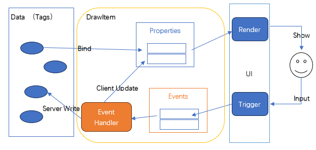
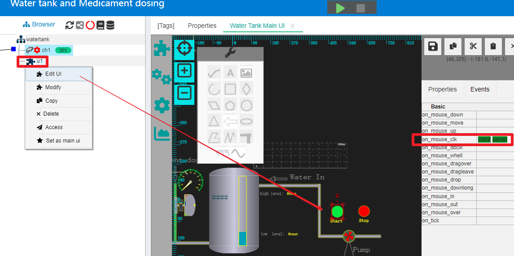
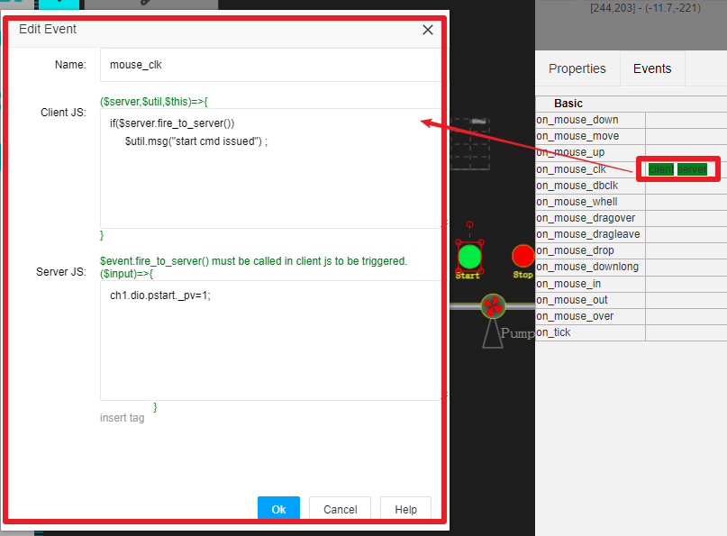
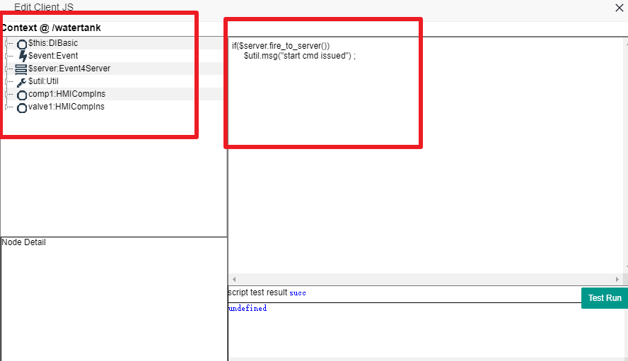
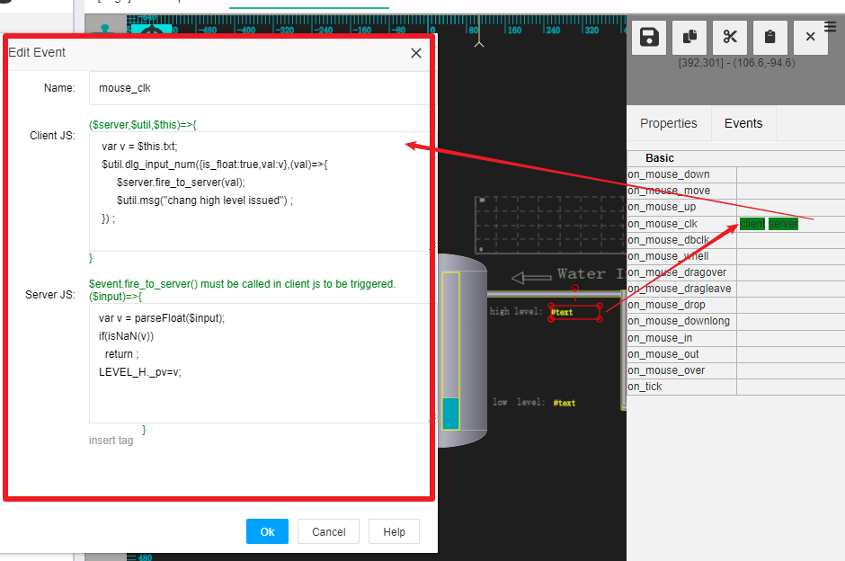
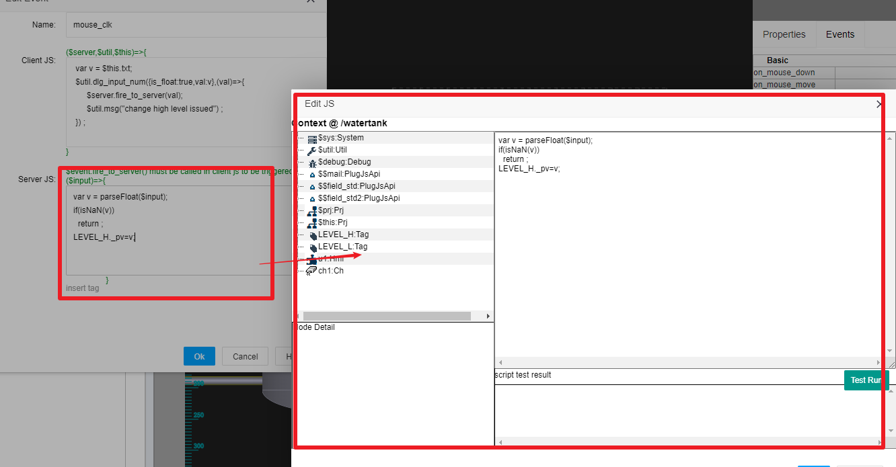
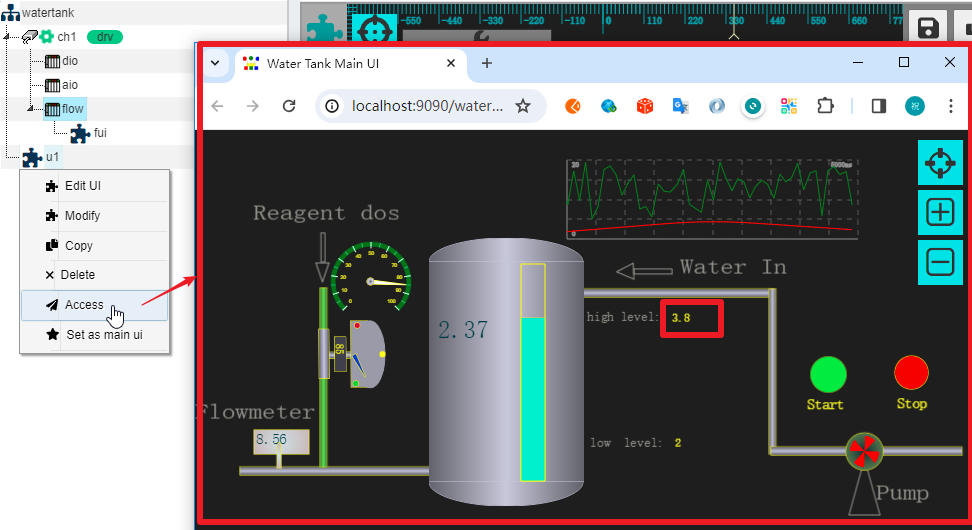
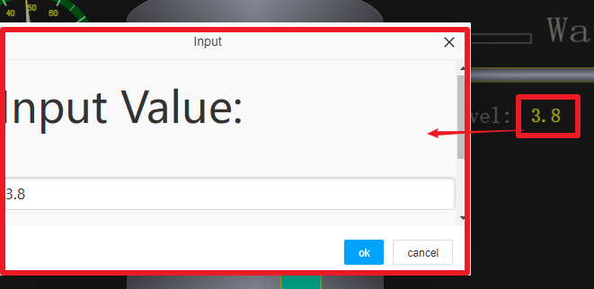

JS In UI Event Handling
==


The UI in IOT-Tree supports online editing and direct online publishing, with all UI being done through the web. In the UI editing process of a project, each draw items has many properties that define the display characteristics, and tag data is provided through binding to drive changes in these properties. On the other hand, if a certain draw item wants to respond to a user's action or input, it is done through events.

he entire mechanism of binding data from a certain draw item to the UI for display and updating data based on user input to event handling is shown in the following figure:





If a user clicks on a certain draw item, a mouse event will be generated. If we want to have corresponding changes or trigger some data changes when clicking on a certain item, we need to use event handlers.

In IOT-Tree, these event handling is also implemented through JS. For the event handling of items, there are two internal things:

1) Changing the properties of an draw item when an event occurs also changes the display of the item. For example, changing the display background of item when the mouse is pressed down;

2) When an event occurs, it triggers some data changes on the server.

Due to the nature of Web UI, IOT-Tree divides event handling into client JS and server JS for the above two things. The client JS only runs on the browser side. The server-side JS only runs on the server-side and can generate changes in server-side data or issue instructions to actual devices through server-side connections and device drivers.

Let's take the demo project "Water tank and Medical Dosing" that comes with IOT-Tree. Right click on the u1 node in the middle "Browser" tree and select "Edit UI". You can see the main UI of the project. Find the editing area on the right, click and select the circular button above "Start". Then click on the Events tab on the right. You can see the 'on_mouse_clk' event of this 'Start'button, which has already been configured with two types of client server scripts. As shown in the following figure:





Click on the content area on the right of "on_mouse_clk" with the mouse, and an event handling editing dialog will pop up, as shown in the following figure:





You can see the Client JS and Server JS editing input boxes, which correspond to the client handling scripts and server handing scripts for the "on_mouse_clk" event generated by clicking this draw item with the mouse.

Below, we will provide a detailed explanation of this separately.


## 1 Client JS

### 1.1 Client JS Context


Client JS runs entirely in a browser that displays the UI, so the runtime environment is only related resources of the UI page. In [HMI Components (Controllers)][hmi_comp], it is mentioned that if you want to operate on an draw item using JS scripts, you must first define the "Name" properties on it, which must comply with the naming qualification of IOT-Tree (variable names starting from a-z A-Z that comply with programming language). So, in the same UI, draw items events can be directly handled through these naming. That is to say, if an draw item in the UI has a 'Name' property defined, then that item naturally becomes the content in the context.

In the "on_mouse_clk" event handling editing dialog above, we double-click the input box on the right side of "Client JS" to open a dedicated Client JS editing dialog. As shown in the following figure:





Among them, the left side displays the contextual content supported by running JS scripts, and the right side is the script editing and testing area.

The contextual content is a tree, and the members corresponding to the root node can be directly referenced in JS. For members in the $xxx format, they represent members that are inherently supported by IOT-Tree. The left members represent draw items with the 'Name' property.

If a member has child nodes (internal properties and functions), it can be expanded to view.


### 1.2 Trigger from Client to Server


In Client JS scripts, special functions can be called to trigger event handling on the server side. This is supported by the function provided by the $server member:

```
$server.fire_to_server(any)
```


In the Client JS code, this function can be called as needed to trigger the Server JS script inside the server (running on the IOT-Server server side) through ajax. Through this approach, the coordination between Client JS and Server JS can achieve good flexibility.


### 1.3 The main implementation content of Client JS


Due to the fact that the code of Client JS, except for triggering Server JS to run through $server, all other content runs in the browser. Therefore, the main function of Client JS is to dynamically adjust the content in the UI based on events.

>By naming property members and directly modifying draw item related properties based on the entity objects represented by other draw item names, the item display state can be changed. For example, changing the background color and rotation angle of the item.

>Use some of the global support provided by the system to support more interaction (such as we can use the input dialog box provided by the system to input parameters). These supports are provided through the $util member.


### 1.4 Client JS Context Main Members

#### 1.4.1 $util


The $util member provides support for input parameters that may be used in the UI, password verification for operator issued commands, and other functions. These functions provide richer interactive functions for UI page through some of the universal input provided by IOT-Tree.

>$util.msg() is used to pop up a message on the UI and it will automatically disappear after a few seconds.

>$util.check_cmd_psw({prompt:string,no_confirm:boolean},()=>void) This function will pop up a user password input dialog for permission verification. In many automation systems, for safety reasons, when a user issues a command on the monitoring UI, they will prompt the current user to enter the control password to prevent improper operation by other personnel. So, IOT-Tree provides support for this function. This function will pop up an input or password selection dialog, and a successful callback function will be called when the verification is successful. You can implement real instruction issuance JS code in the callback function.

>$util.dlg_input_num({tp:string,min:number,max:number,val:number,is_float:boolean},(v:number)=>void)。 This function provides a numerical input window, and after successful input, the callback function will be called. You can obtain the input value and perform subsequent operations in the callback function after successful input.


#### 1.4.2 $server


The $server member provides support for interaction between Client JS and Server, and currently has the following functions:

>bool fire_to_server(any) . When Client JS calls this function, it will trigger the Client UI to push a message to the server, and this message can carry a parameter. The server processing script (Server JS) can obtain this parameter and perform related handling.


#### 1.4.3 $this


$this represents the currently selected draw item, for example, when we edit an event handler for an item, the $this member corresponds to the draw item object. You can expand the corresponding directory tree on the left side of the JS editing dialog to view the internal properties and function support of this object


#### 1.4.4 $event


$event represents the current event object. You can expand the corresponding directory tree on the left side of the JS editing dialog to view the internal properties and function support of this object. The main content is the currently processed event.


#### 1.4.5 Explanation by Example


We will use the demo project example mentioned in this article to illustrate. Click on the text draw item on the right side of the UI main "high level:". In the example, the txt property of this draw item is bound to the tag value "LEVEL_H._pv". This is an automatic save tag that supports parameter settings. When a certain value is written, the system will automatically and permanently save it. The next time this project is started, this value will be automatically loaded.

In the Events on the right, you can see that the "on_mouse_clk" event has already set up a client server JS script. The implementation effect of this script is that in the running monitoring UI, clicking this element with the mouse will pop up a parameter modification input dialog. After the user enters the new value, they can submit it to the system to modify the tag value "LEVEL_H._pv".

Click on this content and you can see the corresponding Client JS and Server JS in the pop-up dialog. As shown in the following figure, we can see typical applications using the above context members:




```
 var v = $this.txt;
 $util.dlg_input_num({is_float:true,val:v},(val)=>{
      $server.fire_to_server(val);
      $util.msg("change high level issued") ;
 }) ;
```


This code is a very typical use. The current draw item $this is a text display draw item, and the currently displayed txt content can be obtained through "$this.txt". Due to the txt property of this draw item being bound to the tag "LEVEL_H._pv". At runtime, the value output by the server will be obtained for display.

Then call the function "$util.dlg_input_num" and enter the current value "{is_float:true,val:v}". And in the callback function after the user enters a new value, the value is obtained as the input parameter. And push this value to the server-side script to run through '$server.fire_to_server(val);'.And output a prompt message.

The following is the arrow function of JS

```
(val)=>{
      $server.fire_to_server(val);
      $util.msg("change high level issued") ;
 }
```


You can also write it as follows. If you are not familiar with this, please search online for relevant instructions on JS

```
function(val){
      $server.fire_to_server(val);
      $util.msg("change high level issued") ;
 }
```

## 2 Server JS


If the corresponding handling process on the server needs to be triggered during event handling for each draw item, the content of the Server JS script needs to be edited. This JS code is similar to other server-side JS codes, limiting the context based on the container node to which this HMI UI belongs. Please refer to other chapters of JS for this section. However, there are still some special aspects to event handling.

### 2.1 Server JS for draw item event handling triggered by Client JS

```
$server.fire_to_server(val);
```


Client JS must call this code to trigger Server JS. The advantage of doing this is that it can flexibly trigger server-side code and can also carry different parameters.


### 2.2 Server JS code is essentially a function


Let's take a look at the Server JS content in the above example, which is essentially an arrow function. This function has a $input parameter carried by the Client JS when triggered.

```
($input)=>{
    // Server JS code here
}
```


Double click on the Server JS content area in the above example to open the Server JS editing dialog box. You can see that the context tree on the left is no different from other Server side JS scripts. So, fundamentally speaking, the server-side handling of draw item events is a function within the context of container nodes. This function has a parameter $input submitted from the client side.




The code for Server JS in this example is as follows:

```
var v = parseFloat($input);
if(isNaN(v))
  return ;
LEVEL_H._pv=v;
```


This code performs float conversion based on the $input value submitted by the client, and then sets it to the tag 'LEVEL_H's '_PV' value. (This is a tag that automatically saves values locally, and the project restart value will not change after setting.).


## 3 The running effect of this example

We started the demonstration project that comes with the system. Please refer to:[Case of industrial automation system][case_auto]。


In the main management UI of the demonstration project, right-click on the "u1" node and select "Access" to pop up the monitoring operation page of this project. In the UI, you can see that the value displayed on the right side of "high level" is "3.8".





We can click on this number to pop up an input dialog box, allowing us to fill in the modified content. Click 'OK' to modify this parameter.





It is obvious that this process is triggered by the Txt draw item mouse event, and the related Client JS and Server JS handling processes produce an effect.


[hmi_comp]:../hmi/hmi_comp.md
[case_auto]:../case/case_auto.md
