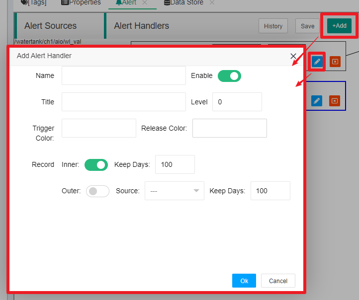

Alert Support
==


IOT Tree has built-in powerful alert support, which allows you to quickly generate corresponding alert information for certain data indicators, as well as the handling process after generating alert items.

In theory, you can continuously read, analyze, and make judgments on real-time data tags of interest through JS scripts within the task, and generate specific alert items according to your needs. But doing so will definitely make you tired.

In fact, there is a great regularity in the generation of alert items in an automated monitoring site, and there are also certain routines for how to handle the generated alerts in the future. Therefore, IOT-Tree has also made a dedicated implementation for this.


## 1 IOT-Tree Alert implementation mechanism

For your convenience, IOT-Tree divides alert management into three parts:


>1. Alert source: These are directly implemented in the Tag definition. You only need to define possible alert conditions and prompts in the tag of the data you are interested in. You do not need to consider any subsequent handling of alert data.

>2. Alert Handling: Based on the alert source information generated by Tags, you can group and level these alert sources. If the alert source in a certain Tag is assigned to a certain handling, then this source can take effect.

>3. Alarm Output: Define a specific alert data output item, and then associate it with handler. The alert data generated by the relevant source will be pushed to the output item.

<font color=red>Please note that if you only define an alert source in the tag without defining alert handling, your project will not generate alert data. The only alert information you can see is in the tag list in the management page.</font>

After defining alert handling, alert data will be generated in the HMI (UI) screen defined within the project during runtime and can be displayed in a universal Alert list. As shown in the following figure:


<font color=green>In many situations, if you need to remind relevant personnel through special means when a critical alert information is generated, then you need to define the alert output. For example, you can define an alert output that supports mobile SMS, or you can define a special alert output that allows IOT Tree to output a certain switch signal to the on-site sound and light device.</font>

Next, we will explain in detail how the alert management of IOT Tree is supported. For convenience, we will use the built-in demo project "Water tank and Medical Dosing" within IOT-Tree for explanation.


## 2 Define alert sources in Tag


In the Tag editing dialog box in IOT-Tree, you can directly add multiple alert data sources. We double-click the Tag "wl_val" under the container node "/watertank/ch1/aio" in the project, and in the pop-up dialog box, we can see that this Tag defines three alert data sources. As shown in the following figure:


If you want to add an alert data source, click the "Add Alert Source" button on the right side of the Alert input; Alternatively, if you want to edit an existing alert data source, simply click on the corresponding alert source with the mouse. The pop-up editing dialog is as follows:


Among them, "Alert Type" is the type of alert source; "Name" is the unique name of the alert source under the Tag and can be empty; "Prompt" is the prompt message generated by this source.

The parameters such as "Reference Value", "Trigger Error", and "Release Error" are related to the specific "Alert Type". After clicking "OK" to close this dialog box, the Tag editing dialog will have corresponding alert items. At this time, you must click the "OK" button of the Tag again to truly save it to the tag.


### 2.1 Tag data types supported by alert sources


At present, the alert source defined within the Tag only supports numerical (Number) and Boolean data types, and it is also required that the data type corresponding to the Tag must be limited within this range.


### 2.2 Alert source type

#### 2.2.1 On Off

Trigger Condition: The current value==Alarm value<br>
Release Condition: The current value==Alarm value

Edit Parameters:Alarm Value = 0/1

#### 2.2.2 Negative Transition

Trigger Condition: The current value has changed from non-0 to 0<br>
Release Condition: The current value has changed from 0 to non-0

Edit Parameters:

#### 2.2.3 Positive transition

Trigger Condition: The current value has changed from 0 to non-0<br>
Release Condition: The current value has changed from non-0 to 0

Edit Parameters:

#### 2.2.4 Bit==

Trigger Condition: Current value of specified bit==specified value(0/1)<br>
Release Condition: Current value of specified bit<>specified value(0/1)

Edit Parameters:Bit Position=0-63;Alarm Value=0/1

#### 2.2.5 Bit Off-&gt;On

Trigger Condition: The current value of the specified bit changes from 0 to 1<br>
Release Condition: The current value of the specified bit changes from 1 to 0

Edit Parameters:Bit Position=0-63;

#### 2.2.6 Bit On-&gt;Off

Trigger Condition: The current value of the specified bit changes from 1 to 0<br>
Release Condition: The current value of the specified bit changes from 0 to 1

Edit Parameters:Bit Position=0-63;

#### 2.2.7 Value==

Trigger Condition: Current value>=reference value - trigger error, and current value<=reference value+trigger error<br>
Release Condition: Current value<reference value - release error, or current value>reference value+release error

Edit Parameters: Reference Value;Trigger Error;Release Error

#### 2.2.8 Value<>  (Value Not Equal To)

Trigger Condition: Current value<reference value - trigger error, or current value>reference value+trigger error<br>
Release Condition: Current value>=reference value - release error, and current value<=reference value+release error

Edit Parameters: Reference Value;Trigger Error;Release Error

#### 2.2.9 Value >

Trigger Condition: Current value>reference value + trigger error<br>
Release Condition: Current value<=reference value + release error

Edit Parameters: Reference Value;Trigger Error;Release Error

#### 2.2.10 Value >=

Trigger Condition: Current value>=reference value + trigger error<br>
Release Condition: Current value&lt;reference value + release error

Edit Parameters: Reference Value;Trigger Error;Release Error

#### 2.2.11 Value <

Trigger Condition: Current value &lt;reference value + trigger error<br>
Release Condition: Current value>=reference value + release error

Edit Parameters: Reference Value;Trigger Error;Release Error

#### 2.2.11 Value <=

Trigger Condition: Current value &lt;=reference value + trigger error<br>
Release Condition: Current value&gt;reference value + release error

Edit Parameters: Reference Value;Trigger Error;Release Error

### 2.3 Implementation of Combined Conditional Alert Sources


You will definitely think that in a project, there will always be such an alert demand - this alert source requires multiple data to be generated based on certain conditions. How should we support this?

In the container node of IOT-Tree, you can define normal tags and middle tags. The middle tags are defined in a JS form style, which allows for flexible combination of other tag data. So, for the above questions, we only need to define an middle Tag and then add alert source within this Tag.

This middle Tag can produce bool or numerical data, and then select the appropriate alert type and configure the corresponding parameters.


If you are not familiar with Middle Tag, please refer to:[Tag List][tag_list]

[tag_list]: ./tags.md

## 3 Alert Handling and Output


After defining the alert source for the tags in IOT-Tree, if there is no subsequent processing, these alert sources will not have any effect on the running IOT-Tree project. You can only see the corresponding tag with alert source data generated in the project configuration management page. Only by taking relevant follow-up handling against these alert sources can you truly take effect. The reason for doing so is as follows:

>1. For a system, alerts are a serious issue, and we must fully consider and establish response measures for abnormal situations in an automated monitoring project. Then make system to serve us sustainably and reliably. The system cannot have no alarms when there is an abnormality, nor can it alarm casually (some Tags may come from the device library, and internal alert sources may not necessarily be what we need). After defining alert sources based on internal Tags, IOT-Tree also needs to do specialized global processing, which forces you to pay attention to abnormal situations in the project.

>2. Layered management makes alert configuration structures very clear, while also simplifying configuration work.

>3. Can provide more flexible alert configuration support.

>4. It can provide more powerful monitoring functions during project running.


### 3.1 Separation of Handling and Output


Taking the Demo project as an example, in the main management page of this project, click on the alert icon at the upper end of the middle Browser tree. You can see that in the main content on the right, the Alert tab will appear, as shown in the following figure:


As can be seen, the alert management page in the project is divided into three parts: left, middle, and right. On the left is the list of Tags and corresponding alert sources, in the middle is the alert handlers, and on the right is the alert output.

We can define alert handler and output separately, and then associate "Alert Source -  Alert handling - Output". This separation and association structure is not only intuitive and clear, but also flexible and powerful.


### 3.2 Alert Handler

#### 3.2.1 Alert handler item editing


In the middle "Alert Handlers" area, click the "+Add" button or click the edit icon of an existing handler to open the alert handler editing dialog box, as shown in the following figure:





It can be seen that alarm processing is very simple, just define parameters such as the alarm processing name, title, alarm level, whether it is enabled, and trigger color. In a sense, alarm processing is the classification of alarm source data.

This can be improved in the future. If you have any good suggestions, you can provide them to us.


#### 3.2.2 Associating alert source


After adding an alert handler item, you can then set which alert sources are associated with this handler. Click to select this processing item, and you will see a checkbox for each item in the alert source list on the left. If you want to associate a certain alert source with the currently selected handler item, click this checkbox. Of course, if there is already an association, clicking on it will cancel the association.

After successful association, you will see that the alert source item will be connected to the corresponding handler item.

Note: After the association operation, you must click the "Save" button above to truly save and take effect.


#### 3.2.3 The effect after association


When an alert source is associated with an handler item, IOT-Tree will generate alert data for that source. And it can be displayed in the HMI (UI) during project running. However, the overall display effect is relatively simple - alert data is only displayed when triggered and not displayed after release.


### 3.3 Alert Output


The alert output also has a list management, and you can add different alert outputs.  For example, you can define an alert output to call the mobile SMS interface through a JS script and output SMS. Alternatively, a certain Tag data can be updated through JS scripts.

Note: The running context of the JS script for alert output is at the root of the entire project, which means that alert output can use all resources in the project.

Through flexible alert output, you can associate different alert handlers to achieve very flexible output support.

For example, for important alerts, you can output text messages and remotely notify relevant personnel to intervene and handle them in a timely manner. You can do simple logging for unimportant alerts. Some alert handlers, you don't even need to associate the output.


#### 3.3.1 Alert Output Item Editing


In the Outputs area on the right, click the "+Add" button or click the edit icon of an existing output item to open the alert output editing dialog box, as shown in the following figure:


```


Type: represents the alert output type, which currently mainly supports JS scripting. (More types of support such as "DB Logger" may be added in the future.). In fact, JS scripts can provide you with very flexible support for the alert output methods you need. For example, you can implement your special JsApi plug-in, and then call it in the JS script to implement any output extension.

Title: is the title of this alert output item

OnAlertSend: the corresponding JS code, which is essentially an anonymous function with two parameters $uid and $alert object. When the associated handler triggers or releases an alert data, this JS function will be called. You only need to perform relevant output processing based on the JS runtime context data and these two output parameters.

```

#### 3.3.2 Context and parameters of JS alert output item

##### 1 JS Context


Since alert processing is based on the entire project, the context in which JS runs is also the project root context. We double click on the JS editing area with the mouse, and a "JS editing assistant dialog" will pop up as shown in the following figure:


You can see that in the members at the root, $this is equal to $prj. Please refer to:[JS Script Usage][js_idx].


You will find a "$alert:AlertItem" member in the context tree on the left, which is actually alert data and corresponds to the input parameter of an anonymous function. The reason why it is placed here is to facilitate member assistance and reference when writing JS code.


##### 2 $uid and $alert input parameters


When an alert output is triggered, provide an "$alert:AlertItem", which will have an internal uid that is the same as the anonymous function input parameter $uid.

<font color=red>IOT-Tree stipulates that when an alert source is triggered, a new  AlertItem will be created, and a new unique string uid will be generated internally. When this triggered alert is released, a release AlertItem will also be generated, with the same internal uid as before</font>

Therefore, if you implement the alert output, you should fully consider the two states of triggering and releasing (called two times successively), and confirm that they are the same alert through the uid.

We can expand "$alert:AlertItem" in the JS editing assistant dialog above and see all members inside the object. We will explain these separately, as shown in the following figure:


```
uid:str The unique ID generated when an alert is triggered

alert_tp:ValAlertTp The alert type object corresponding to the source,it has the following members:
  name:str Type name, type identification
  title:str Type title

prompt:str Alert prompt, corresponding to the prompt set by the source

handler:AlertHandler The alert handler object has the following members:
    id:str Handler ID
    name:str Handler Name,If you want to distinguish the corresponding handler, please use this name as an identifier
    title:str Handler Title
    trigger_color:str Trigger color, you can use this color to display alert information during output
    level:number Alert Level

triggered:bool True indicates triggering alert data
trigger_dt:number Trigger time (milliseconds from 1970-1-1), valid when triggered=true

released:bool True indicates releasing alert data
release_dt:number Release time (milliseconds from 1970-1-1), valid when released=true

str_val:str The data value (in string form) when triggering an alert

tag_title:str Corresponding Tag item title
tag_path:str Corresponding Tag item path
```

The specific example of $alert is as follows:

```
{
    uid: "e9NREyIqVV61gi7tCok",
    alert_tp:{
        name: "val_lt",
        title: "Value <"
        },
    alert_title: "Val<1.5+0",
    prompt: "Water Low",
    handler:{
        id: "dfBz3f8jSgJazPIa2UE",
        name: "serious",
        title: "Serious",
        trigger_color: "red",
        release_color: "",
        level: 5
        },
    triggered: true,
    trigger_dt: 1701678400460,
    released: false,
    release_dt: -1,
    str_val: "0.0025",
    tag_title: "water level value",
    tag_path: "/watertank/ch1/aio/wl_val"
}
```


It is obvious that when implementing alert output, you need to make full use of the $alert object.

For example, you can generate text messages through this object for sending. You can also push the JSON format data of this object directly to another processing program, which can record and update it in its own database.

For example, you can determine whether to activate an audible and visual alarm based on the $alert object. If this sound and light switch corresponds to a certain tag of its own project. So all you need to do is assign a value to this tag.


#### 3.3.3 Associating alert handler


After creating an alert output item, you can associate it with the handler. Click to select an alert handler item. You will find a checkbox for the output item. Clicking on this checkbox will allow you to establish or disassociate this output item from the handler.

After association, there will be a connection line between the output and handler. As shown in the following figure:


## 4 Summary


In summary, the alert function structure of IOT-Tree is clear, flexible, and scalable. It can allow you to spend minimal effort and achieve maximum alert processing capability.


[js_idx]: ../js/index.md
