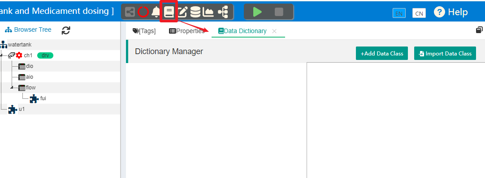
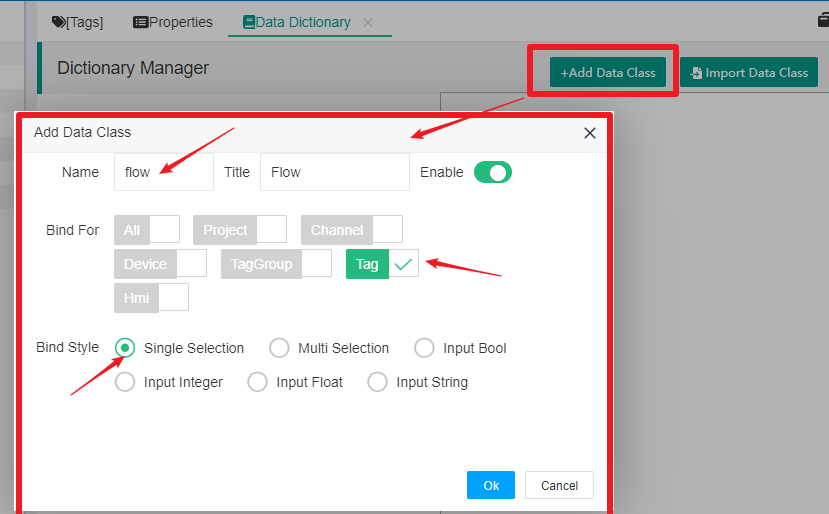
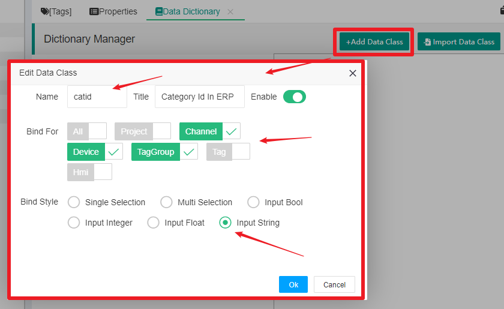
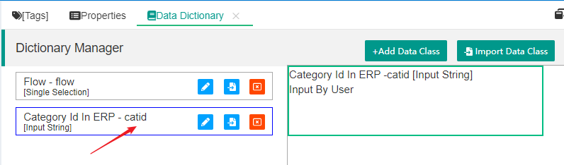
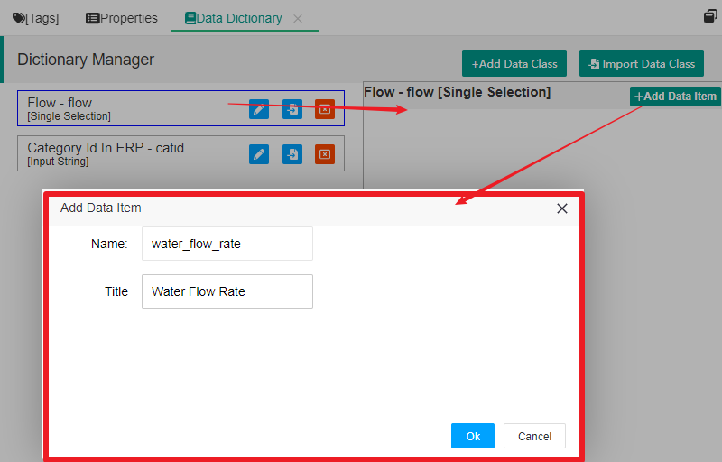
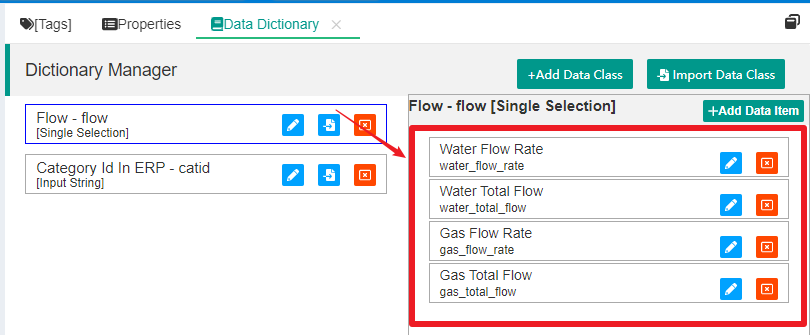
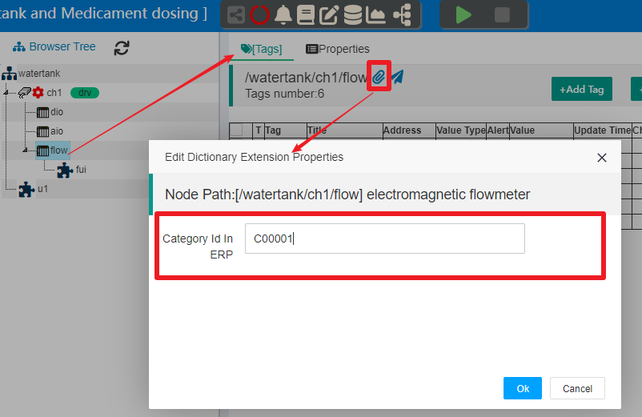
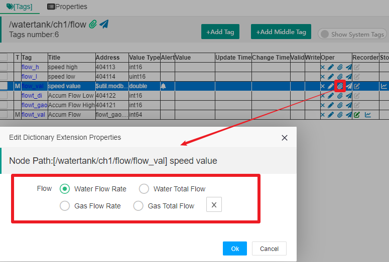
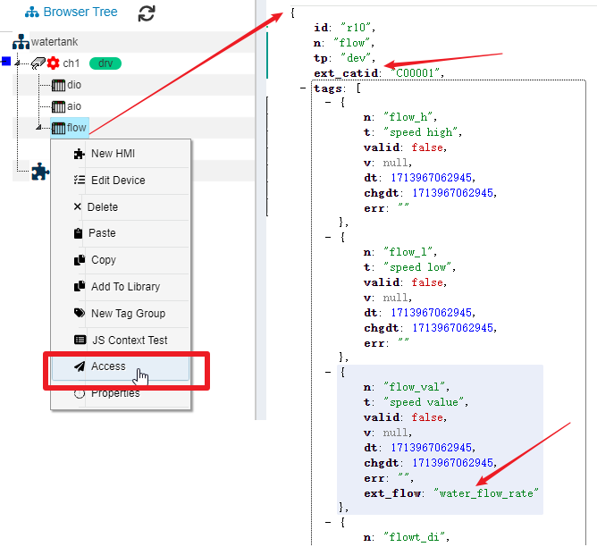

Data dictionary
==


The data dictionary in IOT-Tree is quite special, mainly for expanding the data content of container nodes and Tag items in the project tree.

When defining a project tree and tags, we can only input basic and necessary information, which constitutes the basic data content of the project tree. But in many situations, this is not enough, such as in the following situations:

1) If our project wants to share JSON data with other systems, it would be greatly convenient for other systems to use the data provided by IOT-Tree if specific Tag nodes can have properties identifiers that other systems need. For example, if a system only cares about temperature data in IOT-Tree, we can set temperature extension properties in the tag corresponding to temperature. So, IOT-Tree can filter the output tags based on this extended properties to reduce data transmission, or the JSON content output with temperature extended properties can be easily recognized and filtered by other systems.

2) For example, we can customize data indicators such as liquid level, voltage, cumulative flow rate, and other extended properties. Based on these extended properties, extract relevant data and store it in different database tables. These database tables have different structures based on the characteristics of indicators and query methods, and the same indicator data can be stored in the same table. In subsequent projects, the same extension properties can be used to set tags in IOT-Tree without the need to rewrite the code.


## 1 Overall Description of Data Dictionary
The data dictionary management in IOT-Tree is based on data classes, and multiple data classes can be created in each project. Each data class represents an extended data definition, and in addition to the name and title, it can also be set which type of node this data class can be associated with (these nodes can be project root node, channel nodes, device nodes, tag group nodes, and tags), and the input method and numerical type of this data class can be set.

If a data class is set to select input, it means that the data values of this class are discrete. Therefore, we can also set the data items that this data class can use. These data items can be managed by simply selecting them during use.


## 2 Data Dictionary Management

In order to have a clear understanding of the role of a data dictionary, we consider a typical usage scenario where there are a large number of collected data and configured tag tags in a project, but different projects may have specialized management for specific tag data. For example, project may be more concerned about material consumption, so tags data such as flow related to material consumption needs to be separately recorded and counted. The top-level ERP or MES system will require the IOT-Tree Server instance below to provide JSON data with specialized metric extension properties for these specific tags.

1) We set four option values for the dictionary class flow, which must be limited to specific tags data.


water_flow_rate 
water_total_flow 
gas_flow_rate 
gas_total_flow 


The top-level system can easily extract this data and store it in different data tables

2) We set management identifiers (dictionary "catid") for some devices according to the needs of the top-level system. These identifiers are strings that need to be manually entered. This identifier must be limited to container nodes.

The top-level system can determine that all tags under a node belongs to a certain identifier based on this property.

In the main page of project management, click on the "Dictionary Manager" icon above, and the corresponding Dictionary Management tab will appear on the right. As shown in the following figure:





### 2.1 Creating/Editing Data Classes

#### 2.1.1 Adding Dictionary Class "Flow"

Click "Add Data Class" and fill in the following information in the pop-up dialog box:




```
Name=flow  Title=Flow
Bind For=Tag
Bind Style=Single Selection
```


Among them, "Bind For=Tag" indicates that this dictionary class is limited to the tag (meaning that this property can only be set in the tag), and "Bind Style=Single Select" indicates that when setting a property, only one value can be selected.

Click "OK" to complete the addition of this dictionary class.


#### 2.1.2 Adding Dictionary Class "catid"

Click "Add Data Class" and fill in the following information in the pop-up dialog box:




```
Name=catid  Title=Category Id In ERP
Bind For=Channel,Device,TagGroup 
Bind Style=Input String
```


Among them, "Bind For=Channel, Device, TagGroup" indicates that this dictionary class is limited to three types of container nodes: channel, device, and tag group. 

"Bind Style=Input String" indicates that when setting properties, it is input by the user.

Click "OK" to complete the addition of this dictionary class.

After completion, the two dictionary classes are in the list on the left. We click on the "Category Id In ERP" dictionary class, and the "Input By User" prompt will appear on the right. As shown in the figure:





The dictionary class Flow requires four optional settings.

### 2.2 Adding/Editing Data Items
Click on the dictionary class "Flow", and the dictionary class data item management function will appear on the right. Among them, there is an "Add Data Item" button in the upper right corner. Clicking on it will bring up the data item writing dialog box. As shown in the figure:





We fill in four data items related to flow separately, and the final list is as follows:


```
Name=water_flow_rate  Title=Water Flow Rate
Name=water_total_flow  Title=Water Total Flow
Name=gas_flow_rate  Title=Gas Flow Rate
Name=gas_total_flow  Title=Gas Total Flow
```




## 3. Use of Data Dictionary

We have already configured two dictionaries above, so the next step is how to use these dictionaries. We need to associate the nodes in the project that meet the dictionary requirements .

### 3.1 Linking to Tree Content

The IOT-Tree project is a tree, which means we need to define dictionary content into the project tree.

#### 3.1.1 Associated container nodes

We click on the device node in the project tree and then select the "\[Tags]" tab in the main content area. You can see an icon for a paper clip on the right side of the container node path above. Clicking on this icon will open the Dictionary Extended Properties Settings dialog box for this node. As shown in the following figure:





The dictionary "Category Id In ERP (catid)" we defined earlier is displayed inside because it is bound to this type of node, and this dictionary class needs to be manually entered. After clicking OK, you can complete the setting of the corresponding dictionary class attribute values.


#### 3.1.2 Associate to Tag

We select flow_val in the tag list, click on the paperclip icon in this line of content, and a dictionary extension properties setting dialog box will pop up for this tag. As shown in the following figure:





You can see that the Flow dictionary option is displayed inside, and you only need to select a content that matches this tag. After clicking "OK", you can complete the setting of the corresponding dictionary class property values.

In this way, we have completed the association setting between the dictionary and the project tree node. Next, you can use these contents.


### 3.2 Dictionary application

IOT-Tree provides output support for the dictionary extension properties in many aspects

In accessing JSON real-time data through nodes, each dictionary properties will be output using the property name prefixed with "ext_". If you right-click on the device node "flow" in the project tree and select "Access" to open the real-time JSON data in the context of this node, you can see the flow container node and the JSON object corresponding to the flow_val tag. There are additional extension properties starting with "ext_", and each extension property is the dictionary class name in addition to the prefix, and the corresponding value is the selected or input content. As shown in the following figure:





IOT-Tree also uses this extended properties in other data analysis functions, including:
1) Filter nodes or tags based on relevant extended properties conditions

2) Output data with this extended properties information to meet the data resolution requirements of other systems


