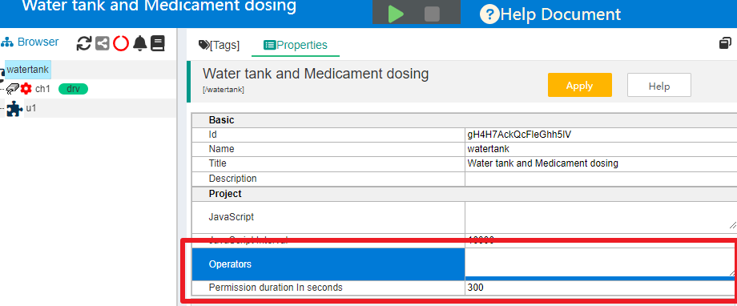
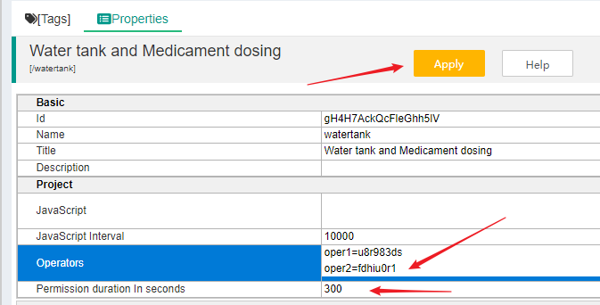
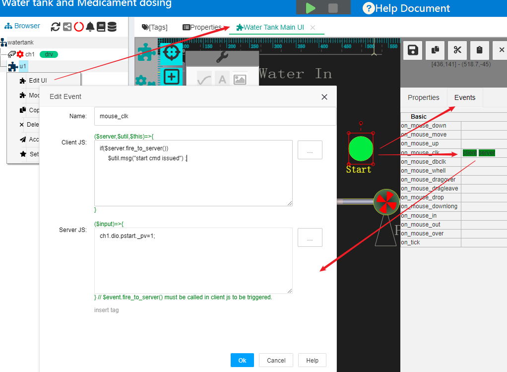
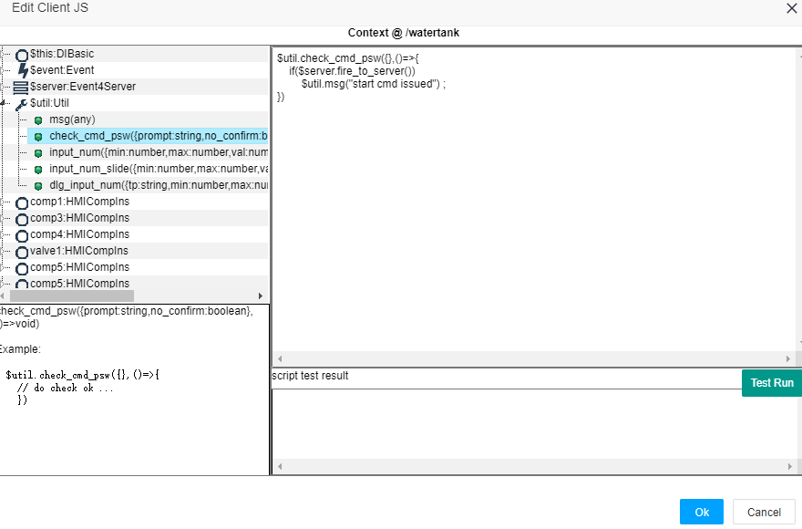
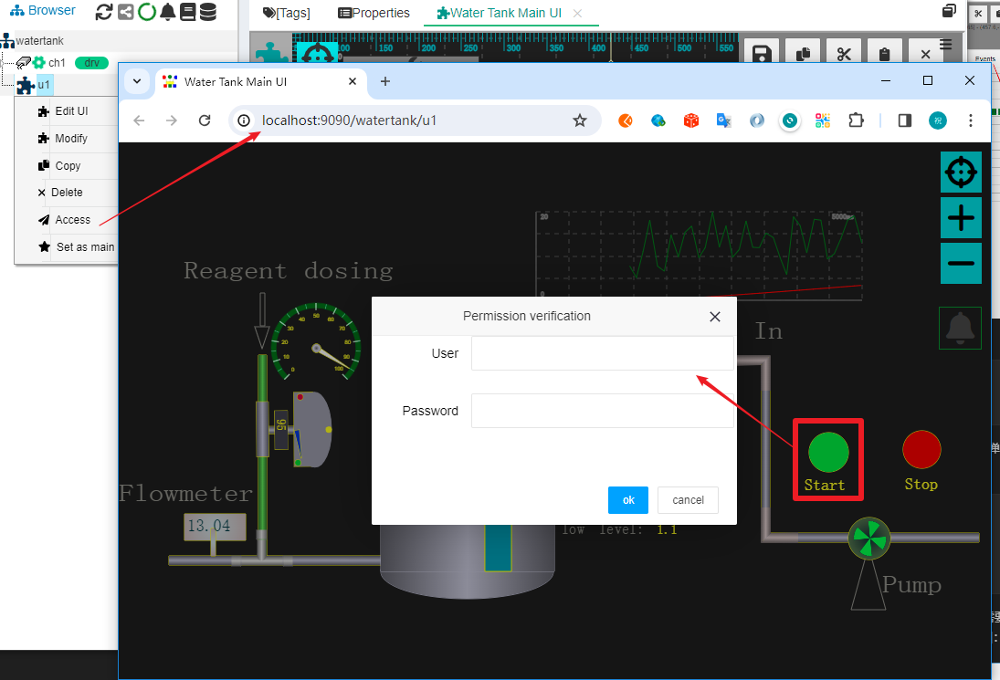
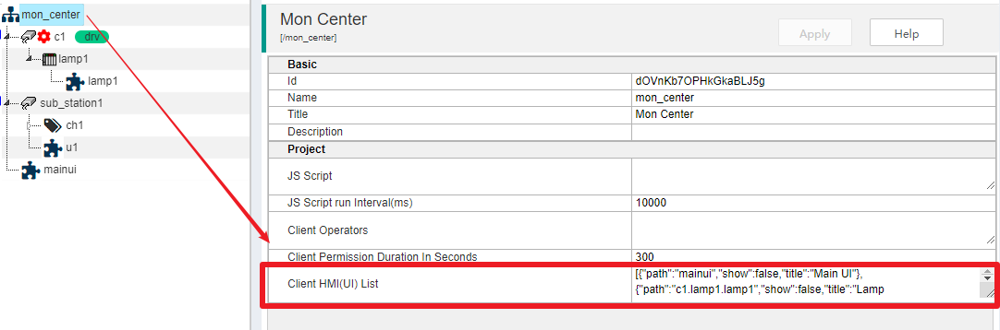
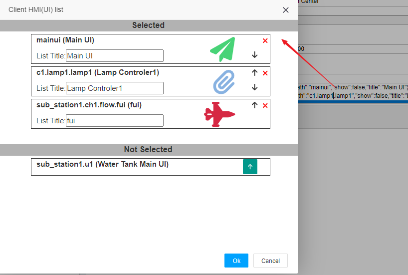
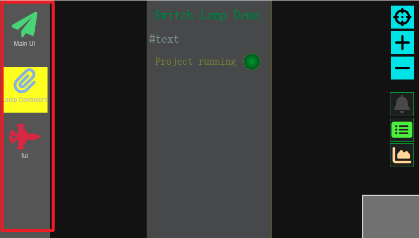
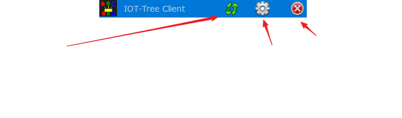
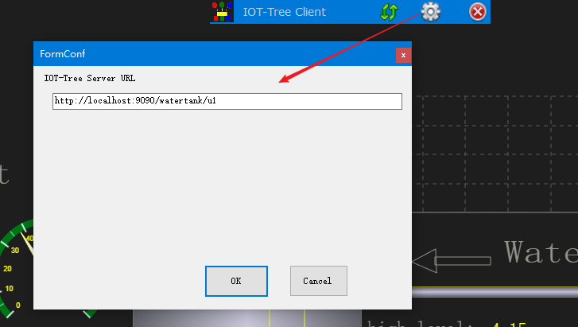

HMI Client
==


When using IOT-Tree, you may encounter a typical requirement:

1 IOT Tree runs on an industrial automation monitoring center or touch screen, which is connected to on-site device data and configured with relevant monitoring UI (HMI);

2 This computer runs continuously in daily work and is used by workers on site;

3 During daily operation, as long as this computer starts up, it will automatically open the monitoring UI and fill the entire screen;

4 There is no need to enter a password when starting the monitoring UI;

5 When the operator gives instructions, it is necessary to enter the operation password;

In order to support the above needs, IOT-Tree has a dedicated client directory in the release package, which provides support for this client HMI program.


## 1 HMI Client runtime environment


The current client implementation only supports Windows systems, developed using C#.net, and internally supported by Microsoft's WebView2 controls.

We plan to use Chromium to implement the client in the future, enabling it to support Linux systems. Stay tuned.


## 2 IOT-Tree</en> deployment and permission settings</en>


When opening the daily monitoring client, it is necessary to display the on-site process UI as soon as possible. At this time, the corresponding page URL does not need to be logged in. If your IOT-Tree does not have "Auth plugins" set, this is the case.

But for safety or to prevent misoperation, operators need to enter their password when giving instructions. This can prevent non relevant personnel from giving instructions to the monitoring system. Therefore, when setting up the monitoring HMI (UI), the corresponding JS verification code should be used for the operation of the instruction issuing entity.

If you are not familiar with the HMI and JS of IOT-Tree, please refer to:


<a href="../hmi/index.md" >HMI</a>

<a href="../js/index.md">JS Script Usage</a>


We will take the built-in demonstration project "Water tank and Medicine doing" in IOT-Tree as an example, and adjust some parameters of this project to quickly support client monitoring and operator instruction verification.


### 2.1 Set the operator and operation password for the project


After entering the project management page, click on the project root node and select the Properties tab on the right. You can see that under the Project property group, there are two property items: Operators and Permission duration in seconds.





Click on the input box to the right of Operators, and a large text editing box will pop up. You can enter the operator username and password inside, one line at a time. This example uses the following content:


```
oper1=u8r983ds
oper2=fdhiu0r1
```


After clicking the "OK" button, you will find that the "Apply" button above will light up, and you need to click to save it to take effect. In this way, we have added two operator users and operation passwords (currently supported by IOT-Tree is relatively simple, and future versions may make better improvements).





After assigning this operator information to different daily monitoring personnel, in the HMI of the project, if operator authentication is triggered, the user can enter the relevant operator and password.

For the parameter "Permission duration in seconds", it represents the number of seconds after the current operator correctly enters the verification information. If there are other command operations, there is no need to enter password verification again - this can greatly facilitate multiple operations in a short period of time. Once this time is exceeded, the next time the instruction is triggered, it needs to be verified again. Therefore, if your operation time is short, please set this value as small as possible. To prevent other personnel from issuing instructions without verification after the operator completes the instructions and leaves.

After setting the operator information, we also need to make slight adjustments to the operation buttons on the monitoring UI, so that operator verification can be performed when the user clicks the button.


### 2.2 Configure operator to click on HMI entity verification


Right click on HMI(UI) node u1, select "Edit UI" to open the UI editing tab, select the circular button "Start" in the editing area, then click on the Events list box on the right, and click on the "on_mouse_clk" right to open the JS event script editing dialog, as shown in the following figure:





As can be seen, when the current user clicks this circular button, the Client JS code will be triggered as follows:


```
if($server.fire_to_server())
    $util.msg("start cmd issued") ;
```


This code directly triggers the event to the server and prints a prompt message. We double click on the JS editing box and a JS editing assistance dialog box will pop up. The modification code is as follows:

```
$util.check_cmd_psw({},()=>{
    if($server.fire_to_server())
        $util.msg("start cmd issued") ;
})
```


This code first runs "$util.check_cmd_psw" function automatically determines whether the current operation requires entering a user and verifying a password. And only after the user inputs successfully, will the subsequent sending command action be called back. As shown in the following figure:




If you are not familiar with the function "$util.check_cmd_psw()", you can expand the $util object in the context on the left and click on this function to see relevant help.

After making the changes, make sure to click the save button on the UI editing area.

So we have prepared the monitoring UI and operator verification. We right-click on the "u1" node and select "Access" to open the runtime page. And start the project, then click the "Start" button. You can see that the operator verification dialog box pops up:




You can only truly give instructions if you enter the username and password correctly. Next, we can configure the client.


## 3 HMI Client Navigation


The client monitoring page may require multiple. In general, most on-site central control computers only have a few monitoring pages. Meanwhile, in our project tree. It is also possible to define multiple HMI nodes, some of which exist as sub nodes of the top-level nodes. So we also need a navigation list that needs to be deployed to the client, listing only a few pages that the user is concerned about.

IOT-Tree supports a project property configuration in version 1.5.2:


<b>Client HMI(UI) List</b>


Click on the root node in the project tree, and then open the "Properties" list tab on the right. As shown in the following figure:





Click on the input area of the "Client HMI (UI) List" property item, and you will see a pop-up dialog:





This dialog is divided into two parts: below are the HMI nodes that were not selected in the project, and above are the selected HMI nodes. You can click on the selection button below to add.

For the selected HMI nodes, you can also set the list title, modify the order, select the list icon and color. After confirmation, don't forget to click on the button "Apply". After completion, when the relevant monitoring page are displayed on the client, a navigation bar will appear on the left, allowing users to intuitively switch between multiple pages. As shown in the figure:



## 4 HMI Client Configuration


We assume that your client and IOT-Tree are running on the same computer, so you only need to access the u1 monitoring page directly through a local link:

```
http://localhost:9090/watertank/u1
```


In the IOT Tree installation directory, locate the client directory and open the client program "wclient.exe". You will see that this program will display the monitoring UI in full screen according to the position of the screen you started.

Please move the mouse to the middle position above the UI, and a toolbar will be displayed. As shown in the following figure:





This toolbar has a refresh button, a settings button, and a close program button. Please click the settings button and enter the URL content in the "IOT Tree Server URL" parameter. If your IOT-Tree Server is deployed on other machines in the local area network, please use the corresponding URL according to your project.

After confirmation, click the refresh button to display the corresponding screen.



## 5 Configure automatic startup with Windows startup


Next, for the convenience of your customer operator, you would like to automatically start this monitoring client when the computer starts.

1. First, create a shortcut to "wclient.exe" in the client directory. Right click on the mouse and select "Create Shortcut". You will find that this content is added to the client directory.

2. Press the Win+R key combination, enter the command "shell:startup" in the pop-up run box, and after entering, you can see that Windows pops up the current user's startup directory. You just need to put the shortcut from earlier into it.


## 6 Summary


The client provided by IOT-Tree is relatively simple, but it also meets the needs of automatic monitoring in many situations. In future versions, we will also make improvements to this and hope that you can provide more suggestions.


