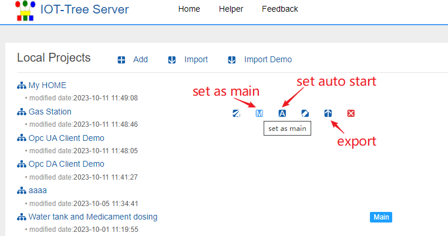
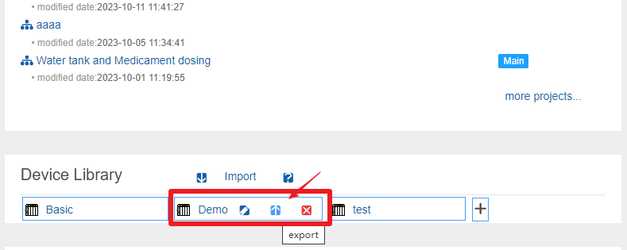
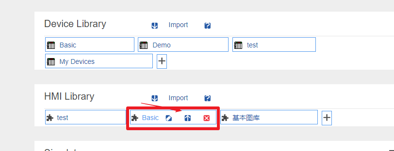
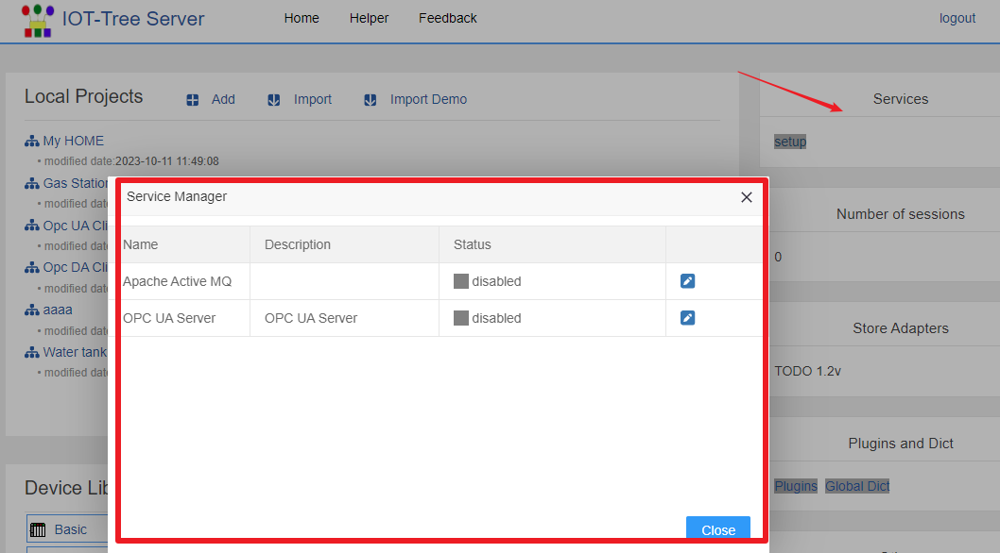
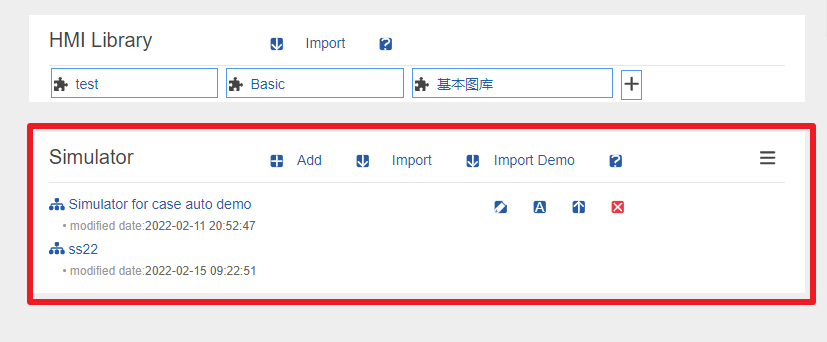

IOT-Tree Server - Overall and Project Composition
==

This section describes the IOT-Tree Server as a whole and the components of each project in depth. If you need to make full use of IOT Tree, please carefully understand the internal content.

IOT-Tree Server is an Internet of Things software that can run independently. It is mainly developed in Java and can run in various environments.

She can integrate and access their own data resources, and organize and manage the accessed data by unifying the data hierarchy and context. On this basis, it provides relevant management and control functions. IOT Tree Server provides support similar to industrial OPC unified standard interface. Through the simple and clear management of the accessed equipment and data sources, the diversity of the underlying complex equipment and data sources is shielded, which can greatly facilitate the implementation of industry, automation systems and the Internet of Things system.

She provides functions related to access and background management that are completely web-based. With it, you can easily complete the underlying support and top-level applications of the IoT system without writing programs.

## 1 IOT-Tree Server Overall

IOT-Tree Server provides a Web based management UI. You only need to access http://yourhost:port/admin You can enter the management UI. Since IOT-Tree provides RESTful access, the name "admin" cannot be used as your project name.

After the IOT-Tree Server is installed, the local and default port access addresses are: http://localhost:9090/admin/ . At this time, the login page will appear, and the first login will let you set the administrator password. You only need to enter the administrator password for subsequent login.

After login, you can go to the main management page and see the following:

**Projects**

A running instance can support multiple projects. You can create multiple projects in one running instance to form a project list. As shown below:

 

Since there are multiple projects, there are primary and secondary. You can specify a project as the main project. For the main project, if an internal UI node is designated as the main, the main UI in the main project will be directly displayed in the Web access root path provided by the IOT-Tree Server. Access on the right side of the list can open the main UI of the project.

The "set auto start" button on the right side of the project can set the project to start automatically when the IOT-Tree Server starts. In the production system, it is important to deploy and register as a system service. If a project does not need to be used, you only need to set it not to start automatically, and there is no need to delete the project.

In the project list, you can add new projects and import and export existing projects. IOT Tree also comes with some demonstration projects, which can be imported directly.

**Device Library**

IOT Tree's device library management is very flexible and convenient. You can easily export a device from a project to the library, so that other projects can easily reference it.

The rich equipment library can greatly facilitate project configuration. In the main management page, multiple libraries can be managed in the "Device Library" area, and each library can be imported and exported separately. When using, it is recommended that you can establish your own library according to your needs, and then import it for use in different IOT-Tree Server deployment environments. Of course, IOT Tree will bring some device library content with it in the release version.

 

After clicking each library, you can see that it can also support one level of classification, and multiple devices can be created under each classification. This three-level structure of "library classification device" can meet any number of devices, while ensuring simplicity and sharing convenience.

**HMI Library**

The element library is used to support the basic support provided by the UI node in the project when editing the UI, which can make the daily drawing faster and more efficient.

In the main management page, multiple libraries can be managed in the "HMI Library" area, and each library can be imported and exported separately. When using, it is recommended that you can establish your own library according to your needs, and then import it for use in different IOT-Tree Server deployment environments. Of course, in the released version, IOT Tree will have its own HMI library.

 

After clicking each library, you can see that it can also support one level of classification, and multiple elements can be created under each classification. This three-level structure of "library-classification-element" can meet any number of elements, while ensuring simplicity and sharing convenience.

**Services**

A deployed IOT-Tree Server instance also has some public services, which can provide special support for IoT applications. For example, Apache Active MQ that supports MQTT brokers.

**Simulator**

The device simulator provided by IOT-Tree Server can provide virtual device support for specific communication conditions. If a manufacturer's device supports the Modbus protocol, but there is no manufacturer's device during software debugging, the device simulator can be used to support relevant configuration operations.

In the main management page, you can manage multiple simulators in the "Simulator" area, and each simulator instance can be imported and exported separately. Each simulator instance can simulate multiple communication channels and devices. The simulation device supports JS script to realize the internal logic of the device.

## 2 IOT-Tree Server Limits

**In order to provide basic support for other systems more conveniently, IOT-Tree Server has made some constraints or restrictions on some internal contents.**

For all configuration items in the system, if a name is required to be entered, the name must meet the variable name requirements of general programming languages, and the starting characters must be a-z A-Z, and the subsequent characters a-z A-Z 0-9 _. For character '_' is not allowed as a starting character,because it is used by internal system of IOT-Tree Server. The names of connector, tree node and tag item node are subject to this restriction.

## 3 IOT-Tree JS Support

IOT Tree supports JS script internally. You can use scripts to define data tags, task running codes, event handling, etc.

## 4 IOT-Tree Plugins

IOT Tree supports you to develop plug-ins using the Java language. These plug-ins can extend your JsApi and support auth permission control.

