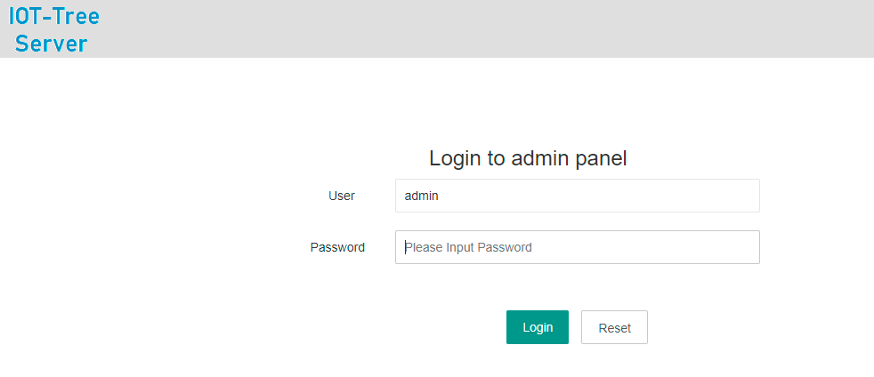

IOT-Tree Server - Overall and Project Composition
==

If you want to know more about IOT tree server, you are recommended to read this section. There are not many contents, and you only need to spend a little time to do it. After mastering the contents of this part, you can make better use of IOT tree server to bring you greater value.

Of course, if you have mastered this part and you want to go deeper, it is recommended that you read [advanced content][advanced_link]

## 1 IOT-Tree Server整体组成

IOT-Tree Server提供Web方式的管理界面，你只需要访问 http://yourhost:port/admin 就可以进入管理界面。而由于IOT-Tree提供了RESTful风格的访问方式，所以"admin"这个名字不能作为你的项目名称了。

IOT-Tree Server安装完成之后，在本地和缺省端口访问地址为：http://localhost:9090/admin/。此时会出现登陆界面，并且第一次登陆会让你设置管理员密码。后续登陆你只需要输入管理员密码即可。

管理登录之后，你就可以到管理主界面，可以看到如下内容：

>**项目(Projects)**
>
>一个运行实例可以支持多个项目，你可以根据你自己的项目情况在一个运行实例中，建立多个项目,形成项目列表。如下图：
>
> 
>
>既然项目有多个，那就有主次和运行管理。你可以指定某个项目为主项目(Main Project)。对于主项目，如果内部某个UI节点被指定为主界面，那么在IOT-Tree Server提供的Web访问根路径，就会直接显示此主项目中的主界面。列表右边的"Access"，可以打开项目中自己的主界面。
>
>项目右边的"set auto start"的按钮，可以设定项目在IOT-Tree Server启动的时候自动启动。这个在生产系统中，部署注册成系统服务的情况下很重要。如果某个项目不需要使用了，只需要进行设置不自动启动，而没必要进行项目删除。
>
>在项目列表中，可以进行项目新增和现有项目导入和导出。IOT-Tree内部还自带了一些演示项目，可以直接导入。

>**设备库**
>
>IOT-Tree的设备库管理非常灵活方便，你可以非常容易的从项目中导出一个设备到库中，这样其他项目就可以很方便的引用。
>
>设备库的丰富，可以极大方便项目配置。在管理主界面，可以在"Device Library"区域管理多个库，每个库可以单独的进行导入导出。在使用时，建议你可以根据自己的业务需要建立自己的库，然后可以在不同的IOT-Tree Server部署环境下导入使用。当然，IOT-Tree在发布版本中，会自带一部分设备库内容。
>
> 
>
>每个库点击之后可以看到内部还可以支持一级分类，每个分类下可以建立多个设备,这种"库-分类-设备"三级结构可以满足任意多的设备，同时还保证了简洁和共享的方便。
>

>**图元库**
>
>图元库是用来支持项目中的UI节点在编辑UI界面时，提供的基础支撑，这可以使得日常作图可以更快更高效。
>
>在管理主界面，可以在"HMI Library"区域管理多个库，每个库可以单独的进行导入导出。在使用时，建议你可以根据自己的业务需要建立自己的库，然后可以在不同的IOT-Tree Server部署环境下导入使用。当然，IOT-Tree在发布版本中，会自带一部分图元库内容。
>
> 
>
>每个库点击之后可以看到内部还可以支持一级分类，每个分类下可以建立多个图元,这种"库-分类-图元"三级结构可以满足任意多的图元，同时还保证了简洁和共享的方便。
>

>**公共服务（Services）**
>
>一个部署IOT-Tree Server实例，内部还带有一些公共的服务，这些服务能够为物联网应用提供特殊支持。如支持MQTT Broker的Apache Active MQ等。
>
>

<!--
**你的自定义插件**
-->

>**设备模拟器**
>
>IOT-Tree Server提供的设备模拟器，可以提供特定通信条件的虚拟设备支持。如厂家某个设备支持Modbus协议，但软件调试时没有厂家设备，可以使用设备模拟器进行相关的配置操作。
>
>在管理主界面，可以在"Simulator"区域管理多个模拟器，每个模拟器实例可以单独的进行导入导出。每个模拟器实例，可以模拟多个通信通道和多个设备。模拟设备内部支持JS脚本实现设备内在逻辑。
>
>
>

## 2 IOT-Tree Server一些限定

**为了更加方便地为其他系统提供基础支持，IOT-Tree Server对内部一些内容做了一些约束或限定。**

系统内所有地配置项，如果有名称(Name)要求输入，则此名称必须符合一般编程语言的变量名称要求，起始字符必须a-z A-Z，后续字符a-z A-Z 0-9 _。对于 _ 这个字符之所以不允许作为起始字符，是因为IOT-Tree Server内部系统自带的变量都以这个为开头。对于接入、树节点、数据项节点的名称，都会受此限制。

## 3 本章节内容组成

### 3.1 Quickly understand the tree of IOT tree server

This part is a key part for understanding the whole IOT tree server. The project established by IOT tree server is a tree in a sense. The root of the tree is the project, followed by the channel (the channel can be associated with the device driver and the access connector). Below the channel is the device.

[detail][qn_tree]

### 3.2 Connector - Channel - Driver

Based on the tree hierarchy of IOT tree server, IOT tree server has made a separate subsystem for communication access and device driver around the channel.

By understanding the contents of this section, you can have an overall understanding of IOT tree server.

[detail][qn_chconndrv]

### 3.3 Quickly understand device definition

Devices in IOT-Tree server can be defined in advance. These definitions must be under an existing driver.

Through pre-defined device, you can not only accumulate more and more equipment for you, but also manufacturers can shield complex driving knowledge and professional parameter configuration through equipment definition according to the complexity of their own equipment, so as to make equipment users easier.

[detail][qn_devdef]

### 3.4 Quickly understand tcpserver accessor

Many cloud IOT systems provide tcpserver access, which can generally support a large number of decentralized underlying devices or industrial site access. The IOT tree server specifically sets TCP server access support for this scenario.

[detail][qn_conn_tcpserver]

### 3.5 Quick understanding of interactive UI (HMI)

IOT tree server directly supports the definition, online editing and reference of human-computer interface UI in the tree hierarchy management structure.

All UIs are managed, edited and deployed based on the web. This is an important part of IOT tree server that brings you great convenience.

Most importantly, in the device definition, you can also define interactive UI components related to the device according to the situation of the device. In this way, the UI components managed by these devices, like devices, can be directly referenced repeatedly in the project.

[detail][qn_hmi]

[Edit operating instructions][qn_hmi_edit]

### 3.6 Quickly understand IOT tree server as your background support system

Similar to database service software, IOT tree server can also be used as your device management system service software as part of your IT infrastructure.

[detail][qn_server]

### 3.7 Quickly learn about IOT tree server projects

With a quick understanding of the above contents, let's take the IOT tree server project as the end of the overall quick understanding.

[detial][qn_prj_edit]

[qn_tree]: ./quick_know_tree.md
[qn_chconndrv]: ./quick_know_ch_conn_drv.md
[qn_devdef]: ./quick_know_devdef.md
[qn_hmi]: ./quick_know_hmi.md
[qn_hmi_edit]: ./quick_know_hmi_edit.md
[qn_server]: ./quick_know_server.md
[qn_conn_tcpserver]: ./quick_know_tcpserver_connector.md

[qn_prj_edit]: ./quick_know_prj_edit.md

[advanced_link]: ../advanced/index.md

