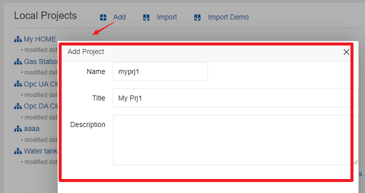
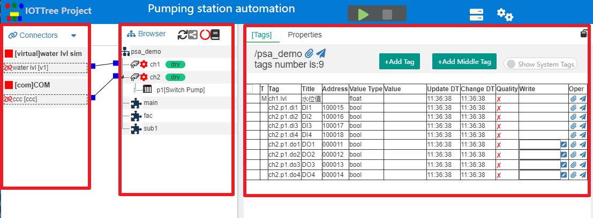

IOT-Tree Project
==

An IOT Tree Server instance is configured, run, monitored and maintained mainly around the project. As mentioned earlier, multiple projects can be managed in the IOT-Tree main management page. One of these projects is a main project, and the project can also be set to start automatically with the IOT Tree Server.

In this document, we analyze and introduce the composition of a project.

## 1 Project main UI

### 1.1 Add New Project

In the "Local Projects" area of the main management UI, click the "Add" button to pop up the new project dialog. Just enter the project name, title and description.

**Note**

For all configuration items in the system, if a name is required to be entered, the name must meet the variable name requirements of general programming languages, and the starting characters must be a-z A-Z, and the subsequent characters a-z A-Z 0-9 _. For '_' is not allowed as a starting character is that it is used in the internal system of IOT Tree Server. The names of connector, tree node and tag items node are subject to this restriction.

### 1.2 Main UI

In the main management UI, click a project to open a new window. Enter the main page of the project. As shown below:

This UI is divided into connectors, browser and main content area. Arrange in left center right order.

The main content area exists in the form of tabs, and you can open and display multiple tabs as needed. Currently, there are mainly \[Tags] and Properties, which correspond to the Tags and property contents of the currently selected node in the middle tree browser. In addition, by right clicking some operations in the tree node, the related function UI can be displayed in the main content area, or can be closed when they are not needed.

On the top of the project UI, in addition to displaying the project title, you can also start and stop the project through the Start/Stop button. After the project is started, the dynamic operation contents such as channels and drives will also be reflected in this UI. At the same time, in the Tags tab, all the context data (Tags) real-time data will be displayed. As shown below:

## 2 Connectors

The connector part of IOT Tree is separated from the data organization browser, which can make the communication link based on the bottom layer more abstract and flexible.

According to the source and characteristics of connected data, we can abstract it into three categories: link, binding and message. The subsequent implementation of device drivers (that is, the processing of data sources) is also based on this, which greatly simplifies the development of device drivers.

In addition, we also provide some special support for data sharing between current information systems. We can extract data directly through configuration, and then directly push it to the data organization browser. The whole process is independent of device drivers.

Such connection mechanism can better adapt to the current integration of traditional information system and IOT system.

**Two level mechanism of connectors**

A project can include multiple connection types. In order to provide a flexible connection organization and ensure simplicity, IOT Tree provides two-level management of "ConnProvider" and "ConnPt".

Different connection types may have one or more "ConnProvider", and each ConnProvider can have multiple "ConnPt". Each ConnPt is managed and restricted by its provider. For example, a Tcp Server connection provider can receive remote client connections. Each successful Tcp link will become a child node of the this provider.

Please refer to[Connectors][conn]。

>Tip: If you don't know how to operate in the Connectors area, try right clicking on the relevant node, and you will see the relevant supported operation menu.

[conn]:../conn/index.md

## 3 Browser

In the project middle "Browser" above, we can see a tree with the project name at the root. This content is the center of the whole project. The connected data on the left will be updated to the corresponding node of this organization, and subsequent data utilization will also be based on this tree structure. In fact, IOT-Tree also uses this tree structure to limit data permissions.

In the IOT-Tree, there are four container nodes: project, channel, device, and tag group. Container node means that each node can contain other contents. The most important content is the tag. The container node can contain multiple tags. Each tag represents a specific data item (including data item name, data type, etc.).

For these container nodes, IOTTree also has the following provisions:

>The channel node is limited to the project root node, so all channels form a list,and each channel can be associated with the "ConnPt" in left Connectors. At the same time, if the devices under the channel needs driver, it is also allocated by the channel. If you want to understand the relationship between channels, connectors and drivers in detail,[Please refer to][ch_conn_drv]。

>The device node must be under the channel node, so that the channel/device two-level relationship can meet most data organization requirements. However, if your application is very special(or complex) and does not meet the requirements, you can use tag groups. As long as it is below the channel, you can arbitrarily create multi-level tag groups, so that you can freely allocate the sub content (such as tag) under these nodes. If you want to know more about channels, devices and tag groups,[Please refer to][ch_dev_tagg]。

Although a tag can be a leaf node under a container node, because the content is simple and the number may be large, it is inappropriate to place it in the middle browsing area, so it is placed in the main content area described below. Related details [please refer to the chapter of tag list][tags]

In addition to the tag belonging to the container node, you can also create an HMI (UI) leaf node under the container node(including project root). Because the UI nodes are very special and few in number, they are directly placed in the tree in the browsing area to facilitate management. IOT Tree provides online editing support for UI nodes. For details, please refer to [UI(HMI) chapter][hmi].

>Tip: If you don't know how to operate in nodes or list, try right clicking on the relevant item, and you will see the relevant supported operation menu.

[hmi]:../hmi/index.md
[tags]:./tags.md
[ch_conn_drv]:./ch_conn_drv.md
[ch_dev_tagg]:./ch_dev_tagg.md

## 4 Main Content Area

The main content area on the right of the project main UI is the display area of the detailed content of the nodes in the middle browsing area. The main content is displayed in the way of tabs, and the two tabs of tag list (\[Tags]) and properties are solidified. When you click to select a node in the middle, the content in these two tabs will automatically change. [Please refer to the tags list chapter][tags].

The Properties tab displays the properties of the currently selected node, especially for channel nodes. The Properties tab will automatically display the relevant property parameter content required by this driver according to the assigned device driver. You can set specific parameters here. For details, please refer to [Properties][props] and [Device Driver][dev_drv].

Of course, you can right click the HMI node and select to open the tab of editing UI. For details, please refer to [UI specific chapter][hmi].

[props]:./properties.md
[dev_drv]:../device/index.md
