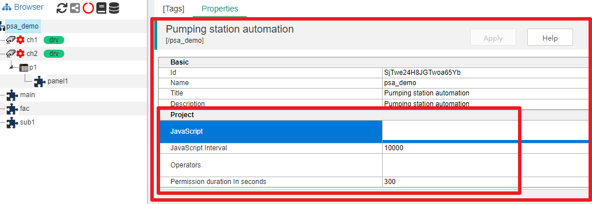
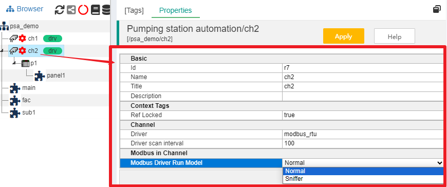
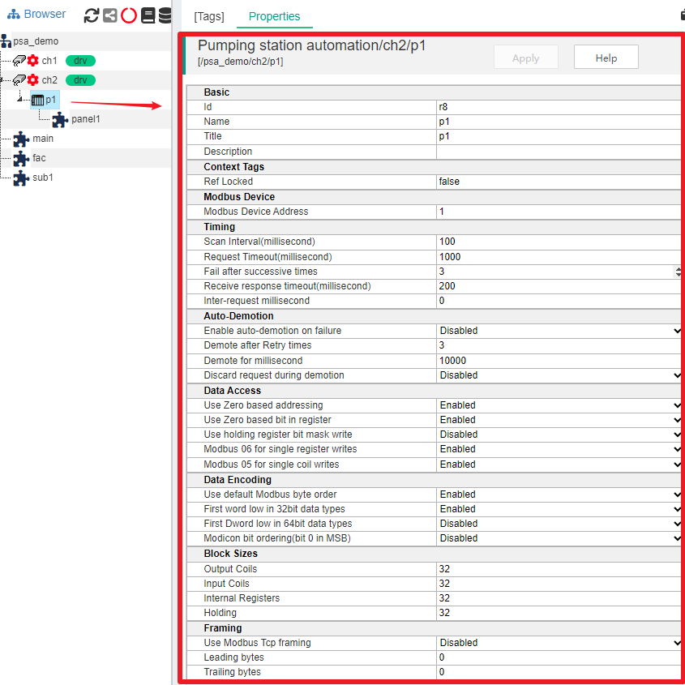
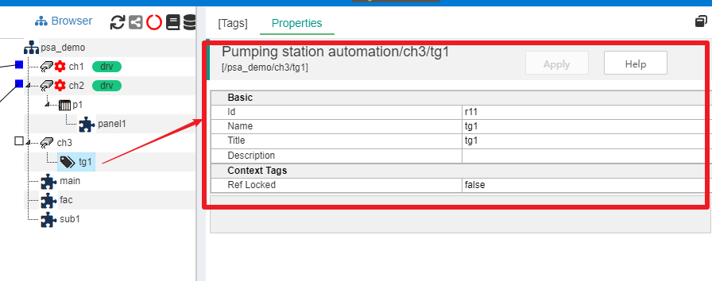

Propertis
==

In the IOT-Tree project main UI, click a container node, and the Properties tab in the main content area will display all the properties of that node. In addition to common items such as Id, Name, and Title, each node also has its own special items. Let's start with the root node and gradually explain  the property content of different nodes.

## 1 Project Root Node Properties

As shown in the figure, the project root node has a dedicated Project property group,_What content to place in this section? The IOT-Tree project team is currently planning. If you have any good suggestions, you can provide them to us
_

Project related properties are basically related to the parameters that need to be supported and configured globally for the entire project. At present, the following contents are considered:

>Run JS scripts at a global scheduled time (similar to task tasks, and this running script takes a node as the context and can access all internal nodes and resources).

>Operators who have data write permission for the project need to input the operator user and password when issuing instructions on the monitoring UI, which can be set here.

## 2 Channel Node Properties

As shown in the figure, the Channel node may have its own property items due to the possibility of selecting device drivers. Among them, under the Channel group, there are the driver name (read-only) and the driver internal thread scan interval "Driver scan interval" (readable and written). These two parameters are intended for use by device drivers.

In addition, if some drivers are very special and need to set some parameters at the channel level, they will also be listed here. As shown in the figure above, modbus_ RTU driver can support setting the parameter "Modbus Driver Run Model" at the channel level. It has two options: Normal (normal Modbus Master mode) and Sniffer (only listens to data packets on the bus and obtains data).

## 3 Device Node Properties

The device node belongs to a channel, and there may be device drivers set inside the channel. At this time, the device properties also include the specific parameters of this driver. As shown in the above figure, the device p1 properties contains parameters related to Modbus driver.

If you want to understand the meaning of these parameters, please refer to [Device,Device Library and Drivers][dev]

[dev]:../device/index.md

## 4 Normal Container Node Properties

These nodes include tag groups, device nodes without device drivers, and so on.

If a container node is a TagGroup, or if the channel to which this node belongs does not have a device driver, then this node is only a container, and the relevant properties are also very simple. We will not break it down here.

