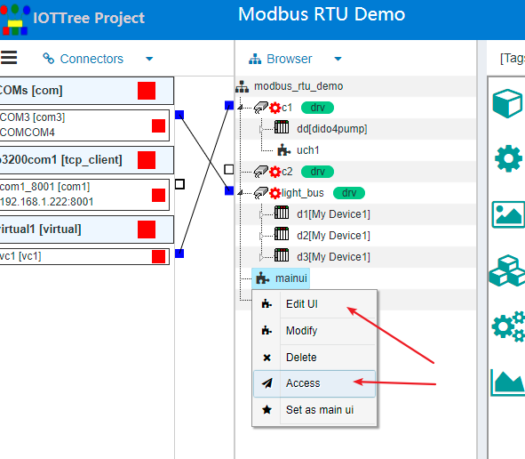

Monitoring UI,Human computer interaction(HMI)
==

IOT tree server can define HMI UI interfaces or components in different nodes on the basis of tree hierarchy.

## 1 HMI node

An exciting feature of IOT tree server is that it can directly provide online interactive UI interface definition, design and release in your project.

Corresponding UI interfaces can be defined at each level of project - Channel - device - tag group. And follow the node contains related resource access. For example, the UI interface under the device can reference the resources of the device and all nodes under the device. The UI interface under the root directory of the project can use all the resources of the whole project - this resource includes the UI sub node under the sub node.

The following is a specific example:

## 2 Defining UI components in a project

As shown in the following figure, UI nodes MainUI and M1 belong to the root node of the project, while uch1 belongs to channel C1. They both belong to the UI defined under the project.

Among them, uch1 can use all resources under channel C1. MainUI and M1 can use all the resources of the whole project.

## 3 UI node in device definition

If you don't understand the device definition, please refer to [quick understanding - device definition][qn_devdef].

Through device driver, device classification and device definition. After defining the tag and taggroup corresponding to the device, you can make UI components that can be provided by the device itself. Especially for special and professional complex equipment, project users cannot deeply understand the internal operation mechanism of the equipment in most cases.

At this time, project implementers will face great challenges in equipment control screen, monitoring logic and how to effectively display UI. The most reasonable way is that the device manufacturer provides the device definition, and after defining the driving parameters and tag data, define the equipment specific multi-faceted monitoring ui. This can greatly simplify the use of device by project personnel.

## 4 Edit and access UI

After the IOT tree server defines the UI, because the UI also belongs to a node in the "tree" level. The name of the node definition conforms to the constraints of tree management.

To edit the specific content inside the UI, just right-click the corresponding node and select Edit UI.

Similarly, the external path to access this UI is also very simple - you only need to access the path composed of the name of the project to the HMI UI node. In the project management tree, right-click and select access to open a new window for HMI UI application access. As shown below:

The open UI page and URL path are as follows:

## 5 Edit or external access UI operation instructions

For the editing operation of HMI UI in the project, please refer to [human machine interaction UI (HMI UI) editing operation instructions][qn_hmi_edit]

The external access operation is very simple. In addition to the interaction defined within the UI, the basic operations of the external access UI only support zoom in and out, content adaptive display window and mouse roaming.

As shown below:

。

### Mouse wheel zoom in and out

Turn the mouse wheel to zoom in and out the display screen with the current mouse cursor position as the center.

### Mouse roaming

Right click the picture without releasing it. When moving, you can roam the picture as a whole.

[qn_hmi_edit]: ./quick_know_hi_edit.md
[qn_devdef]: ./quick_know_devdef.md
