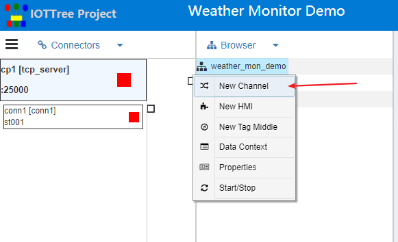
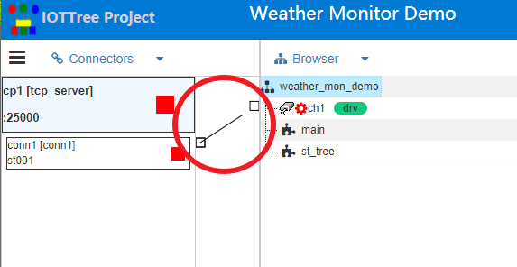
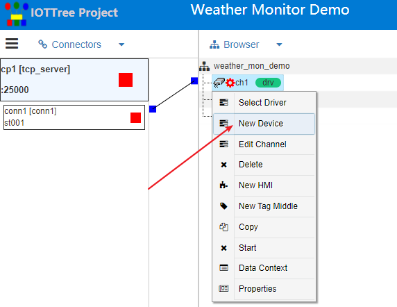
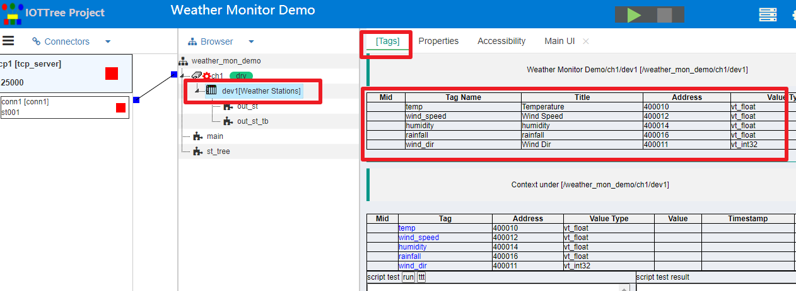

Quickly understand tcpserver connector
==

## 1 Tcpserver connector usage background

If you have a cloud server (with a fixed public network address) and are ready to serve as an access server for the Internet of things project.

Your project is likely to be a relatively simple collection device, and the indicators collected by each monitoring point at a specific location are relatively fixed. Just like the weather station, each monitoring point is very similar. The roughly collected data indicators are such as temperature, humidity, wind speed, wind direction and rainfall. However, the number of such monitoring points may be large and widely distributed.

You may use a GPRS or 4G communication module at each monitoring point. This device can access the Internet through Telecom wireless network, that is, it can establish a link with your cloud service. This communication device provides the simplest RS485 interface locally. Thus, your field monitoring sensor can probably provide RS485 Modbus RTU docking interface and protocol. In this way, your field monitoring circuit can be very simple. You only need a simple power supply and an RS485 bus.

So, how do you deliver data to cloud servers? Of course, you can also use the simplest method: your GPRS / 4G communication module actively links to your cloud server. After successfully establishing the TCP link, it immediately sends its own identity and authentication information. After the cloud server determines the identity of the link, Next, it becomes the master of the monitoring node. The subsequent work of the communication module is only to transparently forward the mutual data between the local RS485 bus and the cloud (of course, it also includes the automatic relink after the link is broken).

The above usage is very simple and effective. Next, you must ask, since device communication is so simple, what should I do in the cloud?

Very simple, use IOT-Tree server in your project, and you will find that the cloud will be so simple that you sigh!

## 2 Use IOT tree server to manage all devices and data in the cloud

You can refer to [quick start][quick_start] to easily install and deploy IOT tree server on your cloud server.

Next, you can check whether there is your field device under a specific device driver protocol of IOT-Tree server. If not, please refer to [quick know device definition][qn_devdef] to define your on-site monitoring device in the deployed IOT-Tree server. When all this is done, it's easy.

### 2.1 Establish TCP server connector

Refer to the figure below and add connector provider - Tcp Server

By setting tcpserver port, Conn identity, etc. In this way, IOT server becomes an access server.

After project startup, tcpserver will accept the TCP link to each remote monitoring point. Thus, each field access will have a corresponding link connector.

Referring to the figure below, add connector under tcpserver. Among them, Conn must set the corresponding access ID, which will match the field access.

### 2.2 Add channels and corresponding drivers for each link connector

Referring to the figure below, add a channel (including selecting a device driver) in the Browser tree. In this example, we use the driver of Modbus RTU protocol.

Establish an association between the channel and the connector

### 2.3 Select Add device and run to view access data

Right click under the channel and select Add device. As shown below

Devices have been added through device management. For details, please refer to [device definition][qn_devdef]. At this time, it can be obtained directly through device selection, as shown in the following figure:

After adding a device successfully, click the new device node in the browser tree and select [tags] from the tab tab tab in the main content area on the right. You can find that the device related tags and child nodes defined in the device definition have been added to the project. As shown below:

Furthermore, the associated nodes defined by the device have also become part of the project, such as the monitoring UI node corresponding to the device. As shown below

When specific device is added to the channel, few parameter settings may need to be made according to the actual situation of the project. For example, in this example, due to the use of Modbus RTU driver, the device added to the channel may need to set its own address (Modbus 1 byte address) on the bus. At this time, you can click the main device node and switch the content area to the Properties tab. Here, you can modify the device MODBUS address under this channel. As shown below:

Other devices are similar. You can repeat the above process to add connector, channels and devices.

Here, you should have found out. The number of accesses under a tcpserver is the same as that of field devices. For example, there may be dozens of typical connector links. Each connector link needs to correspond to a channel, and the devices under each channel are similar.

IOT tree considers this situation and adds a wizard to the tcpserver provider. You can quickly complete the addition of connector, channel and device, as well as the association between access and channel through the wizard. For details, please see [tcpserver quick access wizard][qn_tcpserver_wizard].

So far, you can start the project. If your field devices, connector and configuration parameters are normal, you can see the real-time data after successfully connected under the tags tab.

### 2.4 Use the online editor to create your project monitoring UI
Please refer to this section

[human computer interaction (HMI)][qn_hmi]

[human computer interaction UI (HMI UI) editing instructions][qn_hmi_w]

### 2.5 Use the storage mechanism to automatically store your device data

This part is expected to be implemented in version 1.2. Please look forward to it.

Through restful interface, you can regularly read all label real-time data of the project, and then store and use the database according to your own needs.

### 2.6 Use IOT-Tree server restful interface to provide API for your application

You can view all HTTP restful APIs and corresponding data formats in the project through the accessibility tab in the main content area of the project.

[qn_devdef]:./quick_know_device_definition.md
[qn_hmi]:./quick_know_hmi.md
[qn_hmi_w]:./quick_know_hmi_edit.md

[quick_start]:../quick_start.md
[qn_tcpserver_wizard]: ./quick_know_tcpserver_wizard.md
