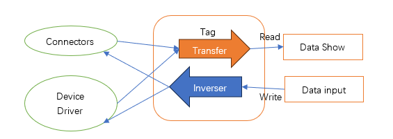

Tag List
==

In the main UI of IOT-Tree project, click a container node, and the Tags tab in the main content area will display all data tags under this node. If you select the project root node, a list of all data tags defined for the entire project is displayed. As shown in the figure:

## 1 Tag Types

Under the container node. There are three types of tags: normal tag, middle tag and system tag.

>The normal tag is the most basic tag, which can obtain updated data from the connector and driver. If the drive supports write operation, it can also write output data to the device or other systems through the tag. The normal tag can also have a converter inside, which can make necessary conversion according to the input original data (such as converting the general semaphore data into specific data of some monitoring indicators).

>middle tags are built on the basis of normal tags and are read-only. Generate your own values through built-in expressions or JS scripts (expressions and JS scripts are input as variable data based on normal tags), so it can support some complex data conversion. Obviously, an middle tag can input multiple other tag data, and then perform relevant conversion. For example, when a certain monitoring indicator data gets the original data from the device driver, it spans multiple normal tags. These tag data need to be combined or converted to calculate. At this time, using middle tags is a good solution.

>The system tag is the internal tag of IOT-Tree. Such as node name, driver name, communication status, etc. The names of these tags start with "_". This also stipulates that when we define normal or name tags, the name cannot start with "_". Generally, system tags are not displayed. You can click "Show System Tags" in the upper right corner of the tag list to show them.

## 2 Tag Context

As explained in the previous document, the hierarchical relationship of container nodes determines the accessibility of internal resources, and container nodes can access all resources within themselves and in their descendants. Therefore, under a container node, the unique ID of each tag is the relative path with the current container node as the root. Each path is hierarchical with the symbol ".". The path is preceded by the name of the parent container, and the last level is the tag name.

>IOT-Tree also stipulates that only the direct tags under the current container node can be edited in the list, and the new tags under a container node are directly belong to the current container.

## 3 Adding and editing tags

Select a container node with the mouse. In the tag list, you can see the "+Add Tag" and "+Add Middle Tag" buttons. Click the "+Add Tag" button to open a new tag editing dialog under the current container node, as shown below:

From the figure, we can see that the current node is "/psa_demo/ch2/p1", respectively, is "/project/channel/equipment". In addition, you can find that the direct sub tags in the tag list are editable.

>We can enter the name and title of the tag. The name must meet the name qualification requirements of IOT-Tree (A-Z a-z starts, and A-Z a-z 0-9 _ can follow). Then we can specify the data value type. If it is a floating point number, we can also limit the number of decimal places. R/W indicates whether the tag is read-only or read-write.

>The tag "Local" parameter is special. If it is true, it means that this tag is a "Localization" label. Turn on this switch, you can see that the dialog allows you to enter default values, and whether you want to auto save the switch option. If "Auto Save=true", the system will automatically save the value of this tag after it is modified. If the IOT-Tree Server is restarted, this tag value will automatically load the last updated value. This tag is suitable for existence as a parameterized value. For example, your project needs to adjust some control parameters at runtime. These parameters can have initial values, which can be defined with this tag. When Auto Save=true is set, the tag value will trigger the save action every time it changes, so try to avoid frequent updates.

>Tag address, which is related to the channel and device driver to which the tag belongs. If the channel does not define the device driver, the label address is meaningless (no need to fill in). If there is a related device driver, the address is related to the driver specification. For example, if the channel limiting device driver to which this tag belongs is Modbus RTU, then the tag address may be 400001; Another example: if the driver is Siemens PLC S7-200 PPI, the address may be I1.0, Q0.2, T40, etc. Please refer to:

[Device,Device Library and Drivers][device]

>Tag value transfer: when connector or driver obtain data and push it to this tag, the original data may not be consistent with our specific monitoring indicator unit. In this case, we can set an autochanger inside the tag. For this part, please refer to the relevant contents of "Numerical Reading, Writing and Conversion (Transfer)" in this article.

>In some practical projects, the monitoring data of some device may occasionally appear some interference data due to uncertain factors. Such as data mutation or acquisition anomaly. These interference data are not only invalid, but also may cause system misjudgment. At this time, we can set this parameter to enable anti-interference. IOT-Tree will use some filtering algorithms to filter the newly acquired data, so that the data can be anti-jamming to a certain extent.

[device]:../device/index.md

## 4 Numerical Reading, Writing and Conversion (Transfer)

It is a data reading process for normal tags by connector or driver. The tag value can be written manually (manually in the list or through the UI interface) or automatically by the internal JS program.

If there is an internal transfer involved, the value read from the tag is the content after the conversion. Similarly, if the tag is writable, a reverse conversion is required in addition to the forward conversion, otherwise data inconsistency will result.

In the normal tag editing dialog, click on the Transfer input box, and you can see that it supports two types of transformations: Scaling and JS:

<table>
    <tr>
        <td></td>
        <td></td>
    </tr>
</table>

Among them, "Scaling" supports the conversion of raw data input through linear or square root methods, and of course, the inherent reverse conversion is also automatically supported. Through JS conversion, it is necessary to distinguish between forward and reverse situations, and they need to implement corresponding JS scripts separately.

From the JS conversion textarea, we can see that a transformation is actually an anonymous JS function inside IOT-Tree, with input parameters of $tag and $input, representing the JS object and input value of the tag, respectively. You only need to fill in the internal code of the function and return the result through the "return" statement.

For JS script support, please refer to:

[IOT-Tree JS Script][js]

[js]:../advanced/adv_js.md

## 5 Middle Tag Editing

In the tag list corresponding to a container node, click the "+Add Middle Tag" button to open the Add Edit Middle Tag dialog.

### 5.1 Read Only Middle Tag

It can be seen that in addition to the items related to name, title, and data type, there is also an Express JS content. This content takes the current container node as the context and can run JS code that outputs to tag value.

### 5.2 Read/Write Middle Tag

In the Read/Write selection box, select the Read/Write option and you will see an On Write JS input box appear. You can fill in the JS script in the input box, which will be triggered when this tag is written.

Please take a closer look at this input box, and you can see that JS code is essentially an internal code of a function, with two input parameters $tag $input. Among them, $input represents the value that the Tag is written to, and the type of this value is determined by the Data Type.

The writing and reading of intermediate nodes are exactly the opposite, where you can provide updates to multiple data or specific JS logic.

For JS script support:[IOT-Tree JS Script][js]

## 6 Tag List Other Auxiliary Functions

In the editable tag list, you can use the mouse to select multiple tags and perform copy and paste functions. These auxiliary operations support can greatly facilitate your project data settings.

