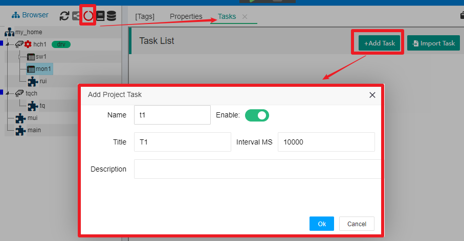
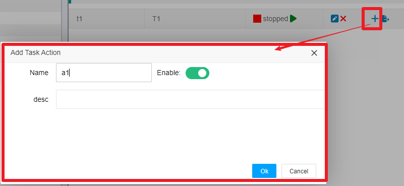
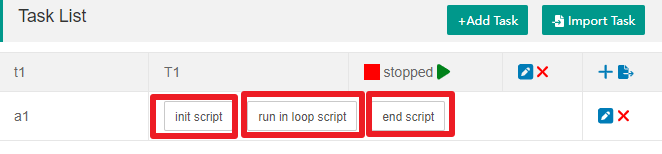

Task
==

In a IOT-Tree project, in addition to accessing devices or data through a Connector, you establish a project tree and organize the data below the nodes. Next, you may need the project to do some ongoing work for you. These tasks may include:

>You need the project backend to continuously run a logic, make judgments based on a portion of the input data, and then write data to other tags to form specific controls, which is similar to a PLC controller - if your IOT-Tree device is running in an embedded device and controlling a specific machine.

>There is a cloud website that requires you to regularly push data in the specified format in IOT-Tree (for example, IOT-Tree exists as a edge computing device of the Internet of Things, and you need to use a secure and reliable communication method to connect to the cloud).

Generally, if you need a project to continuously carry out some internal work, you should consider using the IOT-Tree task mechanism to solve it.

## 1 Task and Action

In an IOT-Tree project, you can define multiple tasks, each of which takes up one thread when running.

Within each task, multiple actions can be defined, which share the threads of the task they belong to.

Task and action two-level management allows you to flexibly arrange you needs.

### 1.1 Adding tasks and actions

In the main UI of project management, click the task running status icon above the project tree, and you can see that the right tab has added Tasks, which is the task list management UI for this project. Click on the "+Add Task" button in the upper right corner and fill in the following information in the pop-up dialog for adding tasks:

In addition to the task name and title, you must set Enable so that the task will also start and run when the project starts. Additionally, you can set the running time interval of the task in milliseconds.

After clicking the "OK" button, the newly added task will appear in the task list.

Each task must contain at least one Action, otherwise the task is meaningless. To the right of the task item t1, click the "+" icon to add an Action, and fill in the following content in the pop-up action editing dialog:

Click "OK" and you will see that item a1 appears under task t1.

It is obvious that the new Action we added has not been completed yet, as we still need to tell this Action how to work. In each Action, the running logic are all supported by JS scripts. But in order to ensure that we can implement a Action with rules to follow, we have also made some JS script functional divisions for each Action. 

### 1.2 JS script partitioning in Action

Let's take a look at the newly added Action a1 above, as shown in the figure:

As you can see, there are three script divisions within each Action: "init script", "run in loop script", and "end script". They correspond to "initialization script", "repeatedly running script in the loop" and "running end script" respectively.

>init script: When the task is started, it is only run once. You can define initialization variables and some function declarations.

>run in loop script: This JS script will be run repeatedly during the task run according to the running time interval set by the task.

>end script: When the task stops normally, it will be run once. You can deal with the aftermath.

You can click to edit the JS script of the three parts of each Action as needed. Of course, if you do not set any script for a part, it will not work.

JS in task, please refer to [JS In Task][js_in_task]

### 1.3 Auxiliary support

Support for exporting and importing tasks

## 2 IOT-Tree Task JS Script

JS in task, please refer to [JS In Task][js_in_task]

[js_in_task]:../js/js_in_task.md
