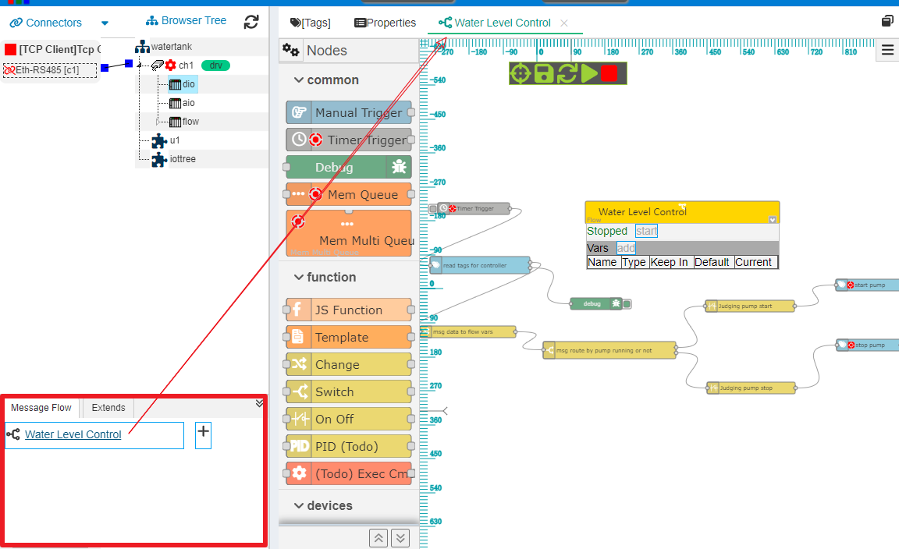
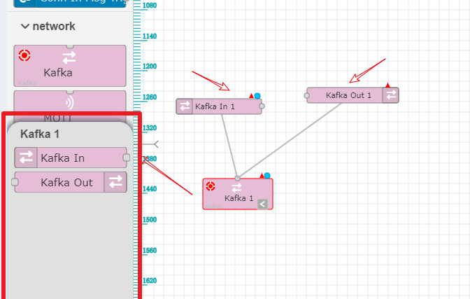
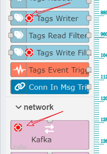
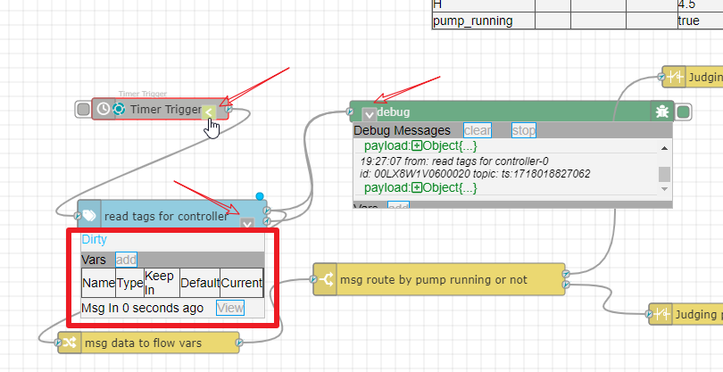
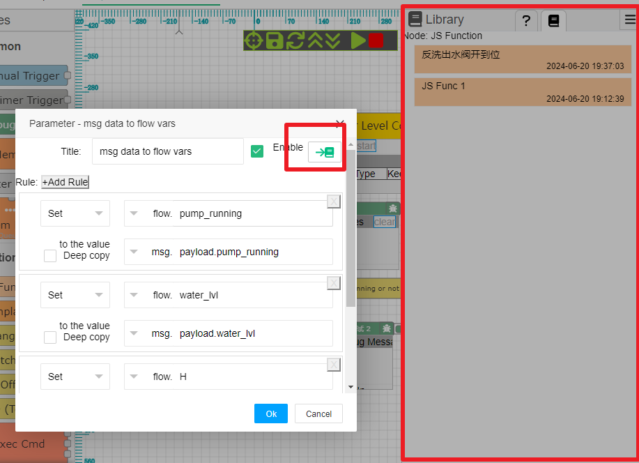

Message Flow/Net
==

Before IOT-Tree 1.7.0, IOT-Tree attempted to use/process data collected from tree roots in various ways. For example, alert module, task scheduling, storage support, and data routing. These modules provide targeted data processing and usage for specific aspects, but each function is always limited. It can be imagined that if IOT-Tree is to provide more powerful upper tree functionality in the subsequent use process, it will only add more limited functional modules, which will make the application of the system at the branch and leaf levels increasingly complex.

For example, in order to enable IOT-Tree to directly support data push for systems such as ERP and MES; Alternatively, providing workstations on the production line with support for production tasks, starting and connecting on-site sensors and other equipment, the existing functional modules are bound to be unable to meet the needs. The only implementation method is to interface with real-time data of IOT-Tree through secondary development, and then analyze and integrate on-site data into the top-level system. In this way, the role of IOT-Tree in it is only an OPC Server or IO data interface, and the implementation of related applications will become very complex.

To address the above issues, in version 1.7.0, IOT Tree introduced important features:

Message Flow/Net

## 1 Overall

This feature can replace all the functions implemented in previous versions, including alert module, task scheduling, storage, and data routing. The overall approach is based on Message, establishing flow management through nodes. The nodes inside provide basic functions, and you can combine these nodes according to your needs, establish various message processing flows/networks, and achieve various top-level business needs.

This is different from the traditional workflow. The traditional workflow node represents the activities or work item. The path can have context data running conditions, and can decide the process direction independently. At the same time, this is different from the ladder diagram of PLC. The path of PLC ladder diagram represents the signal line, and the granularity of nodes can be very small, basically existing to achieve control logic.

This is similar to "Node-Red",but very different. "Node-Red" provides various basic nodes based on Node.js, and the basic idea is to replace message processing code programming with message nodes. The functional granularity of related nodes is also very fine, but the overall flow operation tends to shield complex underlying layers. This creates a bit of contradiction - if you want to implement simple functions, it's not a big problem, but if you want to implement complex business paths, it may cause the network to be very large and lose its intuitiveness (it may be better to write code directly, this is my personal opinion. If I don't understand correctly, please criticize me).

Taking into account the advantages and disadvantages of various flows, IOT-Tree provides the following strategies for this:

1) Fully utilize the intuitiveness of the message flow to simplify development.

2) To avoid a flow that is too large, try to provide medium granularity nodes as much as possible: node functions should be as independent as possible but not too finely divided

3) Support on-site control, provide asynchronous running nodes, and enable intuitive observation of running status in the flow. The Debug node can independently display a list of received messages.

4) Supporting intuitive display of contextual data, allowing users to have better control over flow running.

5) Support standard Java web-app deployment and provide business node plugins, allowing the system to expand infinitely and cope with various ever-changing needs.

At this point, IOT-Tree can be considered as two functions in architecture: one is the root function that connects various device sensors and forms unified and organized data; One is the message flow/network on the upper tree, which can provide powerful and efficient support for various complex business functions while maintaining light coupling between modules.

## 2 Message flow/network composition

### 2.1 Three levels of project, flow, and node

The message flow in IOT-Tree is dependent on the project, and a project can define multiple message flow objects. Each flow can have multiple nodes, and message routing logic is established through connections.

Therefore, for runtime context, the scope of use of relevant variables is as follows:

1. Variables in the flow that can be used by all nodes

2. Variables within a node can be used within the node

The message object can be considered as dynamically generated memory, and after each triggered message runs through different nodes in the flow, it will disappear.

### 2.2 Flow

The flow established based on project, the data defined in the project can naturally be directly used. At the same time, the start and stop of the flow are also controlled by the start and stop of the project.

In the flow, different types of nodes can be placed arbitrarily. You can place multiple starting nodes(that can trigger messages), intermediate nodes, and ending nodes. Intermediate nodes can also be used as end nodes.

Therefore, in a sense, you can complete all the operational requirements of a project within only one flow.

In the project management main page of IOT-Tree, the flows list management is located in the bottom left corner, where you can add, delete, and modify basic information about the flow. Click on a flow title, and the corresponding message flow editing UI will appear in the main content area on the right.

#### 2.2.1 Basic operations in the flow editing area

The message flow editing area displays the flow using infinite scaling, and you can use the mouse scroll wheel to zoom in and out of the image.

Use the right mouse button to move and roam the editing area.

Use the left mouse button to select, move, and modify nodes and paths.

After selecting nodes or paths, click the "Del" button to delete the relevant node.

When a node is moved, a modification circle will appear in the upper right corner of the node, indicating that the basic information such as the node's position has been changed. At this time, you need to click the save button above to synchronize to the server.

### 2.3 Nodes and Paths

The flow is mainly composed of nodes, and nodes can flexibly establish associated paths. Currently, the path only represents the message passing path between nodes and has no other functional significance. Therefore, the node capabilities related to the flow have become crucial.

#### 2.3.1 Overall node description and basic operations

The node of the IOT-Tree message flow is represented as a rectangular block, with input and output corresponding to the left and right sides. Among them, each node can only have a maximum of one input, and the output can be unlimited according to the needs of the node.

1. Add nodes

In the message flow editing UI, all nodes are displayed in the left list, and you can add nodes by clicking and dragging them to the content area.

2. Modify node parameters

After adding a node, to set parameters, double-click with the mouse to open the node parameter editing dialog box.

3. Establish paths between nodes

Input and output connection points on both sides of the node. After left clicking with the mouse, do not release it. When moving, a connection line will appear. When the mouse moves over another node (or the connection points on both sides of the node), release the left button. If conditions permit, a path will be established

4. Delete node

After selecting a node, press the "Del" key to delete the corresponding node

#### 2.3.2 Module

A module is a special node that does not have input/output connection points, but has an association point above or below. It represents a collection of functions and can carry its own supporting nodes.

For example, a module that supports Kafka communication can represent a Kafka client link. Click and select on this module, and a list of matching nodes corresponding to the module will pop up in the node list on the left. You can also create supporting nodes by dragging and dropping them, and these nodes will have an associated line to the module block. The newly created supporting nodes will share resources within the module.

We can double-click the module or supporting node in the same way to open the parameter editing dialog box for setting.

#### 2.3.2 Asynchronous running node

IOT-Tree also has clear time control over message flow. In general, message passing between nodes is essentially a function call - that is to say, during the message passing flow, the running time of the preceding nodes will be affected by the running time of the following nodes. If a node has a relatively long processing time, it will cause the previous node to receive and process messages, which is intolerable for situations with high time requirements.

Therefore, when implementing a node, it can have its own internal processing thread, which is an asynchronous processing method. When a message is delivered, it is immediately received and returned, and then an internal asynchronous thread is used for specific processing. Asynchronous nodes will have a running status icon, as shown in the following figure:

#### 2.3.4 Node runtime status information

IOT-Tree provides strong support for debugging and observing the operation of message flows. After selecting each node, a running status display/hide button appears, and clicking this button can display or hide status information below the node. Especially for the "Debug" node, all received messages can be listed. As shown in the figure:

#### 2.3.6 Common Nodes

1. <a href="n__com.manual.md">Manual Trigger</a>

Manually triggering messages, this node is generally used for testing

2. <a href="n__com.timer.md">Timer Trigger</a>

There is a timer inside this node that can trigger new messages based on certain strategies (such as time intervals)

3. <a href="n__com.debug.md">Debug</a>

Support printing a list of received messages, which can be used to track and debug the output message data of specific nodes in the message flow.

4. <a href="n__com.mem_que.md">Mem Queue</a>

There is a queue and queue listening thread inside the node,which allows input messages to be quickly received and avoids some subsequent nodes blocking the message processing of previous nodes.

#### 2.3.6 Function Nodes

1. <a href="n__func.js_func.md">JS Function</a>

This node internally supports the running of server-side JS code,allowing you to flexibly handle input messages and control output messages

2. <a href="n__func.template.md">Template</a>

This node internally supports the running of server-side JS code,allowing you to flexibly handle input messages and control output messages

3. <a href="n__func.change.md">Change</a>

This node supports the setting or exchange of contextual data,such as saving the data in the message to variables in the node or flow

4. <a href="n__func.switch.md">Switch</a>

When there is an input message, determine which channel to output from based on certain conditions

5. <a href="n__func.onoff.md">On Off</a>

Determine whether the input message has passed or blocked based on certain conditions

#### 2.3.7 Devices

1. <a href="n__dev.tag_reader.md">Tags Reader</a>

Based on the selected tags and variable names,read the tag values in the current running project to form JSON data output

2. <a href="n__dev.tag_writer.md">Tags Writer</a>

Write the Tag based on the selection and assignment method. Due to the potential involvement of underlying drivers and communication in tag writing,there may be some delay, so this node also supports asynchronous running

3. <a href="n__dev.tag_filter.md">Tags Read Filter</a>

According to certain filtering conditions (project tree root and node attributes), read device runtime data (JSON format tree structure)

4. <a href="n__dev.tag_filter_w.md">Tags Write Filter</a>

Nodes receive JSON data in a specific format and can be determined by the outside world which Tags to write to.Nodes can set the range of writable Tags

5. <a href="n__dev.tag_evt_trigger.md">Tags Event Trigger</a>

By selecting the event configuration item in the tag,listen for events generated by changes in the value of the relevant tag during runtime,and generate event message outputs based on certain strategies

### 2.3.8 Network Nodes

1. Kafka

2. MQTT

3. HTTP

### 2.3.8 Simulator Nodes

1. Modbus Slave Bus

## 2.4 Nodes Param Library

When a node parameter is complex and needs to be reused in other flows, the parameter library function can be used. Double click on the node to open the parameter editing dialog, click on the "Save To Library" icon in the upper right corner, fill in the title, and then complete the parameter entry operation.

When you double-click a node in the list on the left side of the flow, not only can you open the help for that node, but you can also switch to the parameter library to view the saved items related to the node. If there have the item you need, simply drag and drop it to the flow drawing area to complete the node addition - this node will automatically set the previously saved parameters.

