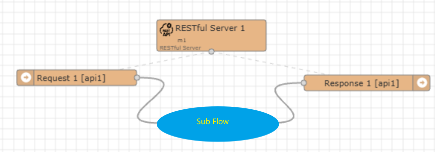

Module: RESTful Server
==


This module provides the configuration function for external RESTful services. It can convert the message input and output processes established by other nodes into external RESTful requests and response APIs, enabling the IOT-Tree running instance to directly become your backend system.

This module has two sub-nodes: the request node and the response node. They must be used in pairs (with the same Api Name) during use. They represent the triggering message node when an external HTTP client initiates a request, and the output response message after you process the message. As shown in the figure below:





Between the request and response nodes, you can configure any message input and output subflow (including a single node).

Note: The module must be configured with a corresponding module name, the request node must be configured with an API name, and the response node must select the same API name as the paired request node.

Ultimately, each requesting node will automatically generate a RESTful URL. The format is as follows:


```
http://your_host:port/[prj_name]/_mn_restful_m/[net_name]/[module_name]/[api_name]
```
