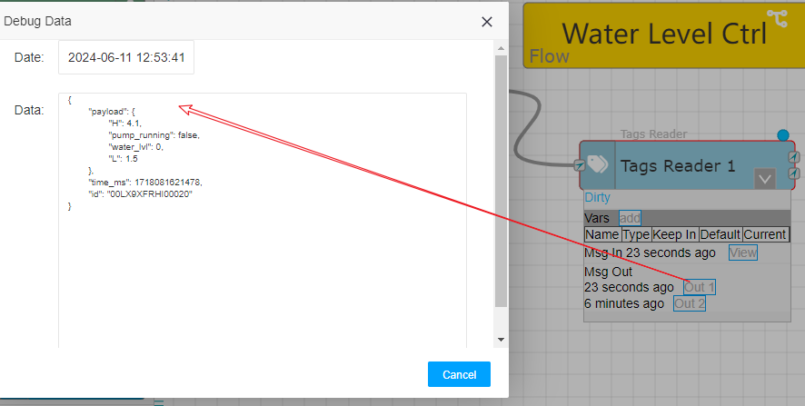

Using message flow to implement control logic
==


Before version 1.7.0, after integrating the device's regular data tags, if control was to be implemented, the task scheduling function could only be used. By defining a scheduled JS server code, real-time data from the tags could be read and control instructions could be output.

When you see this article, you no longer need to use task scheduling to implement control logic. Of course, the task scheduling function will also be retained indefinitely.


### 1 The advantages of using message flow for control


1\. More intuitive display

The flow established by nodes and paths is naturally more intuitive and less prone to errors than pure code, resulting in higher implementation efficiency.

2\. Flow nodes can naturally represent states

The essence of control is the process of continuously obtaining real-time data from on-site sensor and controllers, then calculating and implementing some results based on control logic, and outputting them to on-site controllers or actuators. The controls here can be seen as the required control logic in the current state, and they switch as the state changes. This is a control state machine.

The message flow consists of nodes and paths, and the nodes themselves can represent a state. Therefore, achieving control will be clearer.

3\. During debugging or running, the flow nodes' status can be monitored at any time

Each node in the IOT-Tree message flow can have its own status monitoring, allowing for monitoring of each stage of the flow at any time. The control logic implemented directly using code is essentially a black box at runtime, apart from possible log output.

4\. Limitations bring better implementation

Message flow has certain limitations on the implementation of logic and cannot be as arbitrary as code. But this can actually bring greater benefits. The sufficiency of some special nodes can make control implementation easier (such as using message queue nodes), and can also enable most users with different technical levels to achieve the same reliable effect in implementation patterns.


### 2 Implementation of control logic


We use the system's built-in demonstration project (Water tank and Medicine doing) to implement the control logic. This demonstration project has already implemented control of water level and pump running status using task scheduling and JS. Please refer to:


　　　　<a href="../case/case_auto.md" target="main">&nbsp;&nbsp;&nbsp;Automation</a>

Now using message flow to achieve the same control process.

#### 2.1 Control implementation ideas


This water level control is very simple. We only need to read the current water level value (water_lvl), maximum water level limit (H), minimum water level limit (L), and pump running status (pump_running).

Then, using the status of the water pump as the state machine, control is implemented to:

1\. State 1: Water pump stopped - Check if the water level is below L. If the conditions are met, output the command to start the water pump.

2\. State 2: Water pump running - Check if the water level is higher than H. If the conditions are met, output the command to stop the water pump.


#### 2.2 Detail of implementation


Please refer to other documents to import the demonstration project (Water tank and Medical Dosing) and the accompanying simulator to ensure they can run normally. Then enter the main page of project management, click on the task icon above, and uncheck the built-in task scheduling setting "Enable" parameter inside, so that the task will not be run. As shown in the following figure:


#### 2.2.1 Create New Flow in Project


Referring to the bottom left corner of the above figure, it is the message flow management area of the project. Click the "+" button to add a new flow. In the pop-up dialog box, fill in the following information:


```
Name:lvl_ctrl
Title:Water Level Ctrl
```


After confirmation, this message flow appears in the lower left corner area. Click on the title, and the main content area will display the detailed content of this message flow:


In the flow, there will be a main flow node displayed, and our subsequent node additions can revolve around this node.

#### 2.2.2 Obtaining tags data

##### 2.2.2.1 Manually obtaining tags data


Following the previous state machine control approach, we first need to obtain the tags data that has already been defined in the project. In the list of nodes on the left, under the "devices" category, left-click on the "Tags Reader", drag and drop it under "Water Level Ctrl" to release it. This completes the addition of the node.


Next, we double-click to open the parameter settings dialog box for this node, click the "+Add" button inside to add multiple read tag items, select the tag in each read item, and fill in the corresponding variable name. They correspond to four variables, namely the current water level value (water_lvl), the maximum water level limit (H), the minimum water level limit (L), and the pump running status (pump_running). As follows:


After confirmation, this node completes the parameter settings, and the four variable names inside will be used as members in the payload JSON object for outputting messages. At this point, we need to check whether the output data of this node meets our requirements, but this node cannot be triggered on its own. It needs to be triggered by a message coming in at the input point.

Then add a manual trigger node for testing!

In the left node list, select the "Manual Trigger" node in the "common" category and add it using the same method. Then click on the connection point on the right side of this node, pull out the connection line to "Tag Reader 1", and once released, establish the path. The "Tag Reader 1" node does not require input message format, it only needs a message to run and retrieve the configured tag data.


At this point, click the trigger button on the left side of "Manual Trigger 1" to trigger a message and make "Tag Reader 1" work through the path. To view the output of "Tag Reader 1", select this node, click on the show/hide running status icon, and you can see that this node "Out 2" has output.


This output point indicates that the data read by the node is invalid, and the payload content is an invalid tags array. You can click the "Out 2" button to view it. Why is it invalid? This is because the project has not been started, and all tags are invalid (if you have already started the project, it is another result). Start the project and ensure that all tags have valid data. Manually triggering again, you can see that "Out 1" also appears. After clicking, you can see the output message in the pop-up dialog box, as shown in the following figure:




You can see that the payload content in the output message of the first out point is, which is the data we want:

```
{
    "H": 4.1,
    "pump_running": false,
    "water_lvl": 0,
    "L": 1.5
}
```

##### 2.2.2.2 Timed acquisition


Now that we can confirm that the "Tags Reader 1" is running properly, we will add a timed trigger to drive this tag to read data on a scheduled basis.

Under the "common" category in the left node list, select "Timer Trigger", create a new node, and establish a path with "Tag Reader 1". Double click on this node and select "Repeat=Interval" and "Interval=100 (MS)", which means that the timer triggers a message every 100 milliseconds. Open the running status of this timer node and click the "start" button inside to start it. You will find that the timer is in running mode, and the small arrow on the connection point keeps rotating, indicating that the node is constantly passing messages.


At this point, we can only view the latest message on "Tag Reader 1". If you want to view each message list, you need to use the "Debug" node.


##### 2.2.2.3 Debug Messages


Select the "Debug" node on the left and create a new node called "Debug 1". Then, establish a path from the first output point of "Tag Reader 1" to this Debug node. Open the running status of this node and you can see a quickly refreshed message list. You don't need to stop any nodes during this process, as shown in the figure:


You can zoom in on the UI to easily view the message list. If you want to view specific messages, you can pause the list refresh, so that you can expand the payload content of the messages.

Next, we will use this message for state switching and control.


#### 2.2.3 Set message data to flow variables


We are now able to obtain tags data, which can only be present in messages. In order to facilitate the use of this data by other nodes at any time, the output of "Tag Reader 1" can be set to the context variable of the message flow.

Select the "Change" node under the "function" category on the left to add node, and connect from the first output point of "Tag Reader 1". Double click to open the parameter dialog box. Choose to fill in the following information:


Among them, each rule inside is obtained from the JSON object of the input msg's payload, and set to the corresponding variable of the flow. After confirming, click on the main node of the flow and expand the running status information. You will find that there are four variables inside.


You can see that the numbers inside will not change because the water pump has not started, so the water level value naturally will not change. These variables can be used in all nodes because they are in the flow.


#### 2.2.4 Switch paths based on water pump status


Next, we need to implement control for different states, which are based on the variable "pump_running". Therefore, we will select "Switch" in the left "function" category and add it after "Change 1". Double click to open and edit the parameters as follows:


Among them, we use the variable "pump_running" in the flow as the basis for judgment, and then add two outputs to compare the Bool constant "true" and "false", which correspond to two output points 1 and 2, respectively. By the way, I also modified the title of this node to "switch by pump running". After clicking "OK", you can see that there are two output points on the right side of this node. When "pump_running==true", the message will be switched to output point 1. If "pump_running=false", the message will be switched to output point 2. As shown in the figure:


#### 2.2.5 Establish two "On Off"


We select the "On Off" node under the "function" category on the left and add two to the "switch by pump running" right side, connecting them to output points 1 and 2 respectively. This is a message OnOff node, which can set internal conditions to determine whether a message passes or not.

For the message output from point 1, it indicates that the water pump is in running at this time. Therefore, in this state, the node determines whether the pump stop condition is met. If it is not met, the message is not allowed to pass. If the pump stop condition is met, the message is allowed to pass. Therefore, we set the node title to "Judging pump stop"

For the message output from point 2, it indicates that the water pump is in a stopped running state. This node determines whether the startup conditions are met. If they are not met, the message is not allowed to pass. If they are met, the message is allowed to pass. We set the title of this node to "Judging pump start"


We double click to open "Judging pump stop" and determine whether the pump stop condition "flow.water_lvl>=flow.H" is met based on the water level variable water_lvl and the high-level variable H in the flow


Similarly, double-click to open "Judging pump start" and set whether the starting water pump condition "flow.water_lvl<=flow.L" is met;

At this point, please observe carefully. As the water pump has not started, the message continues to flow to the node representing the status of "Judging pump start".
It is obvious that we need to place a node to start the water pump on the right side of this node, which involves writing the tag.


#### 2.2.5 Tag writing output water pump start/stop command


In this project, if the water pump needs to be started, it is necessary to write true or 1 to the tag "ch1.dio.pstart"; If the water pump needs to be stopped, write true or 1 to the tag "ch1.dio.pstop";

In the list of nodes on the left, under the category "devices", select the "Tag Writer" node to add, modify the title to "start pump", and connect it after "Jumping pump start". After double clicking, modify the parameters as follows:


Among them, select this node to run asynchronously, and select "ch1.dio.pstart" for Tag to assign the constant "true".

Similarly, add this type of node "stop pump" again, with the node running asynchronously. Choose "ch1.dio.pstop" for the Tag and assign the constant "true". The results are as follows:


#### 2.3 Running effect


If during the above setting process, your front timer is not turned off, then the flow control has already taken effect. You will find that the water pump will control the water level to change between H and L levels.

<font color="red">Please do not operate in this way in actual projects. All relevant message flow settings must be completed and tested before they can be connected to actual on-site equipment for testing</font>

You can also open the monitoring page and compare the message flow control you have done. In addition, you can also add multiple Debug nodes to view the running status of messages inside.

If you are not familiar with the function of a node, please double-click the node in the node list, and a help will pop up on the right.

Compared to using JS code and implementing by task scheduling, it is obvious that this control flow is much easier and more enjoyable!

