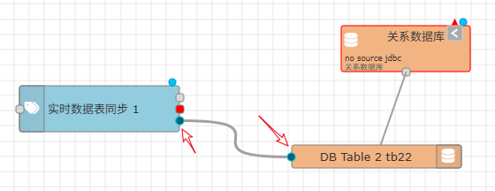

Tags RT To DB
==

By configuring relational data table, triggering the synchronous update of real-time data for all tags, it can provide real-time data queries based on relational database tables for the outside application

This node must be used in conjunction with "DB Table" resource nodes included in the "Relational DB" module.

Every time there is an input message, a synchronization operation of the database table is triggered. Each tag in the project will create a row of data in the corresponding table, and the values and time columns inside will be synchronized according to the actual changes of the tag.

