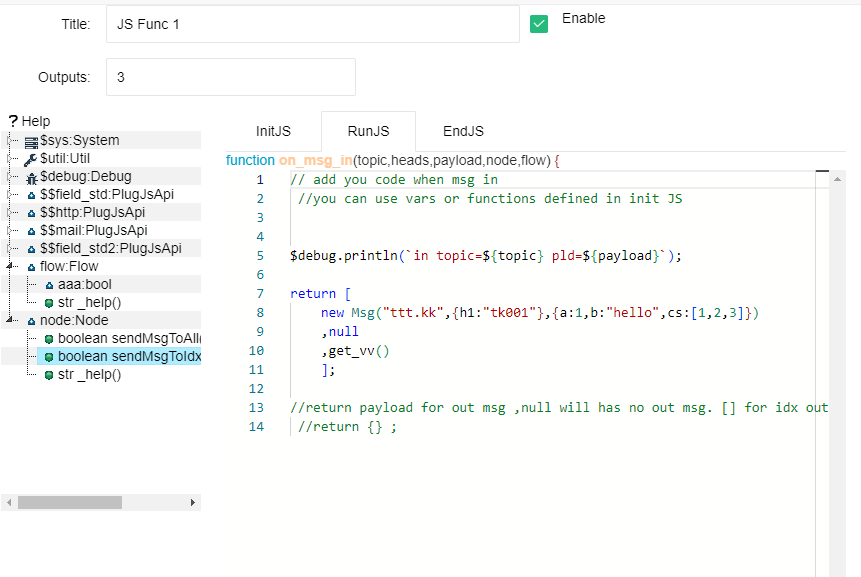

Node: JS Function
==


This node supports using JS scripts to handle input messages, node variables, and flow variables, and controls the output of new messages.

Double click on the node to open the parameter settings dialog box. As follows:




### Outputs

This node can define one or more outputs. The output path is determined by the parameter settings of Outputs.

### InitJS


In this input box, you can define the JavaScript variables and functions required for node. These variables and functions will be used by other parameters.

The JS script content inside will run once during node runtime.

<font color="red">
Please note that the variables defined inside will not be automatically saved on the next startup. If you need to permanently store certain variables, please use variables from nodes or flow</font>


### RunJS


This script is essentially a message processing JS function. When a node receives an input message, this function will be called. You only need to fill in the content of the function:


```
function on_msg_in(topic,heads,payload,node,flow) {

}
```


Among them, topic, heads, and payload are belong to the input message; Node represents the object of this node, and you can access the variables and support functions inside; Flow represents the object of this flow, and you can access the variables and supporting functions inside.


**The return value of this function represents the output of this node in the following ways**

1. return null; Or no return statement: This indicates that this node has no message output

2. return obj; This obj represents a basic data or a {} object, which means that this node outputs the same message object to all output channels. The payload of this message object is this obj.

3. return \[null,obj,null\]; Returns an array representing control over the output of multiple channels, starting from 0 and corresponding to the output message payload of each channel. If one position is null, it means that this channel has no output.


The content directly returned above will only affect the payload of the output message. If you want to output a message with more detailed content, such as setting a topic or heads. So please use the built-in Msg object.


**Output "Msg"**


The Msg is a built-in JS object, and you can construct and return it as follows to fully control the overall structure of the message:


```
let obj = new Msg(topic,heads,payload) ;
return obj;  // or return [null,new Msg(topic,heads,payload),null]
```
Among them, topic is a string, heads is a regular object {}, and payload is the message payload content.

**Using node support functions to output messages**


When implementing this node, you may encounter the requirement that after an input message is processed, it will be decomposed into multiple output messages. At this point, simply returning a value through the above function cannot meet this requirement.

At this point, you can call the functions in the node object in the JS script:


```
node.sendMsgToAll(msg)

node.sendMsgToIdx(idx,msg)
```


They correspond to outputting messages for all channels or for a specific channel. Among them, idx is an integer starting from 0, corresponding to different output channels. "msg" must be an Msg object.

<font color="green">
If your JS code calls the above functions, then in fact, there is no need for a return statement. Of course, if you write a return statement, the content of the final return will also take effect</font>


### EndJS

Essentially, it is also a function that will be called once when the flow stops running normally

```
function on_end(node,flow) {

}
```
