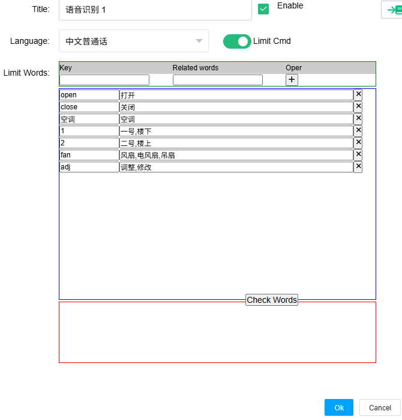
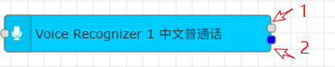
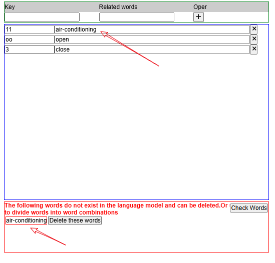
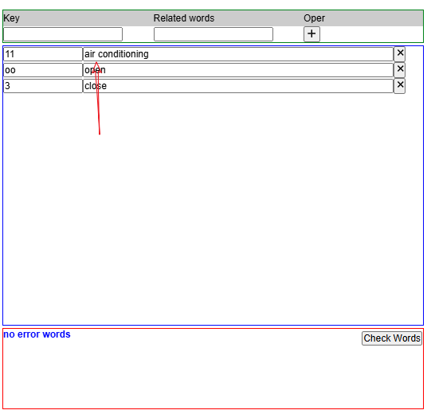
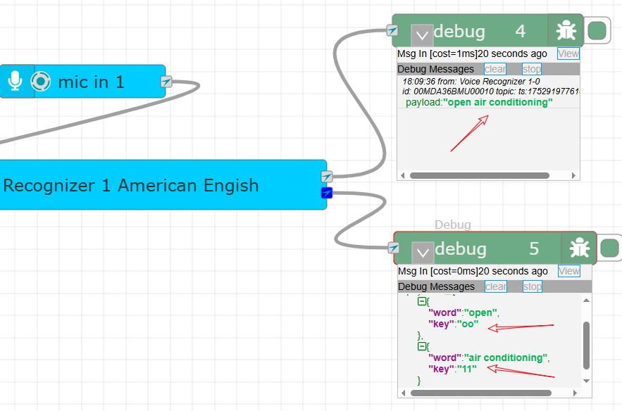

Voice Recognizer
==


Support voice stream input, and recognize and convert input audio data into text based on the set voice library.

This node can be used in conjunction with the bytes output data of the \[MIC IN] node.


### How to add language models to the system


In order to control the size of the IOT-Tree installation package, the language model was not packaged into it. After installing and deploying IOT-Tree, please visit <a href="https://alphacephei.com/vosk/models" target="_blank">here</a> to download the language model you need. And create directory "./vosk/models/" under the IOT-Tree installation directory 'data' .

Unzip the model and place it in this directory, and create a file named 'list.json' in this directory.

For example, two models are configured in the following figure:

```
vosk-model-small-cn-0.22
vosk-model-small-en-us-0.15

```
The final directory is as follows:
```
─vosk/
    └─models/
        ├─vosk-model-small-cn-0.22/
        ├─vosk-model-small-en-us-0.15/
        └─list.json
```
Edit list.json as follows:

```
{
	"models":[
		 {"n":"en_us","t":"American Engish","dir":"vosk-model-small-en-us-0.15"}
		,{"n":"cn_zh","t":"中文普通话","dir":"vosk-model-small-cn-0.22"}
	]
}
```


Ensure that the format meets the JSON format requirements. After saving, restart IOT-Tree and double-click on this node to select the corresponding model in the parameter dialog.


## Limit Cmd Parameters


The biggest goal of IoT-Tree using this node is to achieve voice control command output, and it is recommended to use a small model of tens of megabytes to avoid occupying too many resources (for large models, it is best to deploy them on high-performance servers to form a voice recognition server, and then call them through APIs such as HTTP).

At the same time, the output of control commonds has limited speech words according to the needs of on-site. If speech recognition can be limited to a set of words, it can not only reduce recognition interference, but also improve recognition success rate and performance.

Furthermore, there may be multiple words related to actions and controlled objects, and there needs to be a corresponding relationship for users to accurately locate specific controlled objects during voice input.

**Therefore, this node has added the option of "Limit Cmd" in parameter settings. Through this option, you can uniquely distinguish between actions and controlled targets using a key, and also associate one or more speech words with a key; And after recognition, the output will also include the relevant unique key as data output. This can provide a more accurate data structure for subsequent control logic (state machine), etc**

Double click the node, and in the opened dialog box, after enabling the "Limit Command", the interface is as follows:



Above the table is the area for adding key related words (words), and in the middle is the list of currently added key words. Each key can have multiple words, and different words can be separated by ','.

Below is the word check result area. Click "Check Words" to return which words currently filled in do not exist in the model. This is because the model has limited support for words, and all language words defined for a certain key must exist in the model. If there are non-existent words, you just need to adjust and process them according to the prompts.


## Node Output



The node has two output points, the first of which is the regular recognition result output, that is, the payload is a simple string composed of recognized words. For example:

```
open air conditiong
```

And the second is structured output after setting the restriction instruction. The format is as follows:

```
[{"key":"k1","word":"xxxx"},{"key":"2","word":"yyy"},...]
```

The whole is a JSON array, where each object is a word and its corresponding key. Subsequent processing can be based on a unique key for action determination and target localization.

## 限制指令单词组合匹配支持</cn><en>Limit Cmd - word combination matching support(<b style="color:red">*</b>)


<b style="color:green">Due to the use of lightweight speech recognition models within this node, some combination words such as "air-conditioning" may not be able to find corresponding words in the model. However, if they are split into two words, "air" and "conditioning", the corresponding content can be found, and two words will also be output during recognition. In order to better support this type of composite object, a matching algorithm has been implemented internally in this node</b>

Taking the identification of the object "air-conditioning" as an example, we have set the following restrictive parameters:

```
Key=ac
Related words=air-conditioning
```
After clicking the "Check Words" button, the model returns that the word does not exist.



At this point, you can replace '-' with a space character to make it a combination of two words, click the 'Check Words' button again, and you will find that it has passed.



Establish a recognition network, and from the voice command "open air-conditioning" on the microphone, you can see the following more accurate Key based result output:




## <font color="red">Important note</font>


Speech recognition is easily affected by surrounding noise interference. If you want to use it effectively, please use a more ideal input device and try to avoid the influence of surrounding noise as much as possible.

Please define the state after receiving commands in the recognition network as much as possible, and then confirm through prompts (such as Q&A or screen illustrations) to ensure that the commands are accurate and reliable before being issued.

In some important security related control situations, unless you can establish an accurate feedback confirmation mechanism before sending commands - which can ensure 100% safety and reliability, then this node can be used. Otherwise, it is recommended that you do not use this interaction mechanism.

