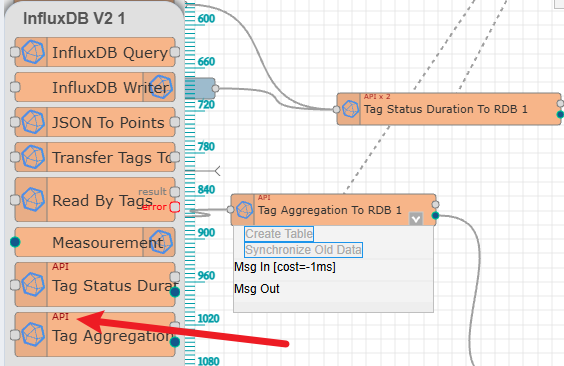
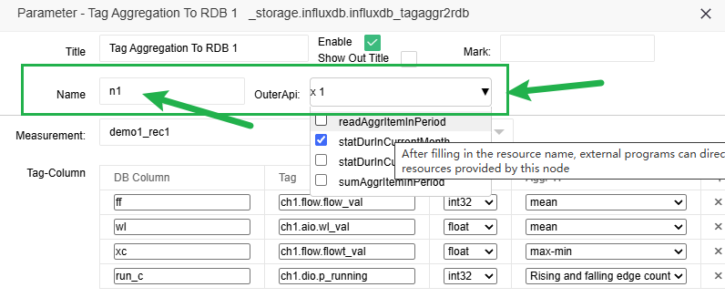
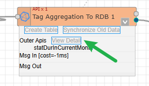

Nodes directly open HTTP API to the outer
==

Starting from version 2.0.0, some message flow nodes of IOT-Tree can directly open RESTful API interfaces to the outside world, which greatly enhances the functionality of message flow nodes.

For example, the InfluxDB Module for data recording provides the function of storing and recording collected data tags during system running. This node configuration directly contains basic database information, and it also includes multiple associated child nodes, which can be data query and data statistical analysis nodes. These nodes can certainly cooperate with other nodes in the message flow to achieve the required functions, but for IoT systems, many front-end displays or third-party systems hope that IoT-Tree can provide relevant data through RESTful APIs.

For the above requirements, you can also use specialized message flow nodes such as RESTful APIs to build external APIs to meet the needs. But upon careful consideration, it will be found that the APIs that are open to the outside world have long existed within the InfluxDB node. Therefore, directly opening up the external APIs of these nodes can bring great convenience.

## 1 Nodes that support outer APIs

If a message flow node supports outer APIs, there will be API markers, as shown in the following figure:

## 2 Set the required API to open

Double click to open the relevant node. If this node supports outer APIs, the following content will appear above the pop-up dialog box:

Among them, you must select the API that needs to be opened in the drop-down list and fill in the unique name of this node. This unique naming ensures uniqueness within the same message flow, used to distinguish different nodes.

## 3 View open outer API access paths

First select the node, then expand the node drop-down box, where you can see the content of Outer Apis:

Click the "View Detail" button, and a dialog box will pop up where you can see a list of all APIs, including access URLs that have already been opened to the outer

You can use some RESTful API client software or plugins for testing. Obviously, these APIs can directly output to the frontend.

