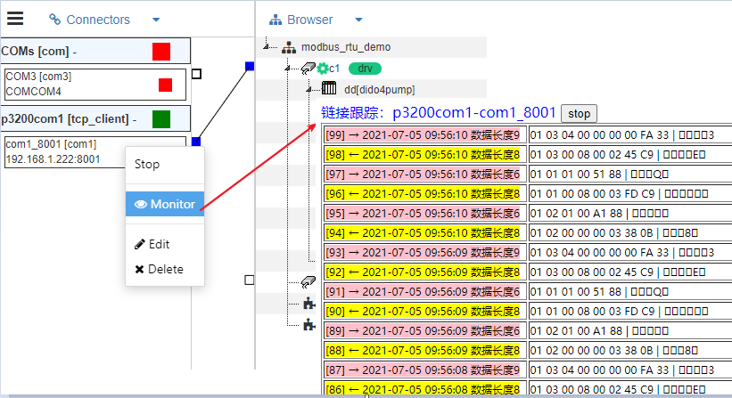

Connector-Channel-Driver
==


[IOT tree server tree] [qn_tree] arranges all devices and resources involved in a project vertically. With the channel as the center, the communication and drivers required for device operation are integrated horizontally.


```
               Project
                 |
Connector --> Channel <-- Driver
                 |
            Device/Tag Group
                 |
               Tag Group
                 |
               Tag
```


In the hierarchical relationship, the channel can be regarded as the deivces classification under the project in a sense. It is an abstract concept that unifies the protocols and drivers required for the same access and device operation that may be used by the device.

That is, all devices under one channel use the same device driver, and if necessary, use unified communication access.


## 1 Device drive

At present, there are many standard communication protocols in the Internet of things, such as modbus, can... And so on. In order to support and expand more and more devices, IOT tree server specifically implements pluggable device driver support. We will have more and more drivers to support your needs in the future.


### 1.1 Device definition

In order to be more convenient to use. IOT tree server specifically sets the organization and management functions of device definitions, which are independent of the project., Equipment definitions are managed through two levels: classification and equipment.

The equipment defined below the channel needs to have a better understanding of the corresponding protocol of the equipment, which requires relevant professional knowledge. Similar to the traditional OPC server, professionals can complete the definition of devices by selecting device drivers, setting device parameters, setting labels and driving address parameters corresponding to labels.

Once the equipment definition is completed, the defined equipment can be directly referenced in the project to form the specific equipment in the project. These specific devices require very few or no subsequent parameter settings.

All device definitions must be under the driver. If a device supports multiple protocols and the IOT tree server has corresponding drivers for different protocols, a device may have multiple definitions in the IOT tree server, each defined under different drivers.


For more detailed device definitions, please click here: 
[device definition][qn_devdef]


### 1.2 Select the drive on the channel

After a driver is selected for a channel, the available devices under the channel are limited - only the devices defined under the driver can be selected.


## 2 Communication access connector

At present, there are various communication modes and protocols in both industrial communication field and Internet field.

Further, in the field of Internet of things, a system is likely to have devices scattered in a wide range for remote access.

In another case, some systems will have special Internet of things gateways. Many devices are connected under the gateway, and then converted into TCP/IP protocol of the Internet through the gateway.

Different from some traditional industrial OPC software systems (these software often combine device driver and communication), IOT tree takes communication and access as a subsystem, and the driver reuses communication access as much as possible in design.

In the IOT tree server project, the communication access connector can only be associated with the channel, which establishes an indirect connection with the driver selected under the channel.

Obviously, when the channel is associated with the access, it is necessary to judge the effectiveness according to the driver. If the access and driver do not match, it is also invalid.

Of course, some drivers directly carry the communication link function (this is common under some drivers such as httpclient), and this driver does not need the associated access of the corresponding channel.


### 2.1 Communication monitoring function

The independence of communication access can not only simplify the development and reuse of drivers, but also introduce more benefits in the communication layer. Such as maintenance and monitoring of communication.

IOT tree server can set or limit the relevant parameters of communication access according to the needs of the project, which can make the access more optimized. At the same time, it can also access the online monitoring function provided to track the communication data during the operation of the project. It is more convenient for the operation of the project.

The following figure shows the tracking display of Modbus RTU communication data:




## 3 run mode of connector, channel and drive
In IOT tree server, the connector can run independently, while the driver runs inside the channel. When the driver is implemented, it needs to consider the corresponding response when the associated access state in the channel changes, such as the disconnection or recovery of the access link.


[qn_tree]: ./quick_know_tree.md
[qn_devdef]: ./quick_know_devdef.md
