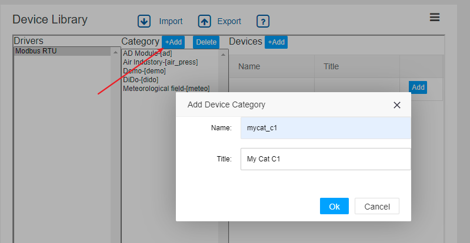
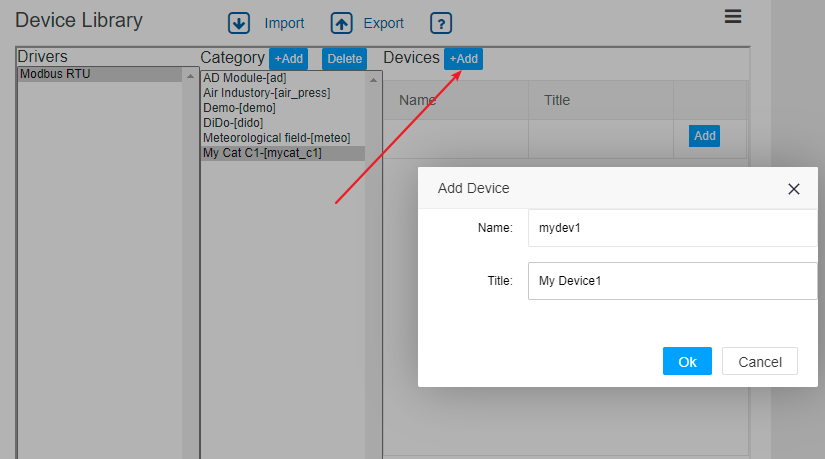
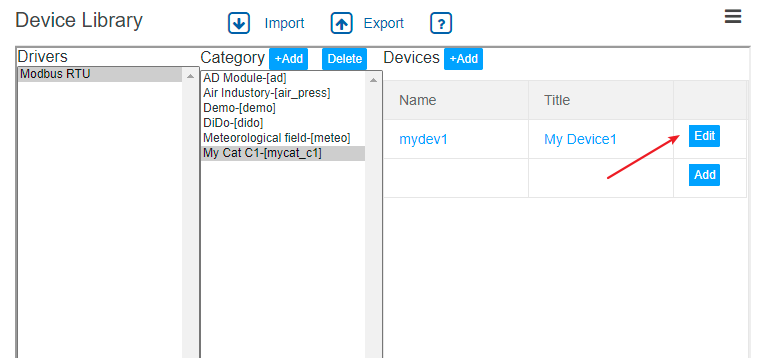
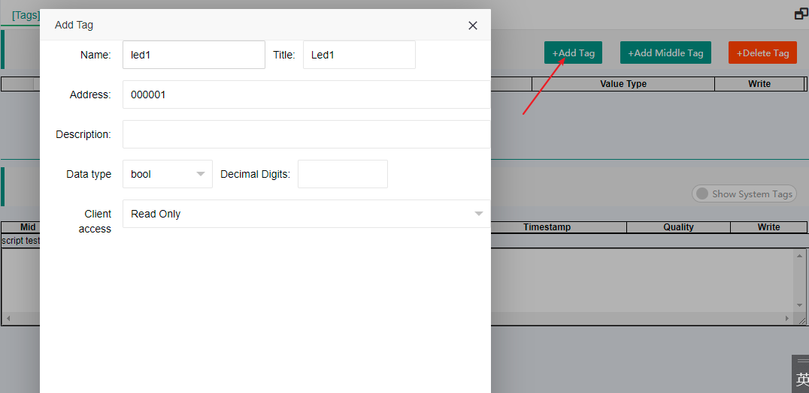
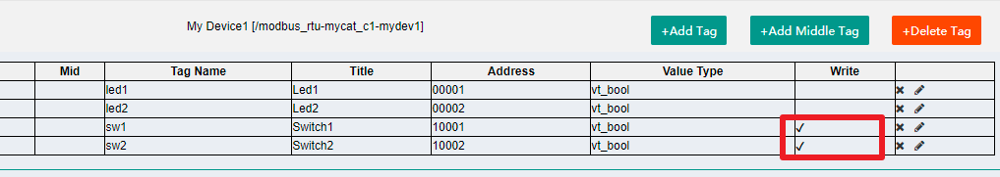
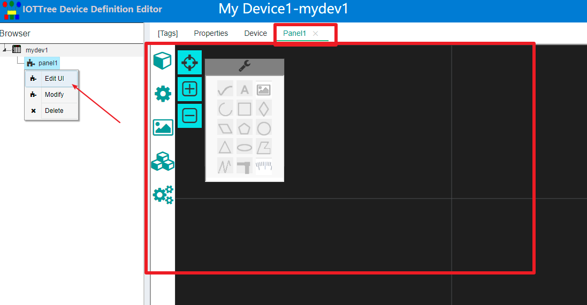
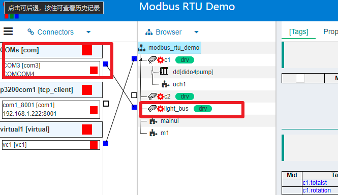

Quick understanding - device definition
==

This part mainly describes the location and overall concept of the device definition in the IOT tree server.

If you want to specifically define a device, you need to understand not only the corresponding driver of the device, but also the detailed characteristics of the device under the driver, such as the data point address provided by the device, etc. All these require certain professional knowledge and working experience in the field of automation. If you want to learn more, please refer to [In depth understanding device definition][adv_devdef]

After you successfully login to the management interface of IOT tree server, you will find a device library under the project list. Click expand on the right to view and manage the equipment library.

## 1 device categories and definitions under driver

IOT tree server stipulates that the device must be created under the channel and controlled by the device driver allocated by the channel. Therefore, the device definition is divided by the driver first, and the device classification is carried out in the middle. There are three levels of driver-category-devicedefinition.

Obviously, if you want your device to support multiple protocols in IOT tree server (your device supports multiple communication interfaces and protocols, and different protocols correspond to multiple drivers of IOT tree server), you must make different definitions for your device under different drivers.

### 1.1 device classification and suggestions

You can define your own device classification and define your device under the classification. The device definition import and export function of IOT tree server is based on classification. Therefore, a reasonable definition of equipment classification can facilitate your use.

It is recommended to use xxx_yyy for classification name and device format, xxx is your exclusive prefix, which reduces the conflict with the classification name provided by the system or other devices.

## 2 Device Definition

### 2.1 Add Device Category and Device Definition

In the device library management window, select the driver, and then click the Add button in the category. As shown below

Click the new category to add devices in the devices list. As shown below:

After the device is successfully added, it will appear in the list. Click the corresponding Edit button to start editing and defining the device in detail.

### 2.2 Edit Device Definition

Click Edit in the device list to open a special device editing interface. This interface is similar to item tree editing. The root node is the equipment node. If the equipment is complex and there are many internal data to be defined (in the form of tags), you can also add a tag group node under the equipment to carry out grouping and hierarchical management of tags.

#### 2.2.1 add tag
If the device is simple, you do not need to add a tag group. You can add labels directly under the device root node. As shown below:

The tag added as shown in the figure is similar to the mainstream OPC configuration device software. The key is to fill in different addresses according to different drivers. This part will be described in detail according to different drivers in the advanced content, or we will directly provide online help in subsequent versions.

If you are familiar with the mainstream industrial automation OPC software, then this part is easier for you. However, if you are not familiar with OPC software, it is suggested that you can also learn these professional contents.

In this example, we added four tags, two read-only LED1 and LED2, and two read-write switches SW1 and SW2, which follow the address of Modbus RTU protocol. As shown below:

#### 2.2.2 Set the properties of device under driving

This part requires an in-depth understanding of the corresponding driver of the device and the meaning of the corresponding parameters. Therefore, this content is not described in depth. For details, please refer to the relevant documents of device driver or the subsequent possible online documents.

Click the Properties tab in the main content area. As shown below:

This properties list is related to the Modbus RTU driver. Here you can define in detail the parameters required for the specific operation of your device on the bus, such as time, data frame, etc. Through the detailed and professional definition here, these complex settings do not need to be considered when the equipment is used in a specific project. For example, only one address needs to be set for Modbus RTU equipment in the project.

After setting the device tags and properties, we can also define interactive UI components for this device, so that the device can bring more reusable support to the project.

#### Define Device UI

Right click the device node and select Add HMI, named panel1

Then right-click the node of panel1 and select Edit UI. A new tab appears in the main content area. Here, we can edit UI components with the device as the root of the context. This part is basically similar to HMI UI components in the project. Please refer to relevant documents for details.

We edited a light control panel with two indicators and two switch buttons. As shown below:

After saving, our device definition is basically completed. Next, the device can be referenced in the project.

## 3 Relationship with the project

The device definition below the driver exists in the form of a device library, which also shows that it can be reused in projects.

Take the device defined in this document as an example. If a project has an RS485 bus and three my device1 devices are connected to the bus, the only difference between each device is the Modbus address. Then in IOT tree server, you can define a channel in the project and access the RS485 bus corresponding to the field. And this channel is driven by Modbus RTU. As shown below:

In the project, COM3 is used as the bus access of three field devices, and the channel light is established named "time_bus", select Modbus RTU driver internally.

Next, you can right-click light_bus node, select Add device. Repeat for three times and select the same device with the name d1, d2 and d3 respectively

Expand any device node and you will find that the defined contents of the device are automatically copied to the project. Of course, since the three devices must have different addresses, assume 1 2 3. Then, you need to click D2 and D3 device nodes and modify the corresponding address parameters in the properties area. As shown below

After saving, the data or UI components of the three devices can be used in the project.

As shown in the following figure, the mainui of the project can directly reference the panel components of these three devices

In the context of the project, you can also see that the tags defined by the three devices are also in the project. You can use them directly in the project, such as binding to the customized UI of the project, etc. As shown below:

[adv_devdef]: ../advanced/adv_devdef.md
