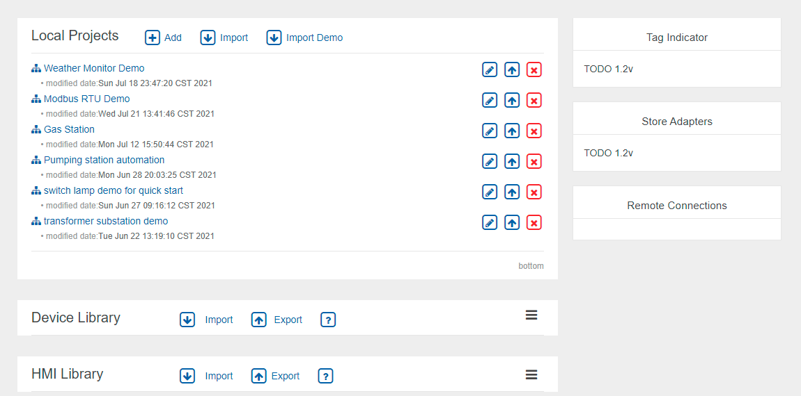
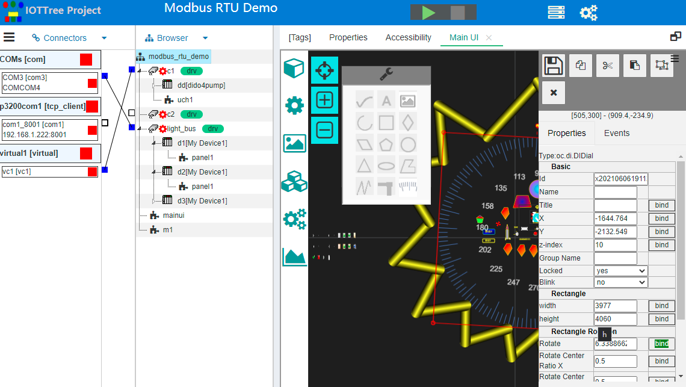

快速了解IOT-Tree Server的整体
==
## 1 IOT-Server的组织整体

IOT-Tree Server安装完成之后，启动访问管理端的相关地址为： http://host:port/admin

例如：在本地和缺省端口访问地址为：http://localhost:9090/admin/

此时会出现登陆界面，并且第一次登陆会让你设置管理员密码。后续登陆你只需要输入管理员密码即可。

登陆之后的首页汇总了此Server的总体内容。其中，最主要有项目列表、设备库、图元库以及辅助功能块内容等。

如图所示：主要区块内容有本地项目列表Local Projects、设备库（Device Library）和图元库(HMI Library)。其中，设备库和图元库缺省不展开，点击右边的图标，可以进行展开和搜索。

## 2 IOT-Tree Server的项目

接下来的重要内容就是单个项目管理主界面，点击某个项目弹出新窗口。进入了项目主界面。如下图：

此界面分为接入区（Connectors）、树型浏览区（Browser)和主内容区。按照左-中-右排列。

其中，主内容区以标签页的形式存在，可以根据需要打开显示多个标签页。
如在树形节点右键某些操作，可以使得相关功能界面在主内容区进行显示，或者不需要了也可以进行关闭。

在项目界面上方，除了显示项目标题之外，还可也通过启动/停止按钮对项目进行启动和停止操作。项目启动之后，通道、驱动等动态运行内容，也会体现到此界面中。同时，在Tags标签页中，所有的上下文数据（Tags）实时数据，会进行展示。如下图。

项目内部更深入的内容，请参考对应的其他文档。

## 3 IOT-Tree Server的设备

