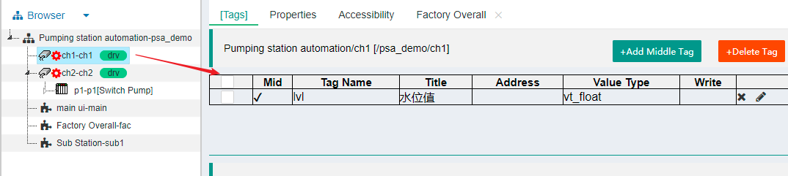
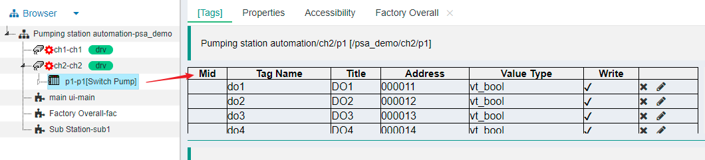
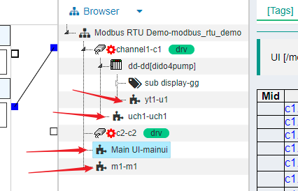
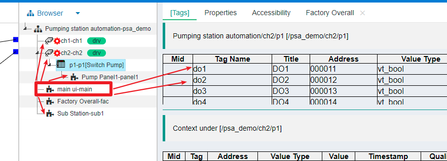

Quickly understand the tree of IOT tree server
==

This is a key part for understanding the whole IOT tree server. The project established by IOT tree server is, in a sense, a tree (an inverted tree or tree root structure). At the top of the tree is the project, followed by the channel (the channel can be associated with the device driver and access connector), and below the channel is the device or taggroup.

## 1 Tree hierarchy and internal data

### 1.1 Tree hierarchy

For ease of understanding and use, the main structure of each project of IOT tree server is Project -> Channel -> Device/TagGroup. In addition, there can be more TagGroups under Channel, Device and TagGroup.

Among them, the device can be a device corresponding to a simple switching value module, a complex device combination, or even an industrial field substation. It can only belong to a channel.

Then, you may ask, since the device may be so complex, can such a single level under the channel describe so many contents. Of course, it is impossible. Then, if you want to describe a more complex hierarchical relationship under the device, you can also add a TagGroup, and you can also add sub TagGroups under the TagGroup.

In addition, if a channel corresponds to another IOT tree server node, the referenced project hierarchy will be directly in the form of TagGroup under the channel. The channels and devices under the referenced node are replaced by the TagGroup of the corresponding level.

Now, a more complex project hierarchy can be as follows:

Project->Channel->Device/TagGroup->Tag Group*->TagGroup*

or

Project->Channel->Tag Group*->TagGroup*->TagGroup*

Obviously, the more complex the device, the more it needs to be layered internally. You just need to add some TagGroups.

### 1.2 Data tag tag under tree structure

Next, you can also think of how to store the data in the tree structure when my project channel device taggroup hierarchy is established. We unify the data in different levels of tree nodes into tags. A tree node can contain multiple tags.

As shown below, the tags defined below the channel

Another example is the predefined tags under the device

tags below TagGroup

### 1.3 Content contained in other nodes (function nodes)

In addition to tags, tree nodes can also define some other elements. Such as human-computer interaction UI. The existence of these nodes is limited to the overall structure specified above.

As you may have guessed, I have defined a UI node under a tree node, so all the tags under this node should be used by this UI node. For example, the UI node defined under the channel should be able to reference all the device data under the channel, or further, the UI node can also directly include the following Device UI as a sub component into its own screen - this use scenario is exciting to think about, right. Easy to use software system should be like this.

Well, yes, that's what IOT tree server considers for you. This involves another provision, the Relationship Agreement between nodes.

## 2 Relationship between tree nodes

### 2.1 Agreement
#### 2.1. 1 naming convention

The names of all nodes of IOT tree server must comply with the following regulations

(1) It must start with a-a A-Z, and subsequent letters must be in the range of a-z A-Z 0-9 _ No other letters are allowed. (because names starting with '_' are internal system names)

(2) Child nodes under the same tree node cannot have duplicate names.

The reason why the naming is so specified is that the external interfaces provided by IOT-Tree Server are basically based on naming. The strict regulations are to facilitate the call of external systems and reduce the possibility of errors.

#### 2.1. 2 access agreement
A function node within a tree node can access all resources of the same level or underlying included nodes.

### 2.2 agreement - Examples

The above agreement may make you feel less excited. Let's take an example:

As shown in the figure above, the UI node MainUI defined under the project node can use the other two UI definition nodes fac and sub1 at the same level, as well as the two channels ch1 and CH2 and all resources under the channel.

During UI editing, you can reference all tags under these nodes and bind them to one of your own elements. Alternatively, you can directly take other UI nodes as part of yourself. Obviously, this agreement is not only simple and clear, but also brings great organizational convenience to the implementation of the project. For example, if an interface UI may be used in multiple places, it can be defined separately and then directly referenced by other interface UIs.

### 2.3 Node context

Each node can access all labels of itself and all child nodes. Under different nodes, all tag lists form the context of this node, as shown in the following figure:

The self label under channel Channel1 and all nodes under this node. Each node of the context is separated by the symbol "." at different levels relative to C1.

## 3 summary

If you understand this section. Then your subsequent understanding of other parts of IOT-Tree server will be relieved.

IOT-Tree Server seems complex, but the overall idea is still very simple. As long as you firmly grasp this "tree", you will find how simple it is and can meet your complex business needs at the same time.

## 4 supplement

### 4.1 relationship between access channel drive

IOT tree is based on the tree structure mentioned in this paper. There are two important concepts. That is, the access and device drivers associated around the channel.

Please click to view the details

[relationship between connector channel driver] [cn_conn_drv]

### 4.2 Device definition

When adding a device under a channel, you can specify the corresponding device definition. IOT tree server specifically implements the device library function for this purpose.

You can view the relevant documents [device definition][dev_def]

[cn_conn_drv]: ./quick_know_ch_conn_drv.md
[dev_def]: ./quick_know_devdef.md
