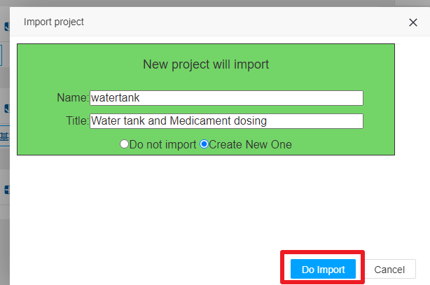
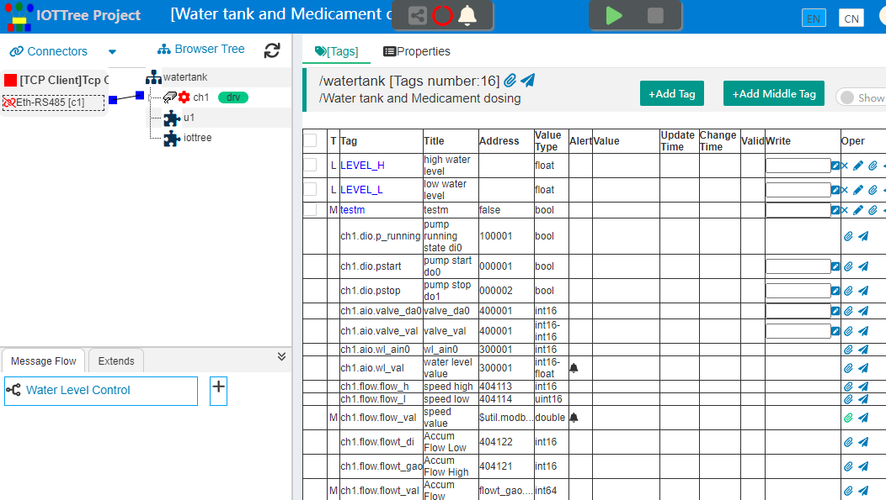

 Quick Start
 ==

 <a href="../../cn/doc/quick_start.md" target="_blank">中文</a>
<!--
 <a href="../../jp/doc/quick_start.md" target="_blank">日本语</a>
 -->


# 1 Downloading and Unzip

Download zip file,and unzip to directory you wanted.

If your running environment is windows, it is recommended to download the "iot-tree-xx.xx.x-winjdk.zip" version. This version comes with the JDK of "windows x64" version, so that you can start it in the simplest way.

<a href="https://github.com/bambooww/iot-tree/releases" target="_blank">download address</a>


# 2 Prerequisites

If your running environment is windows x64 and you have downloaded the "iot-tree-xx.xx.x-winjdk.zip" version, you have all the running conditions. The following operating conditions do not need to be concerned.

## 2.1 iot-tree-xx.xx.x.zip version running conditions

Java running environment version 1.8 and above, and ensure that your running environment is specific to Java environment variables such as path JAVA_HOME has been set.

If you have not installed the Java runtime environment, please go to <a href="https://www.oracle.com/java/technologies/" target="_blank">Oracle Java</a> or other relevant websites to download and install it according to the prompts, and select the Java SE version.

For example:

In Windows environment, if your Java installation directory is C:\JDK1.8, please set

```
set PATH=%PATH%;c:\jdk1.8\bin
set JAVA_HOME=c:\jdk1.8
```


These two environment variables are best set in "advanced system settings" - "system properties" - "environment variables" under windows. After setting, open a CMD window and enter the following command to check.

```
echo %PATH%
echo %JAVA_HOME%
java -version
```


In Linux environment, please set the current user .profile file, (assuming you install Java in /usr/java/jdk1.8.0_281)

```
export JAVA_HOME=/usr/java/jdk1.8.0_281
export PATH=$JAVA_HOME/bin:$PATH
```


# 3 Modify configuration

Use a text editor to open the config.xml file and configure the access port in it. The default value is 9090. You can modify it to other port numbers


# 4 Start

## 4.1 Service registration, start and stop in panel mode under Windows x64 environment

In Windows x64 environment, IOT tree server provides a control panel to support the registration, start and stop of system services, which is very convenient for your use.

In the installation directory, double-click the file iottree_win_panel.exe. Because the program requires administrator permission, after you authorize, the system will start the control panel, as shown in the following figure:


Click the button "Register Service". If the registration is successful, a successful prompt will pop up. At this point, you can click the "Start" button to start the IOT-Tree Server. After a prompt of success pops up, you can see that the running status on the panel also changes, as shown in the following figure:


You can also click "Stop" to stop the service, or click "Unregister Service" to cancel the service registration.


## 5 Command start

Run iot-tree.bat under Windows

Run iot-tree.sh under Linux

After the startup screen appears and prompts success, you can start to use it

```
_________ _______ _________           _________ _______  _______  _______
\__   __/(  ___  )\__   __/           \__   __/(  ____ )(  ____ \(  ____ \
   ) (   | (   ) |   ) (                 ) (   | (    )|| (    \/| (    \/
   | |   | |   | |   | |      _____      | |   | (____)|| (__    | (__
   | |   | |   | |   | |     (_____)     | |   |     __)|  __)   |  __)
   | |   | |   | |   | |                 | |   | (\ (   | (      | (
___) (___| (___) |   | |                 | |   | ) \ \__| (____/\| (____/\
\_______/(_______)   )_(                 )_(   |/   \__/(_______/(_______/   version xx.xx.xx

web port: 9090
iottree->
```


# 6 Access the management ui and modify the administrator password

Open the browser and enter the host address to install and start IOT tree in the address bar. As follows:

```
http://localhost:9090

```


The first administrative login needs to accept the software license terms and enter the administrator password. Please keep this password in mind. This password is required for subsequent administrator logins of this system.

After the administrator logs in, you can see the main management ui of the system. You can add projects and other related follow-up work under this. If you need help, you can also click "helper" above to open the help document.


# 7 Register as a service in command mode under Windows Environment


Use the administrator to open the CMD window and go to your IOT-Tree Server installation directory through the command line, assuming that your directory is d:\iot_tree

Enter the following command to register the IOT-Tree Server as a Windows service, which can be started automatically when Windows starts.
```
cd d:\iot_tree
iot-tree-setup.bat install
```

Of course, if you want to unregister a service, you just need to run it

```
iot-tree-setup.bat uninstall
```
After successful registration, you can open the windows service manager and see the following:


# 8 Background startup under linux environment

Enter the following command in IOT tree directory to make IOT tree run in background mode:

```
./iot-tree-service-start.sh
```

After startup, the original console output will be input to nohup.out file.You can use tail - f nohup.out to view.
If you want to stop the daemon, run:

```
./iot-tree-service-stop.sh
```

you can also use the systemd related mechanism to set iot-tree-service.sh start As a service mode, it will runs automatically with the start of the system.


# 9 View the built-in demonstration items in the system

If you are using IOT-Tree Server for the first time, you can try to import the built-in demonstration project of the system for the most intuitive experience. Visit the login system management link below.
```
http://localhost:9090/admin/
```
In the Local Projects block, click Import Demo. Select one of the demonstration items, as shown below:


After selection, click "Do Import" in the import project prompt, as shown below:





After success, the demo project you just imported appears in the project list. Click this item to display the management configuration ui of this item in the pop-up new window. Here, you can see the connector part on the left, the browser part in the middle and the tab main content display area on the right:


In the tree node expanded in the middle browser section, select a UI node, right-click, and select Edit UI in the pop-up menu to see a new UI editing sub window on the right. As shown below:



