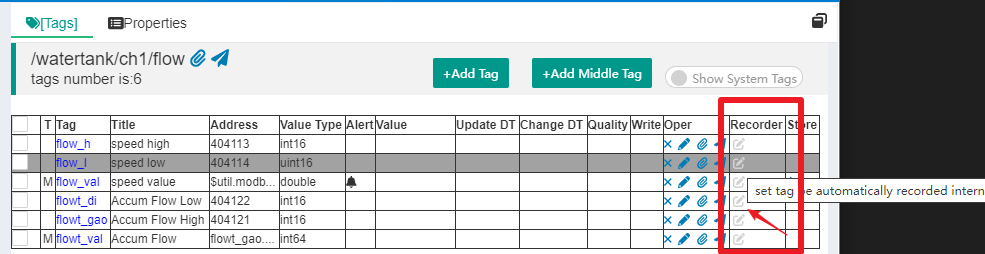
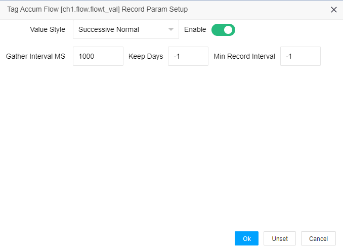
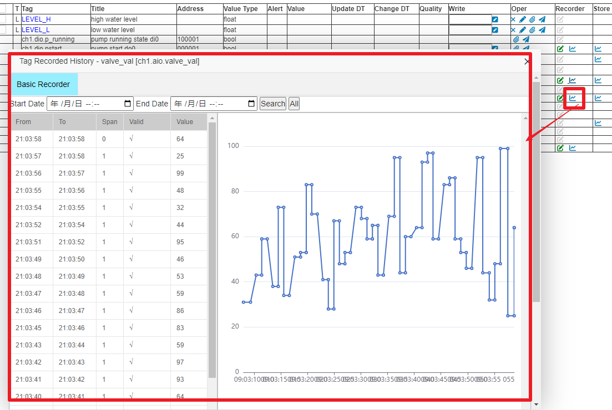

Internal timing segment recorder (TSSDB)
==

## 1 IOT-Tree's internal timing segment recording mechanism

In the digital age, our human perception and recording of the physical world can only be obtained by using certain time intervals to acquire certain indicators of the measured object - this is called the sampling frequency. For some board-level (PCB-level) sampling, most of the time intervals are very short, and may even be nanosecond level. However, when we use IoT-Tree to manage IoT field devices, it is basically in the millisecond level or above, and many field sensors can even use the minute level to meet the requirements. For example, the temperature change of an area and the accumulated value of liquid flow, most of which can meet the requirements at the second or minute level. Regardless of the length of time interval for recording data, each record is actually data at a specific time point.

For IoT applications, in the management of upper-level systems, the frequency of most data tag collection does not need to be too high. In fact, many sensors may also add filtering algorithms to ensure more reliable data, which makes many collected data change slower. Of course, if you apply IOT-Tree to the internal control of some complex machines, some indicators may change at the millisecond level, but in most cases, such control tags do not need to record all information.

### 1.1 Timing Segment Series Recorder

IOT-Tree provides high-speed recording of tag changes internally through a queue. It also uses the concept of time segment recording, where if a tag value has not changed after multiple consecutive acquisitions, only the same record is used. The resulting record is a five-tuple (tag, value, validity, start time, end time), and each five-tuple can be considered a time segment. Therefore, we call it the Time Segment Series Recorder.

### 1.2 Asynchronous storage record

IOT-Tree has a queue cache for these records internally.  When the tag value changes, only the record segments in memory are updated. The system writes these segments to storage through separate threads. This ensures high efficiency for data change records and also ensures high efficiency for bulk writes.
The only disadvantage is that when the system suddenly experiences an abnormal situation such as a power outage, data that is not written and saved in memory in a timely manner can be lost. Carefully consider the specificity of this situation, and in most cases it is acceptable - for the system, this period of time only collects invalid data.

## 2 Set tag to record parameters

When you configure a data tag Tag (if you are not familiar with the tag Tag, please refer to the previous document for related content), after the project starts running, although these tags may obtain data and change over time, by default these changes will not be recorded. If we want to record the change data of an important tag, we need to make some settings for this.
The setup is very simple.  In the main interface of the project management, click the "\[Tag\]" block in the content area, and you can see a "Recorder" column on the right side of the tag list:

If this tag supports recording, there will be a small icon for setting internal recording.  Clicking this icon allows you to set recording parameters, as shown below:

Among them, the tag "Value Style "has the following options: Successive Normal, Successive
Accumulation and discrete values. For analog signals, the vast majority are ordinary continuous values, such as temperature and liquid level; while cumulative continuous values represent the cumulative values of the instrument, such as the cumulative flow value. For discrete values, it can be Boolean or enumerated values. By setting this parameter, you can make the tag data more meaningful.

(Note: A tag indicator parameter may be introduced later, which can be set to represent a standard unit indicator parameter such as temperature, liquid level, speed, position, etc.)

The Gather Interval MS parameter is used to determine the minimum value of the two-time interval during the recording of time series segments. Because the real physical world is more complex than we imagine, a certain on-site sensor may experience anomalies (such as power outages, network disconnections, etc.).  When our software collects a certain value, it can be compared with the last collected value. If it is found that the time exceeds several multiples of this parameter, it can be assumed that there is an invalid data segment in between. This allows for a more faithful recording of the actual situation on site.

The Keep Days feature allows you to control the storage duration of some tags' records, without having to keep past records that are no longer needed (-1 indicates permanent retention).

Minimum Record Interval. Some metrics have a high frequency of data collection and updates, and each collected value may vary.  However, for some metrics, such intensive recording may not be necessary.  To reduce the number of data records for such tags, this parameter can be set. By setting a minimum record interval, data changes within this time frame can be ignored.
 
In a typical flowmeter example, because we can simultaneously obtain the current flow rate and cumulative flow value, we may need to collect the flow rate quickly to determine sudden changes in speed.  However, for cumulative flow, we do not need high-speed recording, we only need to record once per minute or even hour. However, when we obtain the cumulative flow and flow rate at the same time, the update speed of the cumulative flow will also be very high.  At this time, we can use this parameter to limit the recording. In addition, for flow rate, we may only need to store data within 100 days, while for cumulative flow, this tag records data that needs to be permanently saved.

## 3 Show recorded data

For tags with recording parameters set, there will be a small icon on the right to view the recorded data.  Clicking it will open the view history information. As shown in the figure:

 
