Simple storage and output of Tag data
==


IOT-Tree's support for data storage is also very distinctive,very intuitive and clear. Automation workers who are not familiar with database systems can quickly configure data storage tables and store tag data within the system to meet more requirements. For example, record the indicator data so that relevant statistics can be conducted over time.

In a sense, data storage is also a way of data sharing. When the data is written to the configured database, other systems can also retrieve the corresponding data from it. This is also a simple and efficient way for data sharing between heterogeneous systems.

IOT-Tree mainly supports three aspects in storage: Data Source, Store Handler, and Store Out. Below are separate explanations


## 1 Data Source


IOT-Tree defines data sources uniformly in the main management page, which can be used by all internal projects.


### 1.1 Adding/Editing Data Sources


We access and login to the management page of IOT-Tree, such as“ http://localhost:port/admin/ . Afterwards, you can see the "Data Source" column on the right. There is a "+" button in the upper right corner. Clicking on it will bring up a data source type selection dialog box, as shown in the following figure:


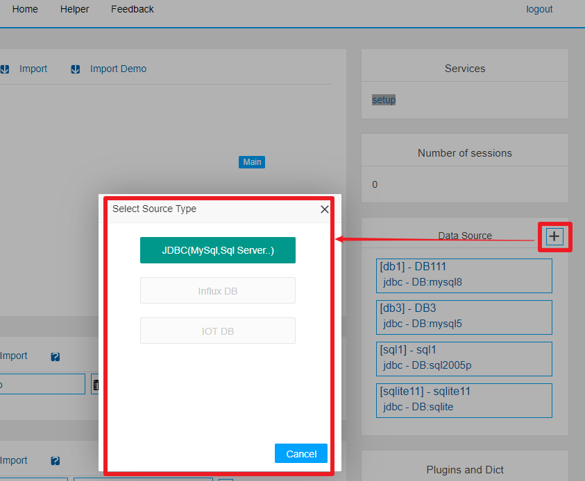


The option JDBC(MySql, Sql Server) represents the current support for mainstream relational databases. The currently supported databases include MySql, SqlServer, Oracle, SQLite, etc. Of course, our future versions will support more. Click this option and you will see the following pop-up dialog box. We will fill in the following information based on the specific database provided:


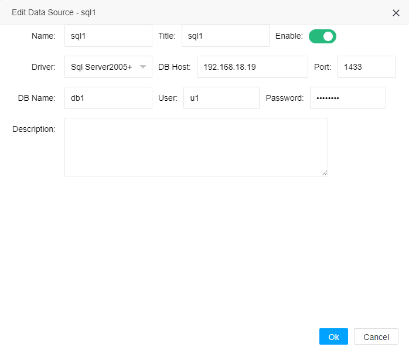


Among them, Name is the name of the data source, which must comply with the strict requirements of IOT-Tree for Name (starting from a-z A-Z and following the variable name of the program). And the name cannot be the same as other existing data sources. Title is the title of this data source.

The driver corresponds to the specific database driver you are using. IOT-Tree considers different versions of the same manufacturer's database, such as "SQL Server 2000" and "SQL Server 2019", which use different drivers. You need to choose different drivers.

The DB Host and Port correspond to the database host address and port you are using, respectively. DB Name is the database name you are using.

User and Password are security validations for establishing links to access databases.

<font color=green>Note: If the database is not provided by your own deployment, you need to obtain the above information from the database manager</font>.

After clicking "OK", you can see that in the "Data Source" column, you have added this data source list item.

Of course, when you hover over this project, you will see three buttons: test, edit, and delete. As shown in the following figure:


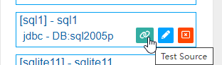


You can click the test button, and IOT Tree will try to connect to the corresponding database server based on the parameter information you filled in. If successful, it will prompt "succ". If it fails, an error message will be displayed.

Adding data sources is just that simple. Afterwards, you can use this in the project.


### 1.2 Special situations of SQLite data sources


SQLite is a local database based on a single file. If you use this driver, you do not need parameters such as DB Host, Port, User, and Password, as shown in the following figure:


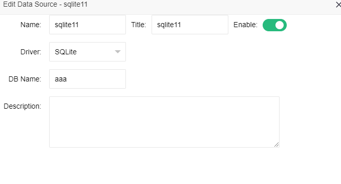


In addition to basic information, only one parameter DB Name is needed later. When using this SQLite data source to store data, IOT-Tree will automatically create the corresponding xxx.db file in the local file system. The specific directory is "IOT Tree installation directory/data/db_sqlite/"

If you need to view the data inside this file during runtime, it is recommended that you use relevant software such as "DB Browser for SQLite".

After we have defined the data sources, we can now use them for storage in the project.


## 2 Store Handler and Output


Due to the fact that all access and organized data in IOT-Tree are Tags, the source of stored data is also based on this. However, we will soon discover an issue where the number of corresponding tags for different projects can range from tens to thousands depending on the connected devices and sensors scale. How to effectively extract data from it and store it is indeed a challenge.

The storage implementation strategy of IOT Tree is based on the following practical needs:

1. We don't need to store all Tags data. In fact, IOT-Tree is organized and managed based on connected devices and channels. In addition to some common tags, there are also many system tags, most of which do not need to be stored.

2. Due to the possibility of a large number of tags, an efficient filtering and selection is needed.

3. The stored output may have multiple as needed and may point to different databases.

4. The output data includes real-time data and historical records

Therefore, IOT-Tree defines two levels based on the tag: handler and output. Among them, handler is used to filter and select relevant tags, and each handler has an internal thread that scans relevant tag data through fixed running intervals to form output data. And submit it to one or more outputs associated with it. The output is used to set the data table corresponding to the specified data source, including automatic creation of database tables, updating or writing of data, and related actions triggered by the handler.

Let's use specific examples from the project to illustrate. In the main page of project management, above the middle browser, click on the "Data Store" icon. In the main content area on the right, the "Data Store" tab content will appear. As shown in the following figure:


可以看到数据存储管理界面分为左中右三部分，左边是标签列表(Tags List)，中间是处理(Handler),右边是输出Outputs。由于标签内容比较多，只有点击某个Handler时，才会显示，如下图：

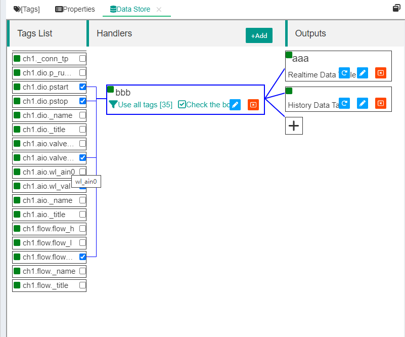


As you can see, IOT-Tree presents you with a very intuitive way of showing the interrelationships between data tag, handler, and output.

### 2.1  Store Handler


The store handler has three internal functions: filtering tags, selecting tags, and scanning interval.

A project can define any number of handlers, which can filter and select tags to form different data sets as needed, and then output them.

#### 2.1.1 New/Edit Handler


We can add or modify a handler by clicking the "+Add" button above the Handlers, or by clicking on the edit icon of an existing handler. As shown in the following figure:


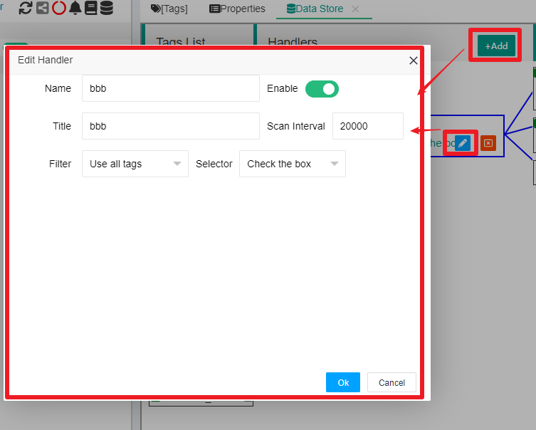


In addition to the basic Name Title Enable parameters, the remaining parameters are related to the handler runtime mechanism:

Scan Interval: represents the time interval, in milliseconds, during which this handler scans relevant tags. This parameter is only used at runtime.

Filter: is a tag filtering option. As the store is under the context of the project root, all tags contents below the project can be accessed. Therefore, the filtering option is used to more flexibly limit which tags can enter this handler. The option has two values:

1. Use all tags: indicates that all tags have been entered

2. Filter by prefix: represents the prefix that uniquely identifies the tag under the project. When this option is selected, a text box will appear where you can fill in multiple tag id prefixes - one for each row.

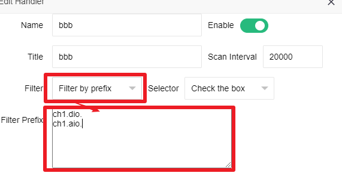


After setting the filter, click on this handler, and all tags that meet the conditions will be listed on the left. At this point, your handler is only halfway through. Under the premise of filtering, you need to set the selector option before the handler can finally determine which tags to use.

The selector has two options: "Check the box", which means that in the filtered list, you need to check the specific tag one by one; The "Select all" option represents the use of all filtered tags.


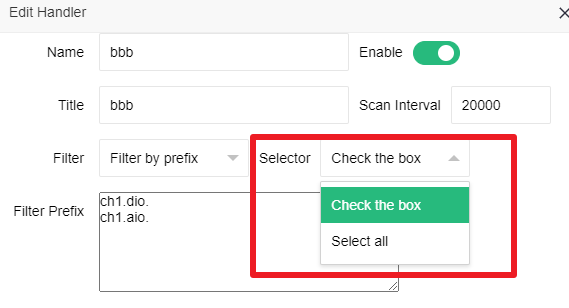


By filtering and selecting, the handler can easily extract the set of tags they care about from a large number of tag lists. When you click to select a handler, a list of tags will appear, and the selected tags will have associated lines. And under the "Select all" setting, all tag selection boxes will be grayed out (because you no longer need to make specific selections at this time).

<font color=red>Note: If your selector uses "Check the box", when you check the left tag to change the content, the corresponding handler will display a "Save" button. You must click this "Save" button after completing the selection, otherwise it will not work</font>

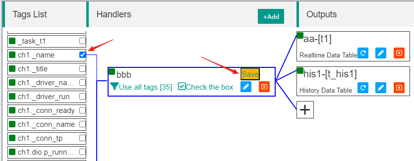

#### 2.1.2 Create/Edit Outputs


Each handler can correspond to one or more outputs, and to the right of the already defined handler, there will be a button "+" to add new outputs to this handler. Of course, if an Output already exists, you can also click the corresponding edit button to modify it.

Currently, IOT Tree supports two types of output (more may be added in the future): "Realtime Date Table" and "History Data Table".

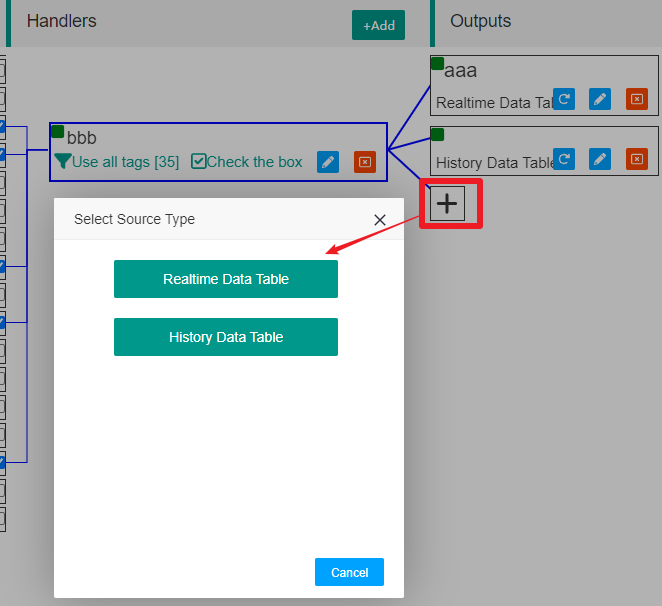


Among them, the real-time data table is synchronously updated at runtime based on the tags selected by the handler, and the number of data records in the table is the same as the number of tags selected by the handler. During operation, the history table will continuously add new records based on changes in tag values. The relevant configuration content mainly involves database table parameters.

Currently, these two outputs of IOT-Tree specify a fixed database table structure, and the main thing you can set in the configuration is only the table and column names. For example, when you choose to add a real-time data table, the dialog box is as follows:


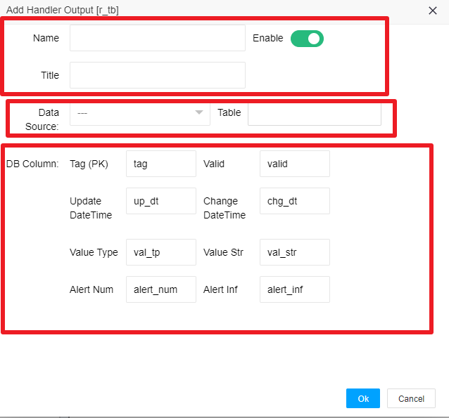


Among them, Name Title Enable is the basic information output.

Data Source is defined in the main management page of this deployment instance. If there is no defined data source, then your output is meaningless.

Table represents the corresponding database table name in the data source.

DB Column is the specific database column name. There are differences in the columns between the two output methods, as explained below:


##### 2.1.2.1 Real time data table columns


The Tag column corresponds to a unique identifier for the tag; Valid represents whether the runtime data of this tag is valid; Update Date is the time when the tag data was successfully read; Change DateTime is the time after the tag value changes; Value Type is the tag value type; Value Str is the string representation of the tag value (regardless of the tag type, it will be converted to a string value for updating); Alert Num is the number of alarms for this tag; Alert Inf is the tag alarm information;

Due to the limited number of records in this table structure, external programs accessing this database table do not require support such as indexes. And specific numerical values are recommended to be converted through type and string values before use.


##### 2.1.2.2 Historical data table

The historical data table output editing dialog box is as follows:

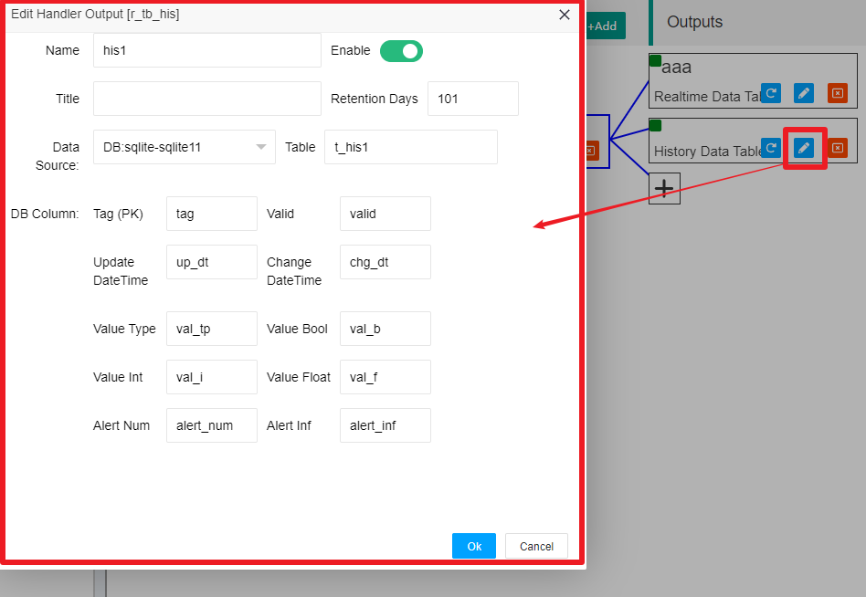


Except for basic information, data source, table name, Tag column, Valid, Update Time, Change DateTime, Value Type, Alert Num, and Alert Info, which are consistent with real-time tables. There are other contents as follows:

Value Bool, Value Int, and Value Float correspond to the Boolean, integer, and floating-point data types corresponding to the tag value, respectively. All of these are stored in this way to facilitate statistical analysis of historical data.

Retention Days represent the retention time (in days) for historical data. During the operation of IOT-Tree, the following strategies are used for the operation of historical tables:

1. When it is found that the previous value of a certain tag has not changed from the current value, no new record will be added, and only the "Update DateTime" column will be updated in the latest record of this value. If the value changes, a new piece of data will be inserted.

2. To avoid having too much data in a database table, IOT Tree performs an expiration check on this historical output table once a day - mainly checking the value of the "Update DateTime" column. If the retention time is exceeded, the record will be deleted.


## 3 Specific configuration examples


We will enter the built-in demonstration project "Water tank and Medical Dosing" of IOT-Tree and enter the Data Storage Management tab. This demonstration project already comes with the handler and outputs in this document (where the handler is in a non Enable state).


### 3.1 Prepare data source


The output of this handler uses the sql1 data source. Without this data source, it will run abnormally. Taking the SQL Server database as an example, please refer to the relevant documentation for the specific installation and configuration process of the database. My database server is on another server, with the address 192.168.18.19, port 1433, database name db1, user u1, and password xxxxxxxx. We will add a new data source sql1 with these parameters. As shown in the following figure:


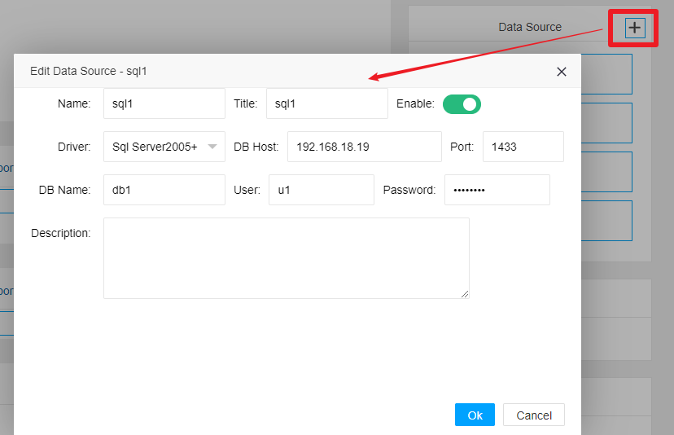


Ensure that when the data source test button is clicked, a successful prompt is displayed. This indicates that the IOT-Tree connection to this data source was successful.


### 3.2 Edit/New Handler


Next, we move on to the addition or editing of the handler - by checking, select multiple tags. In order to test the effectiveness, we have selected three types of tags values: Bool, Integer, and Float. The specific selected tags are as follows:


```
ch1.dio.pstart   bool
ch1.dio.pstop   bool

ch1.aio.valve_val  int16

ch1.aio.wl_val float
ch1.flow.flow_val  double

```


After checking, we click the "Save" button in the handler to save. At this point, you can see that after clicking to select the handler, the selected tags will be associated with this handler.


### 3.3 Edit/New Outputs


We have added two new outputs to the handler defined above, one database table (t1) corresponding to real-time data, and the other table (t_his1) corresponding to historical data. The data sources they have chosen are all sql1. The relevant data table column parameter information is as follows


<table>
  <tr>
    <td>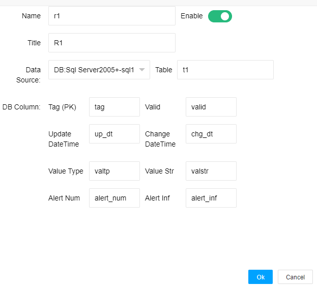</td>
    <td>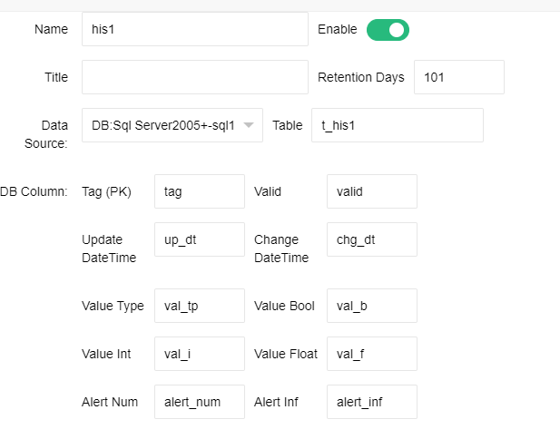</td>
  </tr>
</table>

After final completion, as shown in the following figure:

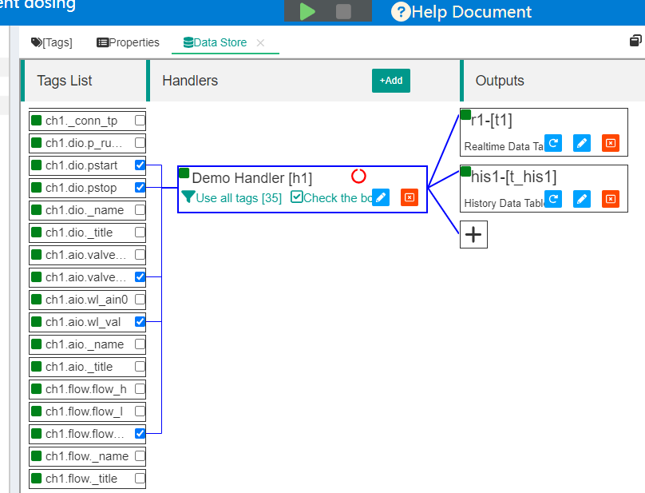

## 4 Run to view data output status

### 4.1 View the running status on the IOT-Tree


We will start this project (note: The handler Enable carried by this project is set to false. If you are using this project for testing, please set Enable to true).

After the project started, we found that both the handler and output would display some running status prompts, as shown in the following figure:

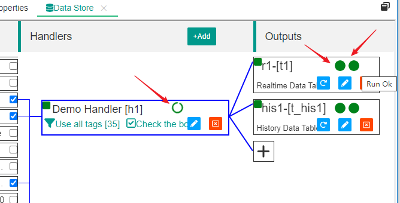


If there is a problem with the output, such as the remote database server being disconnected. An error message will be prompted (IOT-Tree fully considers this situation, and if the database link is restored to normal, it will automatically reconnect and continue outputting data):


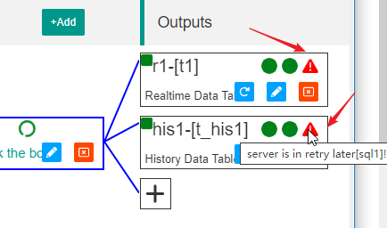

### 4.2 Viewing data on the database side


If everything runs normally, we can go to the database to check the data status. As shown in the following figure


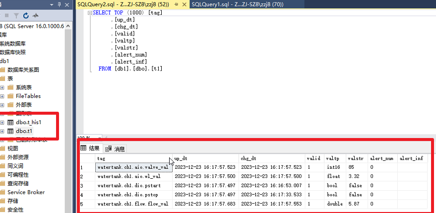


It can be observed that IOT-Tree automatically creates two tables under the corresponding data source database: t1 and t_his1. When querying the records inside, you will find that the number of records in Table t1 is fixed, only the time and value will be updated.

And for the historical table t_his1. The data inside continues to grow, and upon closer inspection of the data, it can be observed that the value of each tag data is written into different columns based on its type. This type of data is very suitable for other business systems to conduct statistical queries or analysis on it:


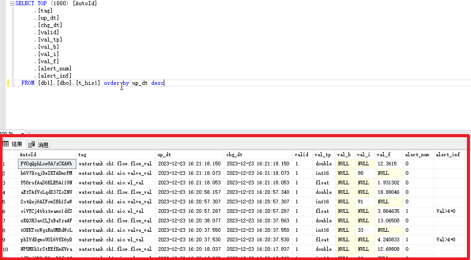

## 5 Summary


IOT-Tree provides intuitive and clear support for database output of data, which can already meet most of your data sharing requirements. If you are developing top-level business systems using technologies such as Spring, you can directly use these data tables.

We will also support more databases in the future, such as real-time databases.

In addition, for the storage of tag historical data, IOT-Tree may also provide related high-level application functions in the future. The initial ideas are:

1. Provide some commonly used statistical data output support based on the historical data of a certain tag. For example, some cumulative data can generate difference data by month, week, day, and hour based on different time points, which can intuitively display the changes in tag indicators at a time end.

2. Based on the historical data of tags, generate some charts.

