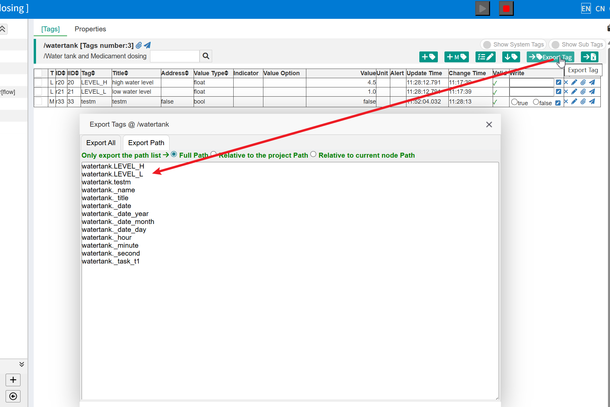

Implement your own .Net client
==


The IOT-Tree Server supports gRPC services and provides a gRPC client call encapsulation library in the accompanying open-source project [iottree.net][iottree.net].

You can conveniently and efficiently use the API provided by this library to access the IOT-Tree Server, and develop the client UI you need using Microsoft .NET technology.

Of course, to run this client, you must also deploy your running instance of IOT-Tree Server together.

The IOT-Tree Server itself only supports a Web-based management UI and monitoring pages. In many scenarios, it is necessary for devices to directly open the corresponding working UI upon power-on, therefore, a pure client-side program must be used.

The IOT-Tree Server provides gRPC support, so you can efficiently and easily call this gRPC interface using various client-side software development technologies.

[iottree.net][iottree.net] directly encapsulates the gPRC interface using C#, which you can directly call in your .NET program, avoiding the cumbersome definition of the gPRC interface.


## 1 Benefits of using this client library


The IOT-Tree Server has already completed the docking for your on-site devices (such as various PLCs) in the background. To implement your own client, you only need to support the tag list that has been organized by the IOT-Tree Server. Each tag uses a unique path identifier in a format similar to xxx.xx.xxx.

In this way, your client software does not need to consider any device-specific differences, such as data addresses in PLCs. This can greatly simplify your client development process.

Using gRPC allows one instance of IOT-Tree Server to support simultaneous access from multiple clients, which can bring significant benefits in some real-world scenarios.

If you are running a standalone system, the IOT-Tree Server and your .NET client program should run on the same system to achieve the best performance.


## 2 How to use this library

### 2.1 Environment Preparation


First, you need to configure your project using IOT-Tree Server, which includes device connection, data organization, and enabling the gPRC service. as follows:


#### 2.1.1 Establish the IOT-Tree Server project


For this section, please refer to the existing documentation of IOT-Tree and numerous project articles available online. For instance, refer to [Quick Start][quick_start], as well as the documentation on connection with various PLCs and data acquisition [wiki][wiki].


[quick_start]: ../quick_start.md
[wiki]: https://github.com/bambooww/iot-tree/wiki

#### 2.1.2 Enable gRPC service


After the project in the IOT-Tree Server instance is running normally (with all relevant collected data tags updating normally), you can enable gRPC, which will enable calls from other client programs.

In the main management page of IOT-Tree Server (not the project management page), click the "Setup" button within the "Services" section. Within the pop-up service list, there is an option for "gRPC Server". As shown in the figure below:


Click the corresponding "Edit" icon, enable this service in the pop-up window, and select the service port you wish to use. Once completed, you can start this service. Here's how:


<table>
<tr>
<td>

</td>
<td>

</td>
</tr>
</table>


The project used in this article is the built-in demo project of IOT-Tree Server: Water tank and Medicament dosing. You can refer to the [Quick Start][quick_start] document to see how to get this demo project up and running in just one minute.


### 2.2 Develop your client using Microsoft .Net language

#### iottree.net Open Source Project


Visit and download the supporting open-source project from [iottree.net][iottree.net]. Open the project using Microsoft Visual Studio software. You can see that there are three sub-projects inside. Among them, lib encapsulates the gRPC interface calls to access the IOT-Tree Server using C#, providing a more intuitive and simple calling interface. The other two are console demo and client demo.

You can compile and launch the iottree_client_demo project. The UI is as follows:


You need to set the IOT-Tree Server gRPC address and port. In this example, it is http://localhost:9092. Although it appears to use the HTTP protocol, gRPC internally employs efficient communication support.

Each client must have its own unique ID to facilitate the IOT-Tree Server in distinguishing between different clients.

Tag Path is a list of tags that this client needs to listen to for synchronization and control output. Its format is prj_name.xx.xx.tag_name. Obviously, multiple projects can run simultaneously in the IOT-Tree Server, and a client can listen to data tags from multiple projects at the same time. In this way, you can see that the client call of the IOT-Tree Server is very simple. You only need to use this unique tag list as a basis, without considering the complex communication protocols of various devices. Because these complexities are all handled by the IOT-Tree Server's projects for you.

Click the "Start Client" button, and you will see the client UI effect after a successful connection:


You can control the start and stop of the water pump through the button below, and also view the updates and changes of the monitored tag data in the top right corner.


#### iottree.net lib encapsulation library call instructions


You can incorporate the lib library into your client-side project, which primarily involves three encapsulated classes: IOTTreeClient, IOTTreeTagVal, and IOTTreeTag. Below is an explanation on how to invoke this lib library.

IOTTreeClient is the main client encapsulation class. Its usage is quite straightforward:

Create an object and set the list of tag paths to be monitored:


```c#
// create IOTTreeClient
client = new IOTTreeClient(url, clientid);
// tagpaths is List<string>
client.SetTagPaths(tagpaths);
```


Since the tag path is provided in the IOT-Tree Server project, you can export and copy it from the tag list in the IOT-Tree project management page, as shown in the figure:





Next, we can listen to and perform subsequent processing based on the events provided by the client object:


```c#
client.StateChanged += (sender, e) =>
{
    ShowInf(false, $"State changed: {e.OldState} -> {e.NewState} ({e.Message})");
};

client.TagValueChanged += (sender, e) =>
{
    // Console.WriteLine($"Tag updated: {e.TagPath} = {e.Value} at {e.UpdateTime}");
    UpdateUI();
    IOTTreeTagVal tagval = e.TagVal;
    if (tagval.Path == "watertank.ch1.aio.wl_val")
    {
        UpdateWaterLvl(tagval);
    }
    if(tagval.Path== "watertank.ch1.dio.p_running")
    {
        //do something ....
    }
};

client.ConnectionLost += (sender, e) =>
{
    ShowInf(false, "Connection lost!");
};

client.ConnectionRestored += (sender, e) =>
{
    ShowInf(false, "Connection restored!");
};

client.ErrorOccurred += (sender, e) =>
{
    ShowInf(true, $"Error occurred: {e.Message}");
};

```

Then you can start or stop this client

```c#

client.Start();
client.Stop();

```

Only after the client initiates a normal connection to the IOT-Tree Server can you use the following functions:

```c#
public IOTTreeTagVal GetTagValue(string tagPath);

public List<IOTTreeTagVal> GetTagValues();

public Dictionary<string, IOTTreeTagVal> GetTagValuesMap();

public List<IOTTreeTag> GetRegisterTags();
```

To write or set tag data to the IOT-Tree Server, use the following functions, all of which trigger separate gRPC calls:

```c#
//write value to tag,it may cause device driver to do write operation
public async Task<bool> WriteTagValueAsync(string tagPath, string value);

//set tag value in memory
public async Task<bool> SetTagValueAsync(string tagPath, string value)
```

Querying the project list and the tag list under each project from the IOT-Tree Server (which triggers a separate gRPC call):
```c#
public async Task<List<PrjItem>> ReadProjectListAsync() ;

public async Task<List<TagItem>> ReadTagsInProjectAsync(string projectName);

```
[iottree.net]: https://github.com/bambooww/iottree.net


