```
watertank
Water tank and Medicament dosing
```


```
Name = ch1
Title = channel1
Driver = Modbus RTU
```


```
Name = dio
```


```
Name = pstart
Title = pump start do0
Data type = bool
R/W = Read/Write
Address = 000001
```


```
Name = pstop
Title = pump stop do1
Data type = bool
R/W = Read/Write
Address = 000002
```
```
Name = p_running
Title = pump running state di0
Data type = bool
R/W = Read Only
Address = 100001
```


```
Name = valve_da0
Title = valve_da0
Data type = int16
R/W = Read/Write
Address = 400001
```
```
Name = wl_ain0
Title = wl_ain0
Data type = int16
R/W = Read Only
Address = 300001
```


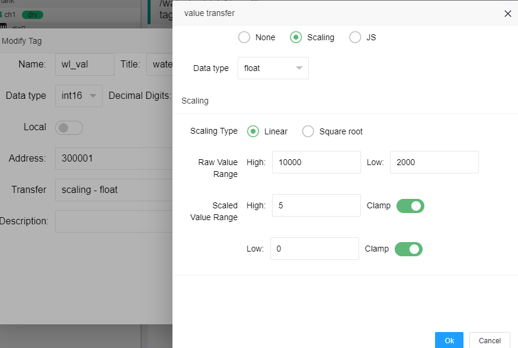


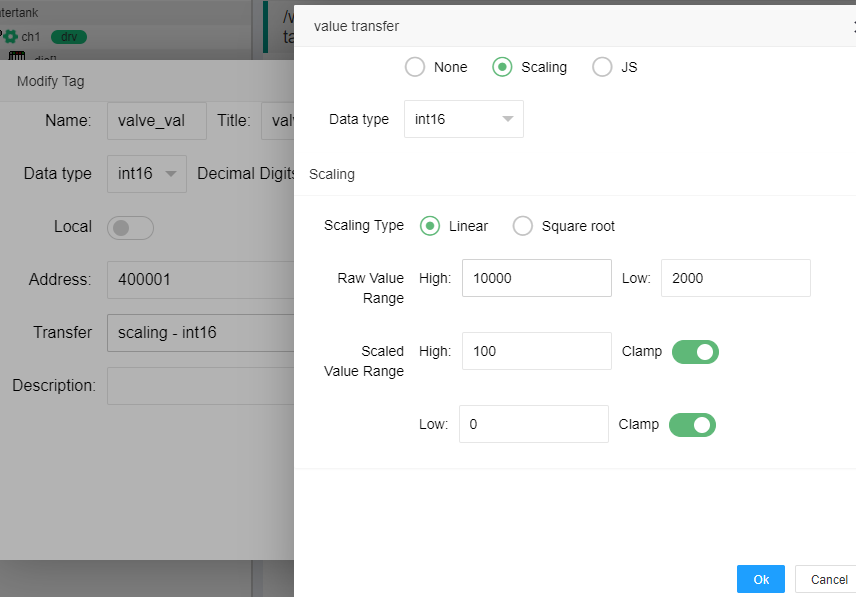


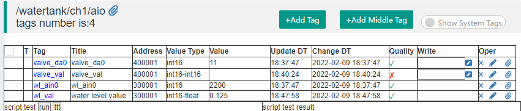


```
Name = flow_h
Title = speed high
Data type = int16
R/W = Read
Address = 404113
```
```
Name = flow_l
Title = speed low
Data type = int16
R/W = Read Only
Address = 404113
```


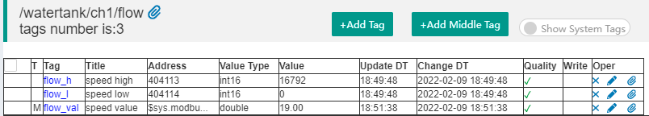


```
Name = LEVEL_H
Title = hight water level
Data type = float
R/W = Read/Write
Local=true
DefaultVal=4.5
Auto Save=True
```


```
Name = LEVEL_L
Title = low water level
Data type = float
R/W = Read/Write
Local=true
DefaultVal=1.0
Auto Save=True
```


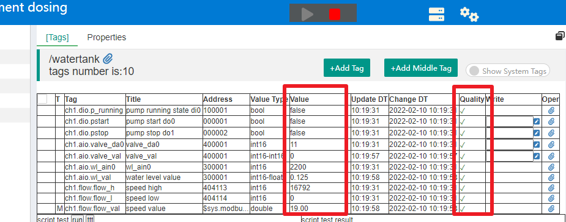


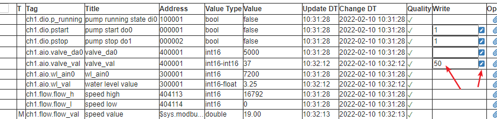


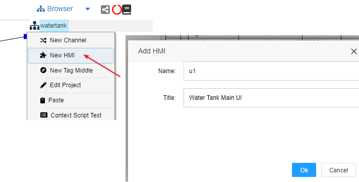


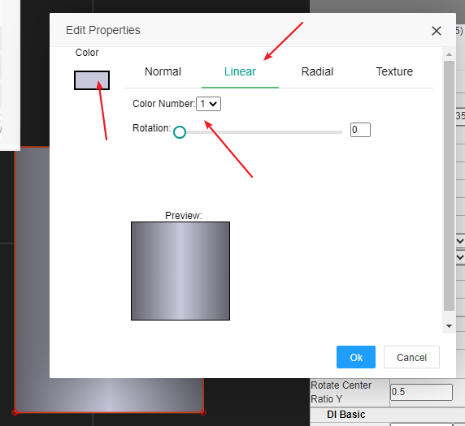


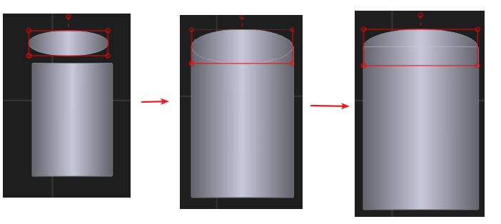


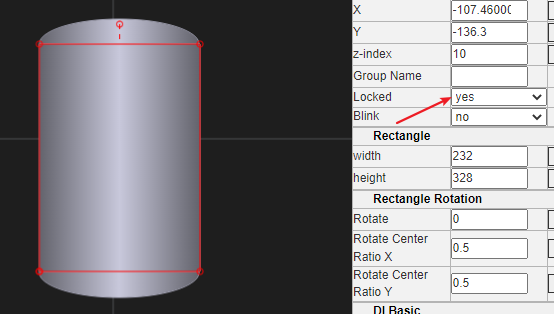


```
Level Total Height=5
Liquid Color=#219fb8
```


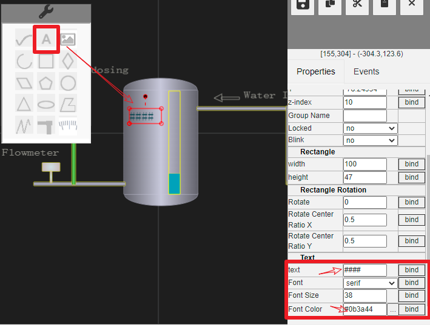


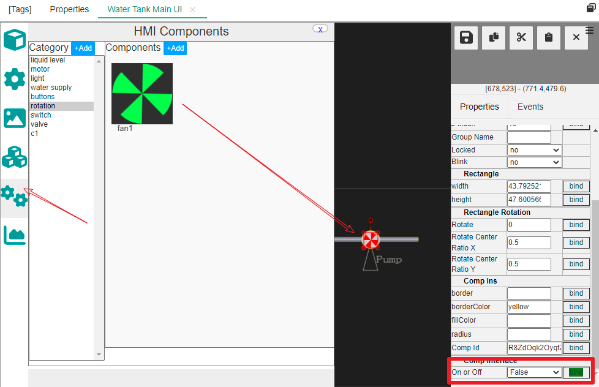


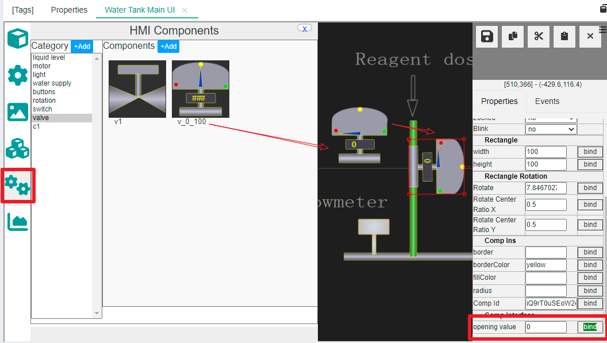


Client JS
```
$event.fire_to_server();
$util.msg("start cmd issued") ;
```

Server JS
```
ch1.dio.pstart._pv=1;
```


Client JS
```
$event.fire_to_server();
$util.msg("stop cmd issued") ;
```

Server JS
```
ch1.dio.pstop._pv=1; 
```


Client JS
```
 var v = valve1.open_v; //$this.open_v;
 $util.dlg_input_num({tp:'slide',min:0,max:100,val:v},(val)=>{
      $event.fire_to_server(val);
      $util.msg("valve cmd issued") ;
 }) ;
```

Server JS
```
var val = parseInt($input);
if(val<0||val>100)
   return "invalid input value";
ch1.aio.valve_val._pv=val;
```


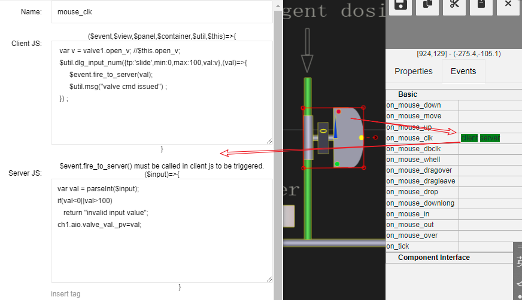


Client JS
```
 var v = $this.txt;
 $util.dlg_input_num({is_float:true,val:v},(val)=>{
      $event.fire_to_server(val);
      $util.msg("chang high level issued") ;
 }) ;
```

Server JS
```
var v = parseFloat($input);
if(isNaN(v))
  return ;
LEVEL_H._pv=v;
```


Client JS
```
 var v = $this.txt;
 $util.dlg_input_num({is_float:true,val:v},(val)=>{
      $event.fire_to_server(val);
      $util.msg("chang low level issued") ;
 }) ;
```

Server JS
```
var v = parseFloat($input);
if(isNaN(v))
  return ;
LEVEL_L._pv=v;
```


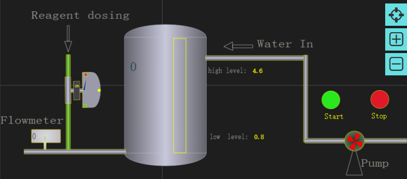


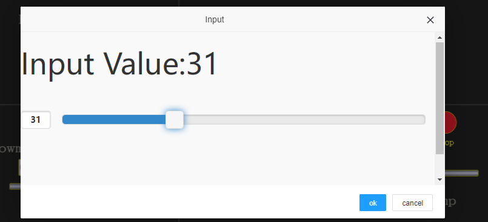


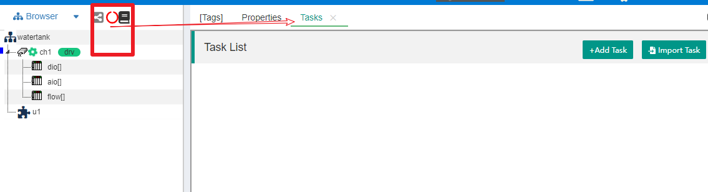


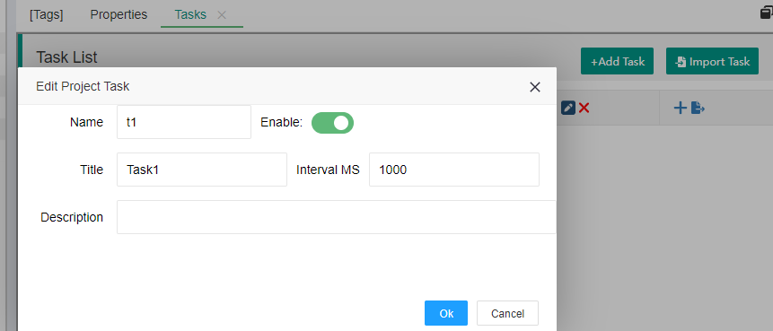


```
//def support func or var
var ob_pump_running = ch1.dio.p_running ;
var ob_water_level = ch1.aio.wl_val;
var ob_flow_speed = ch1.flow.flow_val;
var ob_valve_open = ch1.aio.valve_val;

function pump_start()
{
    ch1.dio.pstart._pv=1;
}
function pump_stop()
{
    ch1.dio.pstop._pv=1;
}
function cal_speed2valve(spd)
{
    if(spd<=0)
      return 0 ;
    var r = spd*5 ;
    if(r>=100)
       return 100 ;
    return r;
}

//pump ctrl by water level
function pump_ctrl()
{
   var wl = ob_water_level._pv;
   if(ob_pump_running._pv)
   {//pump is running
        if(wl>=LEVEL_H._pv)
           pump_stop();
   }
   else
   {
        if(wl<=LEVEL_L._pv)
           pump_start();
   }
}

//valve ctrl by flow speed
function valve_ctrl()
{
    var spd = ob_flow_speed._pv;
    var v_open = cal_speed2valve(spd);
    ob_valve_open._pv=v_open;
}
```


```
pump_ctrl();
valve_ctrl();
```


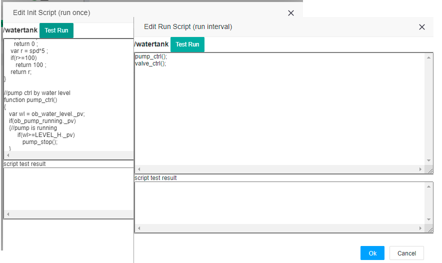


