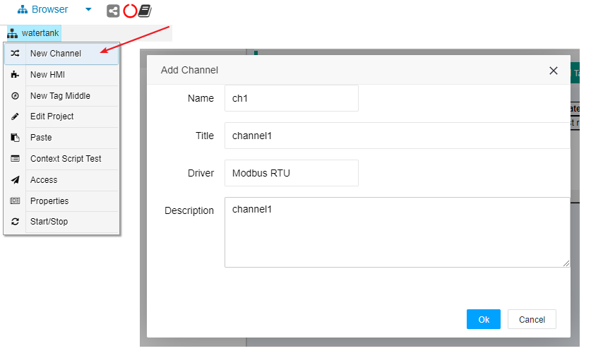
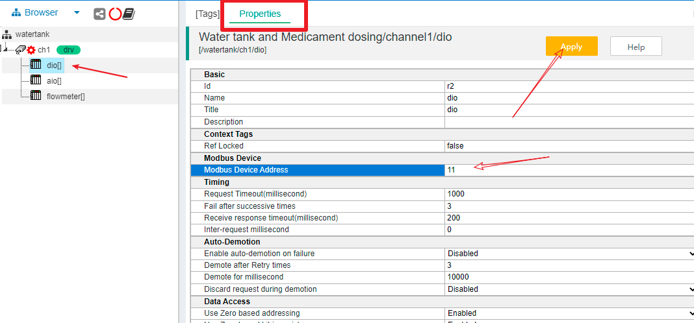
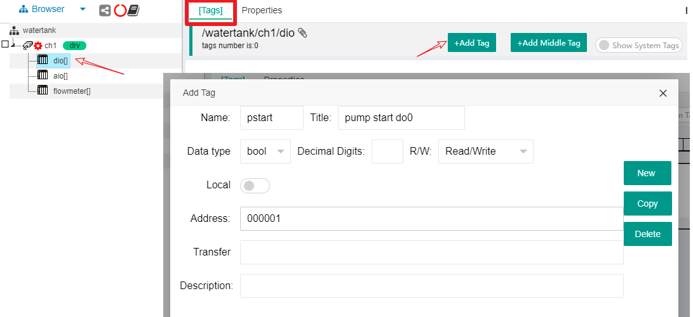

## 1.2 自动化相关设备

### 1.2.1 水泵控制相关设备

现场水泵只需要通过接触器进行供电通断即可达到启停控制，配合中间继电器和反馈触点，最终通过两个24VDC继电器线圈进行启动和停止控制。一个线圈通电触发启动水泵，一个线圈通电触发停止水泵。同时，通过一个无源触点反馈水泵运行状态。

控制箱中，配置一个24VDC开关量输入输出模块，提供RS485 Modbus RTU接口，设备地址11，do0接启动线圈，do1接停止线圈。di0接无源反馈触点。do0，do1，di0对应的寄存器地址分别为 000001,000002,100001。

另外，现场的控制箱也有两个触发按钮（启动按钮和停止按钮）和一个水泵运行状态指示灯。用来支持现场人员进行手动介入进行紧急情况下的控制。

### 1.2.2 阀门开度控制和水位监测设备

在水罐内部投入一个0-5米量程的水位计，24VDC供电，4-20mA电流信号输出。在加药投加管道上安装一个电动阀门，其中开度控制通过4-20mA输入控制。

在现场控制箱，配置一个多路模拟量输入输出模块，提供RS485 Modbus RTU接口，设备地址12，AIN0（寄存器地址300001，对应4-20mA数值为2000-10000）接水位计电流信号，DA0（寄存器地址400001，对应4-20mA数值为2000-10000）接药剂投加电动阀门控制信号。

### 1.2.3 出水口电磁流量计

在水罐出水口安装配置电磁流量计，其变送器也提供RS485 Modbus RTU接口，能够读取瞬时流速和累计流量。设备地址13，流速通过寄存器404113作为高位、404114作为低位组成的4bytes浮点数，单位是立方米/秒。

### 1.2.3 上位控制计算机或嵌入式控制器

以上设备通过一根双绞屏蔽电缆作为RS485总线接入上位系统，所有的设备串口参数为[9600 N 8 1]。上位系统可以是一台工控机，也可以是嵌入式ARM控制器，内部都安装配置了IOT-Tree Server。

RS485总线接入上位控制器，在软件内部对应串口COM5。当然，你也可以配置一个RS485转以太网的串口服务器模块。使得IOT-Tree Server可以通过Tcp方式透明访问RS485总线。现场使用企业内网，IOT-Tree Server对于的设备地址为192.168.0.18。串口服务器地址192.168.0.10，端口12345。

# 2 上位系统IOT-Tree Server作为子系统控制器配置

在前面的相关设备安装、接线成功之后，接下来主要工作就集中在控制器的IOT-Tree的配置上了。在工控机或嵌入控制器安装IOT-Tree Server请参考相关文档。本次案例IOT-Tree Server对外提供9090 http协议端口。

如果你在IOT-Tree Server本地工控机上，只需要打开浏览器，访问http://localhost:9090/admin 地址就可以登录进入IOT-Tree Server的管理、配置和控制界面。如果你在远程计算机上，则可以访问http://192.168.0.18:9090/admin 进行访问。

## 2.1 新建项目

登录IOT-Tree Server管理界面之后，在Local Projects中点击Add按钮，新增项目，如下图：


项目名称和标题如下：
```
watertank
Water tank and Medicament dosing
```
成功之后，在Local Projects列表中，就会出现新增加的项目。点击此项目，即可进入项目详细配置界面。

## 2.2 新增Connector

如果你运行IOT-Tree Server的设备直接通过串口连接现场RS485总线，则应该选择Connector - COM。如果通过以太网Tcp转RS485的串口服务器连接，那么应该选择Connector - Tcp Client方式。

他们分别对应的输入如下图：


以下内容，都以Tcp Client方式进行进行推进。接下来我们就要在树形Browser里面新增Channel-Device两个层次的内容了。

## 2.3 新增通道和设备

Browser下面已经有个项目根节点"watertank"，鼠标右键在弹出的菜单中选择"New Channel"，在弹出的对话框中，输入或选择如下内容。确定之后，"watertank"下面新增了这个通道。
```
Name = ch1
Title = channel1
Driver = Modbus RTU
```



在通道下面，我们就可以添加设备了。在RS485总线上的设备有3个：开关量模块、模拟量模块和流量计。我们分别取名为dio、aio、flowmeter。

在新增的通道节点鼠标右键选择"New Device"，在弹出对话框中，只需要填写如下内容，其中里面的Device选项保留空（原因是当前的设备并没有存入设备库）：
```
Name = dio
```


通过相同方式我们只需要填写一个设备Name，新增另外两个设备aio、flowmeter。

设备添加完成之后，通道下面就有了这3个设备节点，此时在主内容区域，点击"Properties"标签页，并且选择点击设备节点dio。您可以看到Modbus RTU设备详细的设置参数列表显示其中。由于dio设备的地址是11，我们只需要修改"Modbus Device Address"这一项的内容改为11，并且点击右上角的"Apply"按钮即可。如下图：



您接着点击另外两个设备aio、flowmeter节点，并且修改"Modbus Device Address"对应的参数分别为12、13。注意：不要忘记点击"Apply"按钮生效！

## 2.4 新增设备Tags

### 2.4.1 水泵控制开关量模块对应Tags

现在，我们应设置设备内部关联的数据了。在主内容区域点击"[Tags]"标签，然后点击设备节点"dio"，在标签下面的内容区域显示路径"/watertank/ch1/dio",此时列表区域没有任何Tag数据。

鼠标点击"+Add Tag"按钮，在弹出的对话框输入如下内容：
```
Name = pstart
Title = pump start do0
Data type = bool
R/W = Read/Write
Address = 000001
```
此Tags对应水泵启动线圈输出do0，如下图：


我们用同样的操作新增另外两个Tag，分别对应水泵停止线圈，水泵运行状态反馈无源触点。
```
Name = pstop
Title = pump stop do1
Data type = bool
R/W = Read/Write
Address = 000002
```
```
Name = p_running
Title = pump running state di0
Data type = bool
R/W = Read Only
Address = 100001
```
最终，在设备节点"dio"下面，有3个Tags，如下图：


### 2.4.2 水位和阀门控制模拟量Tags


### 2.4.3 电磁流量计流速Tag

