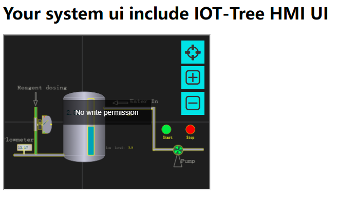

```
package com.xxx.plug;

public class User
{
	String id,regName,fullName ;
	
	public User(String id,String regname,String fulln)
	{
		this.id = id ;
		this.regName = regname ;
		this.fullName = fulln ;
	}
	
	/**
	 * unique id  (option method)
	 * 
	 *  
	 * @return
	 */
	public String getId()
	{
		return this.id ;
	}
	
	/**
	 * get registion name (unique name for login)  (must have method)
	 * @return
	 */
	public String getRegName()
	{
		return this.regName ;
	}
	
	/**
	 * get display name (option method)
	 * @return
	 */
	public String getFullName()
	{
		return this.fullName ;
	}
}
```


```
package com.xxx.plug;

import java.io.*;
import java.util.*;

/**
 * auth demo plugin for
 * IOT-Tree Server
 * 
 * You can implement the methods in this plug-in by sharing data.
 *  For example, through relational database, redis, WebService or other
 *  
 *  
 *  
 *  The key point is that you need to bind the node tree in the IOT-Tree Server 
 *  as a resource with your user system.
 * 
 * @author demo
 *
 */
public class AuthDemo
{
	/**
	 * this method will be called when plug is inited.
	 * you can do some initial work here
	 * 
	 * @param plugdir
	 * @param params
	 * @throws Exception
	 */
	void init_plug(File plugdir, HashMap<String, String> params) throws Exception
	{
		
	}
	
	/**
	 * option method
	 * 
	 * when you access http://iot_tree_server_host:port/admin,you must login by register name and password
	 * 
	 *  if this method is here,the default user authentication provided by the system will be ignored.
	 *  
	 *  
	 * @param reg_name
	 * @param password
	 * @return
	 */
	public User checkAdminUser(String reg_name,String password)
	{
		if("admin".equals(reg_name) && "123456".equals(password))
			return new User("","admin","Adminstrator") ;
		
		return null ;
	}

	/**
	 * Obtain user information according to the token
	 * 
	 * @param token provided by page cookie or other ways
	 * @return
	 */
	public User checkUserByToken(String token)
	{
		if(token==null||"".equals(token))
			return null ;
		
		if(token.startsWith("user1"))
			return new User("","user1","User1") ;
		else if(token.startsWith("admin"))
			return new User("","admin","Adminstrator") ;
		return null ;
	}
	
	/**
	 * this method will be called when outer will access node path in iottree like /prjname/n1/u1
	 * 
	 * The node related to this path may be a context node that returns JSON data. 
	 * Or the HMI UI node outputs the UI picture
	 * 
	 * @param node_path  like /prjname/n1   /prjname/n1/u1
	 * @param reg_name login user name or null or empty
	 * @return
	 */
	public boolean checkReadRight(String node_path,String reg_name)
	{
		if("admin".equals(reg_name)||"user1".equals(reg_name))
			return true ;
		return false;
	}
	
	/**
	 * this method will be called when outer will write some data to node path in iottree like /prjname/n1/u1
	 * 
	 * this may be update some tag value in node or send cmd in hmi
	 * 
	 * @param node_path
	 * @param reg_name
	 * @return
	 */
	public boolean checkWriteRight(String node_path,String reg_name)
	{
		if("admin".equals(reg_name))
			return true ;
		return false;
	}
}

```


### 1.2.1 init_plug


### 1.2.2 checkAdminUser


### 1.2.3 checkUserByToken


### 1.2.4 checkReadRight


### 1.2.5 checkWriteRight


```
{
"name":"auth_demo","title":"Auth Plug,a demo for auth",
"js_api":[
	],

"auth":[
	{name:"auth_demo",class:"com.xxx.plug.AuthDemo"}
	]
}
```


```
<?xml version="1.0" encoding="utf-8"?>
<iottree ... >

	<plug_auth name="auth_demo">
	</plug_auth>

</iottree>
```


```
127.0.0.1 iot.xx.com
127.0.0.1 abc.xx.com
```


```
    server {
        listen       80;
        server_name  iot.xx.com;
		charset utf-8;
        location / {
			proxy_pass http://localhost:9090;
            root   html;
            index  index.html index.htm index.jsp;
			
			proxy_http_version  1.1;
			proxy_set_header Upgrade $http_upgrade;
			proxy_set_header Connection "upgrade";
        }
	}
	
	server {
        listen       80;
        server_name  abc.xx.com;
        location / {
		proxy_pass http://localhost:8080;
            root   html;
            index  index.html index.htm index.jsp;
        }
	}
```


```
<%@ page contentType="text/html;charset=UTF-8"%>
<%@ page import="java.util.*,java.io.*,java.net.*"%>
<%
	Cookie ck = new Cookie("token","user1_sdfasdfsafdsad2312323___23");
	ck.setPath("/");
	ck.setDomain("xx.com");
	response.addCookie(ck);
%><html>
<body>
<h1>Your system ui include IOT-Tree HMI UI</h1>
<iframe id="f1" src="http://iot.xx.com/watertank/u1" style="width:400px;height:300px"></iframe>
</body>
</html>
```


```
http://abc.xx.com/biz/index.jsp
```


```
<?xml version="1.0" encoding="utf-8"?>
<iottree ... >
	<plug_auth name="auth_demo" 
			login_url="http://abc.xx.com/login/login.jsp"
			token_cookie_name="token"
			no_read_right_prompt="No read permission"
			no_write_right_prompt="No write permission"
			>
	</plug_auth>
</iottree>
```


```
Cookie ck = new Cookie("token","xxx_sdfasdfsafdsad2312323___23");
```


```
Cookie ck = new Cookie("token","user1_sdfasdfsafdsad2312323___23");
```





```
Cookie ck = new Cookie("token","admin_sdfasdfsafdsad2312323___23");
```


[case_auto]: ./case_auto.md 
