https://worldweather.wmo.int/en/city.html?cityId=278


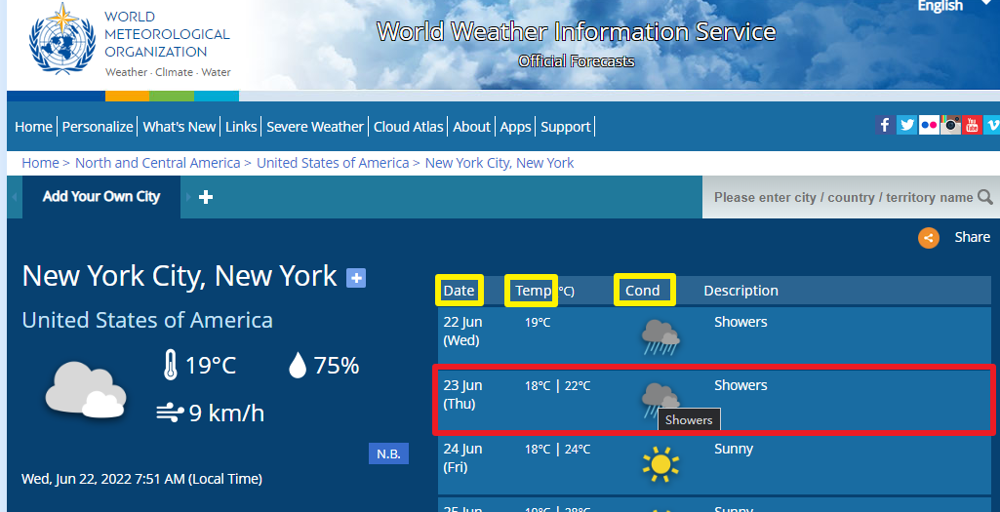


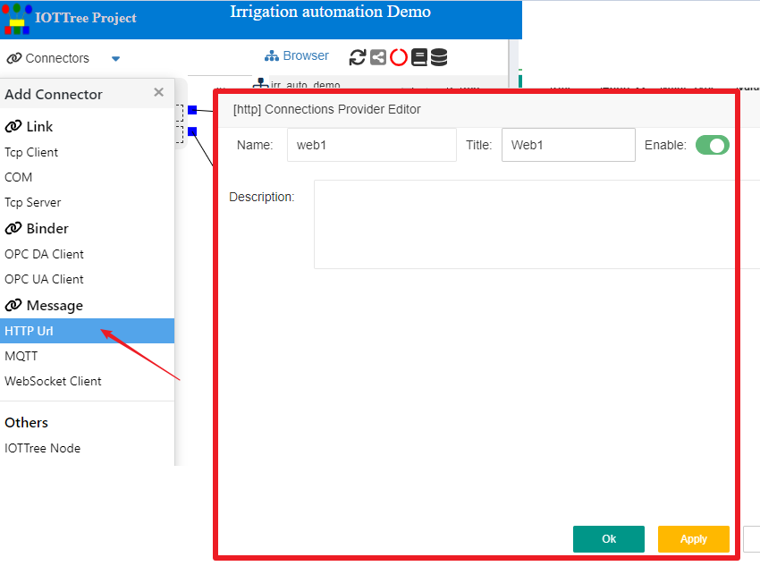


```
Name: weather1
Title: Weather1
Url: https://worldweather.wmo.int/en/city.html?cityId=278
Method: Get
Update interval: 1800000
Source Type: html
Handler: Binder
Run Page JS: Enabled
Run JS Timeout: 30000
```


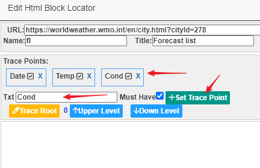


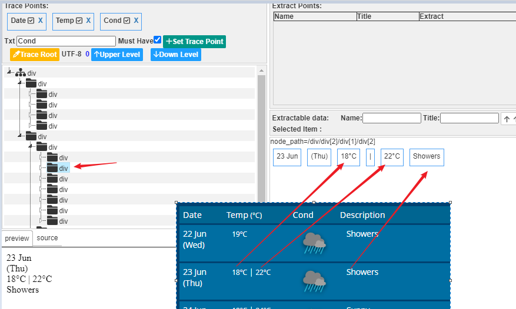


```
Name=nd1_t_min
title=next day1 min temp
```


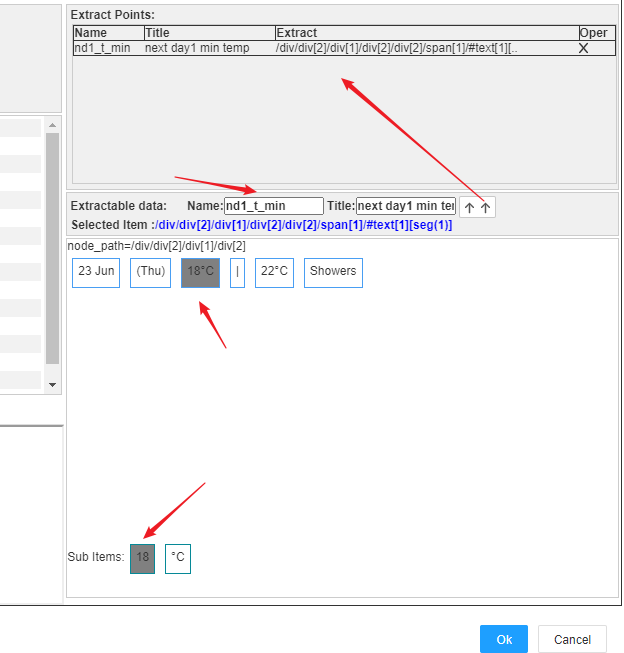


```
Name=nd1_t_max
title=next day1 max temp

Name=nd1_cond
title=next day1 cond
```
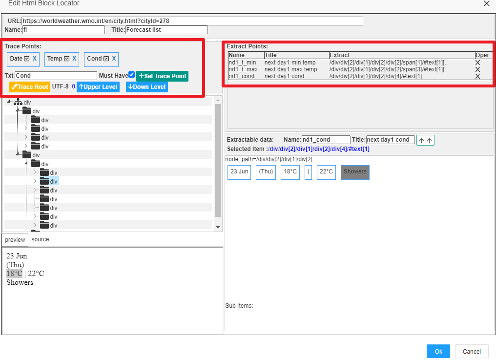


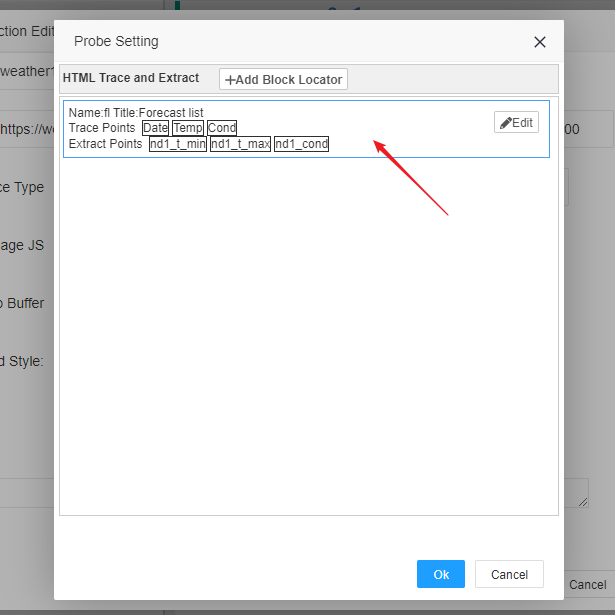


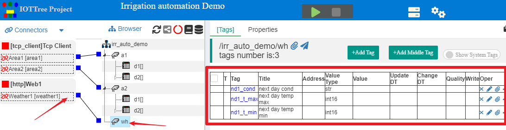


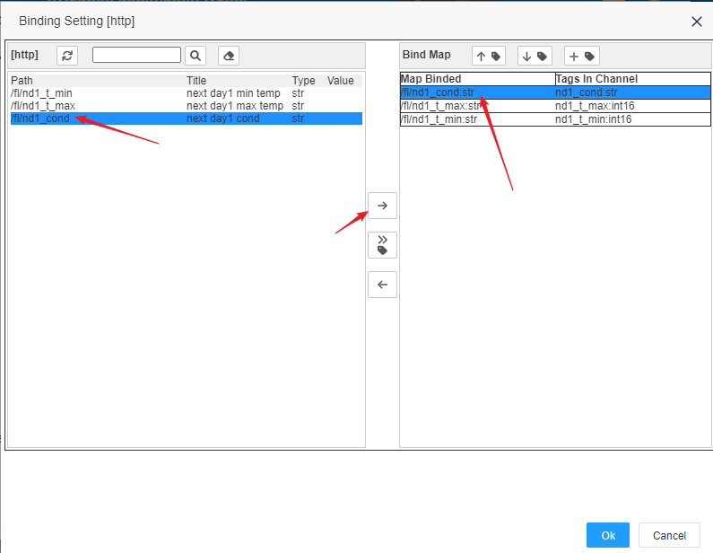


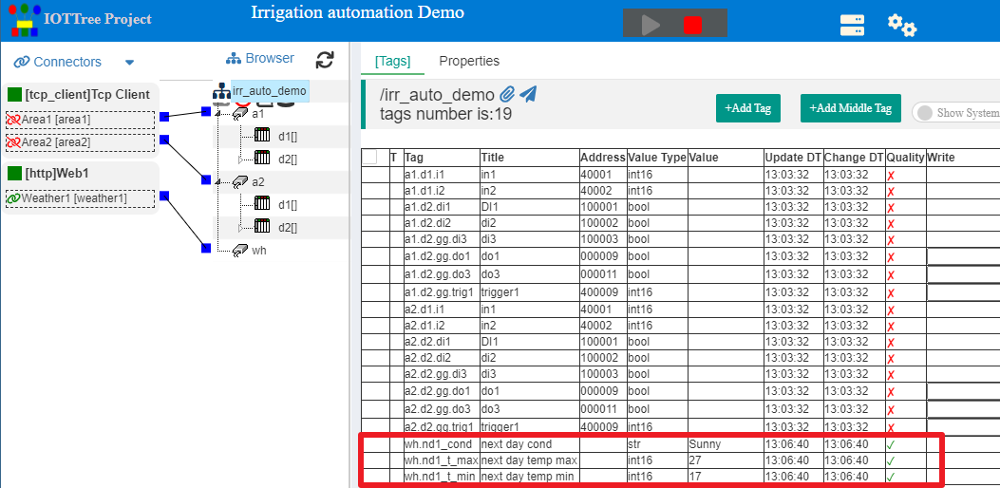


```
http://your_ip:yourport/irr_auto_demo/wh
```
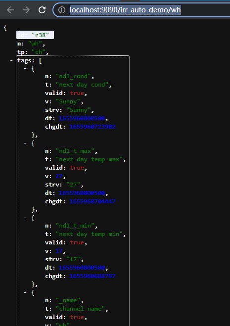


