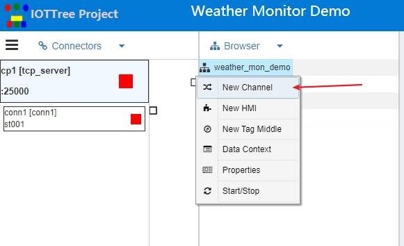
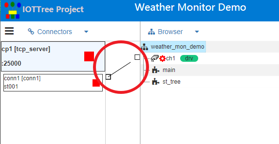
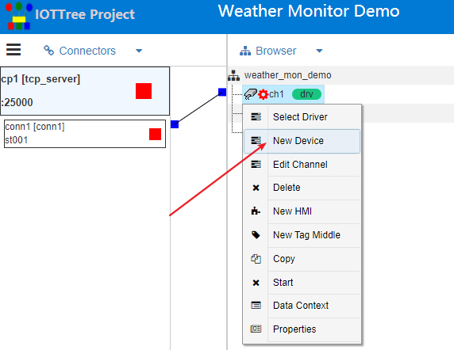
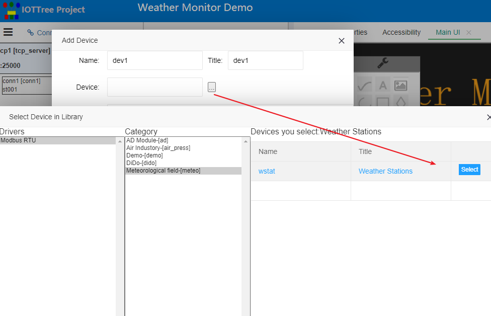
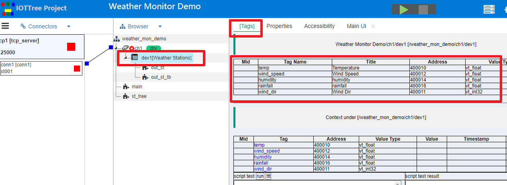

[qn_devdef]:./quick_know_device_definition.md
[qn_hmi]:./quick_know_hmi.md
[qn_hmi_w]:./quick_know_hmi_edit.md

[quick_start]:../quick_start.md
[qn_tcpserver_wizard]: ./quick_know_tcpserver_wizard.md
