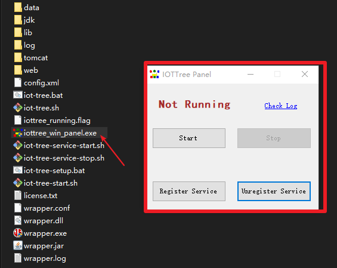
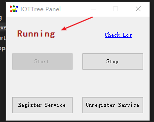
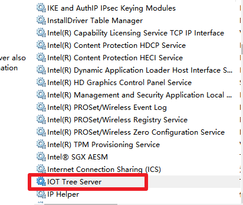
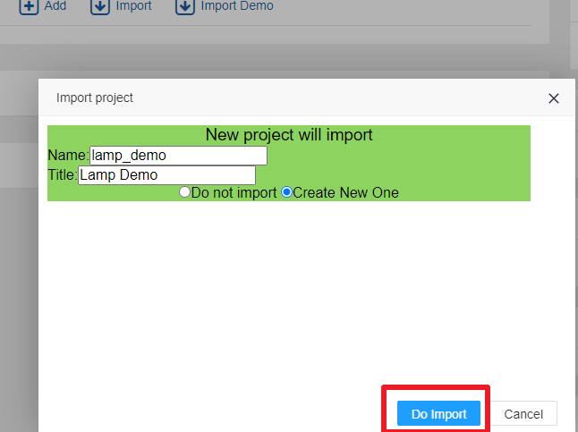
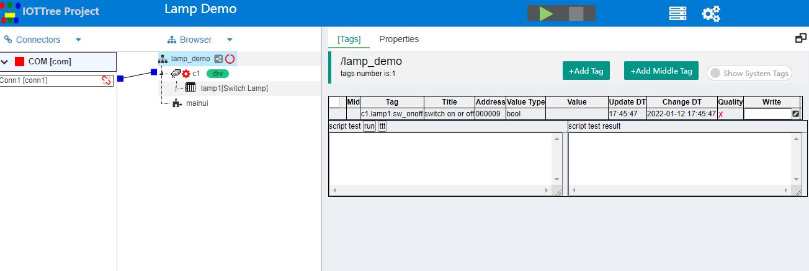

```
set PATH=%PATH%;c:\jdk1.8\bin
set JAVA_HOME=c:\jdk1.8
```


```
echo %PATH%
echo %JAVA_HOME%
java -version
```


```
export JAVA_HOME=/usr/java/jdk1.8.0_281
export PATH=$JAVA_HOME/bin:$PATH
```








```
_________ _______ _________           _________ _______  _______  _______
\__   __/(  ___  )\__   __/           \__   __/(  ____ )(  ____ \(  ____ \
   ) (   | (   ) |   ) (                 ) (   | (    )|| (    \/| (    \/
   | |   | |   | |   | |      _____      | |   | (____)|| (__    | (__
   | |   | |   | |   | |     (_____)     | |   |     __)|  __)   |  __)
   | |   | |   | |   | |                 | |   | (\ (   | (      | (
___) (___| (___) |   | |                 | |   | ) \ \__| (____/\| (____/\
\_______/(_______)   )_(                 )_(   |/   \__/(_______/(_______/   version xx.xx.xx

web port: 9090
iottree->
```


```
http://localhost:9090

```











